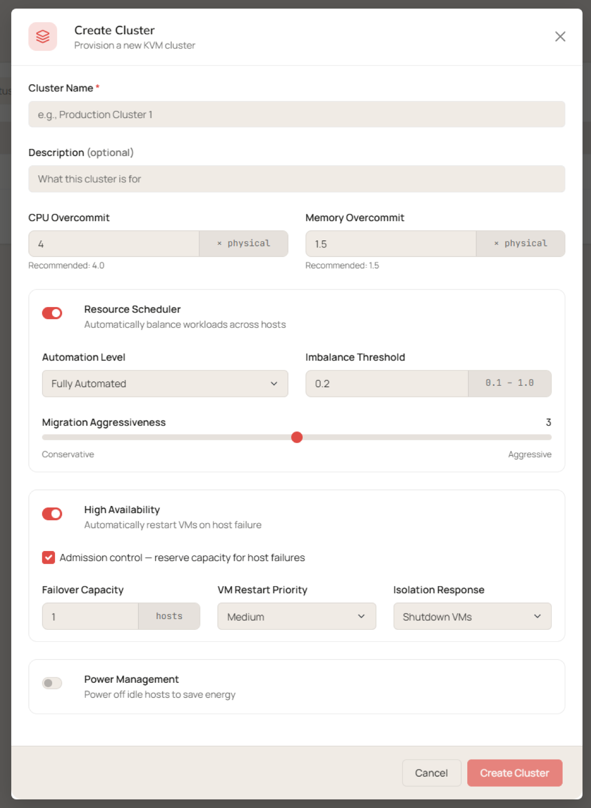

Clusters in Talos Director are logical groupings of KVM hosts. Each host remains a standalone system with access to shared storage; Talos Director uses the cluster boundary to make virtual machine placement decisions, balance load with the Resource Scheduler (RS), and restart workloads on surviving hosts through High Availability (HA).

Use the **Clusters** page to answer fleet-level questions — is every cluster healthy, and how much capacity is committed? — before drilling into an individual cluster's hosts, VMs, storage, or upgrade state.

## The All Clusters view

Navigate to **Compute** > **Clusters** (`/clusters`) to see every cluster in one table.

### Columns

The table shows the following columns.

| **Column** | **Description** |
| --- | --- |
| **Name** | The cluster name. Click it to open the cluster detail screen. |
| **Status** | Cluster health and operational state. Use this as the quick signal for whether a cluster needs attention before drilling into hosts, storage, alerts, or metrics. |
| **Hosts** | Host membership, shown as available/total. |
| **VMs** | Virtual machine count, shown as running/total. |
| **CPU Cores** | Allocated vCPUs versus physical CPU cores in the cluster. |
| **CPU %** | Allocated vCPUs as a percentage of physical cores. Values over 100% indicate vCPU overcommit relative to physical capacity. |
| **Memory** | Allocated memory versus physical memory capacity. |
| **Mem %** | Allocated memory as a percentage of total physical cluster memory. |
| **RS** | Whether Resource Scheduler placement and load-balancing automation is enabled for the cluster. |
| **HA** | Whether High Availability restart/failover behavior is enabled for workloads in the cluster. |
| **Actions** | The row-level menu for cluster operations. |

<Note>
CPU and memory percentages measure *allocation*, not live utilization. A cluster showing 289% CPU is oversubscribed by design — compare this figure against actual host utilization on the cluster's **Performance** tab before adding capacity.
</Note>

### Controls

The controls above the table let you search, shape, and export the view:

- **Filter clusters…** — filter the table with free text or query-style expressions, for example `health_status:healthy`.
- **Columns** — choose which columns are visible.
- **Export CSV** — download the current view for reporting or offline analysis.
- **Create Cluster** — define a new cluster boundary for hosts you plan to add.
- **Items per page** — page through large fleets at 25, 50, 100, or All rows.
- **Global search** — the top-bar search spans VMs, hosts, networks, and users, and supports scoped queries such as `vm:name`.

### Create a cluster

Select the **+ Create Cluster** button to provision a new KVM cluster. Complete the following fields.

| **Field** | **Description** |
| --- | --- |
| **Name / Description** | The cluster's display name and an optional free-text description, shown throughout the console. |
| **CPU Overcommit** | The ratio of virtual CPUs to the actual physical CPUs in the cluster, expressed as a multiple. The recommended default value is 4.0 (4:1 ratio). |
| **Memory Overcommit** | The ratio of total RAM assigned to VMs to the total physical RAM across all hosts in the cluster, expressed as a multiple. The recommended default value is 1.5 (1.5:1 ratio). |
| **Resource Scheduler** | Enable or disable the resource scheduler, which automatically balances workloads across hosts in the cluster. |
| **Automation Level** | Determines how much the resource scheduler can act on its own: **Manual** — A human must review and approve each migration recommended by the scheduler. **Partially Automated** — the initial VM placement is automated, but rebalancing migrations require manual approval. **Fully Automated** — the resource scheduler acts autonomously to place new VMs and rebalancing migrations between hosts based on cluster usage data without human intervention. |
| **Imbalance Threshold** | Determines how uneven the cluster must be before the resource scheduler considers it imbalanced. Expressed as a target deviation of how far a host's load is from the cluster's average load. **0.1** (minimum) is the tightest threshold for the resource scheduler, meaning it will try to keep all hosts evenly loaded and rebalance frequently. **1.0** (maximum) is the loosest threshold for the resource scheduler, meaning it will allow hosts to run unbalanced for longer. |
| **Migration Aggressiveness** | Determines how aggressively the resource scheduler acts on migrations. **1 / Conservative** (minimum) sets the resource scheduler to only migrate when improvements to load are substantial and worth the migration cost. **5 / Aggressive** (maximum) sets the resource scheduler to migrate more readily in order to achieve a better balance. |
| **High Availability** | Enable or disable High Availability, which automatically restarts a failed host's VMs on surviving hosts in the cluster. |
| **Admission Control** | When enabled, the cluster reserves failover capacity and refuses to power on workloads that would consume the reserve, so HA restarts are guaranteed room to succeed. |
| **Failover Capacity** | How much capacity admission control holds in reserve, expressed as the number of host failures the cluster must be able to tolerate. |
| **VM Restart Priority** | The default restart order for VMs after a host failure, for example High, Medium, or Low. Individual VMs can override the cluster default from their Availability & Scheduling settings. |
| **Isolation Response** | What happens to a host's running VMs when the host loses cluster connectivity but keeps running. VMs set to UseClusterDefault inherit this setting. |
| **Power Management** | Enable or disable power management, which lets the resource scheduler consolidate workloads onto fewer hosts and place idle hosts in standby during periods of low demand. |
| **Consolidation Threshold** | Determines how much consolidation benefit must be available before power management acts; higher thresholds make host power-down more conservative. |

## The cluster detail screen

Click a cluster name to open its detail screen. The header summarizes the cluster's configuration and scale at a glance:

| **Field** | **Description** |
| --- | --- |
| **Name / Description** | Cluster identity. |
| **Resource Scheduler Enabled** | Whether RS automation is active. |
| **Resource Scheduler Automation** | The automation level, for example `FullyAutomated`. |
| **HA Enabled** | Whether HA restart/failover is active for the cluster. |
| **HA Admission Control** | Whether the cluster reserves failover capacity so HA restarts are guaranteed to have room to succeed. |
| **CPU Overcommit Ratio** | The permitted vCPU-to-physical-core ratio, for example `6x`. |
| **Memory Overcommit Ratio** | The permitted memory allocation ratio, for example `1.5x`. |
| **Total Hosts / Total VMs** | Current membership counts. |
| **Status** | The cluster's operational state. |

Below the header, tabs separate each operational dimension of the cluster.

### Hosts

Lists the hosts that belong to the cluster, with status, agent version, CPU and memory usage, VM count, and uptime. Use this tab to assess member health without returning to the global **Hosts** inventory. The table supports the same column selection, refresh, and CSV export controls as the All Clusters view.

### Virtual Machines

Lists every VM placed in the cluster, with power state, guest status, resources, and storage consumption. This is the fastest way to scope the blast radius of a cluster-level issue.

### Storage

Shows the storage pools serving the cluster, with type, capacity, used and available space, and usage percentage. You can add a storage pool directly from this tab, keeping storage provisioning in the context of the cluster that will consume it. For details on pools, see [Storage Pools](/director/compute/storage-pools).

### Profiles

Manages the cluster configuration profile and the default per-OS CPU profiles applied to new virtual machines. Defining profiles at the cluster level standardizes how workloads are built and keeps per-host or per-VM overrides explicit exceptions rather than the norm.

### Resource Scheduler Rules

Defines affinity and anti-affinity rules that constrain automated placement. Use affinity rules to keep chatty workloads together and anti-affinity rules to keep redundant workloads (for example, the members of a database cluster) on separate hosts. Each rule shows its type, scope, member VMs or hosts, and status. Click **Create Rule** to add one.

### Updates

Runs rolling operating system upgrades across the cluster's immutable hosts. A rolling upgrade updates hosts **one at a time**, so workloads keep running while the cluster converges on the new version. Start an upgrade with **Start Rolling Upgrade** and track progress from this tab.

<Warning>
Confirm the cluster has spare capacity before starting a rolling upgrade. Each host is taken out of service in turn, and its workloads must fit on the remaining hosts.
</Warning>

### Services

Shows the platform services running on the cluster, the effective state of each, and its provenance — whether the setting is inherited from the platform default or overridden for this cluster. This makes configuration drift visible and auditable.

### Performance

Charts cluster-wide utilization over selectable time ranges (1 hour to 30 days, or a custom range) and resolutions. Use this tab to distinguish genuine saturation from allocation-level overcommit, and click **View hosts** to break the aggregate down by member host.
