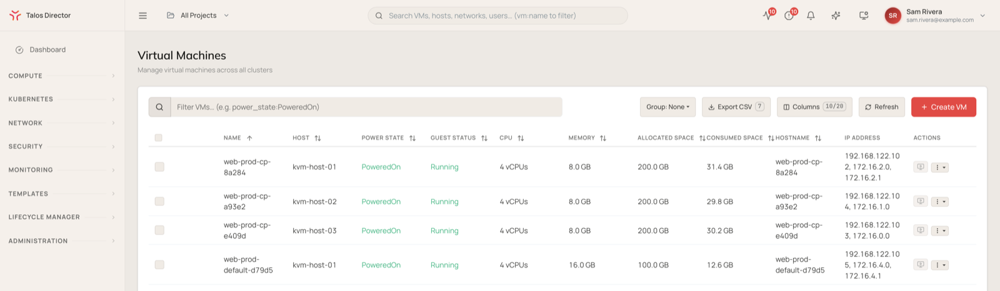
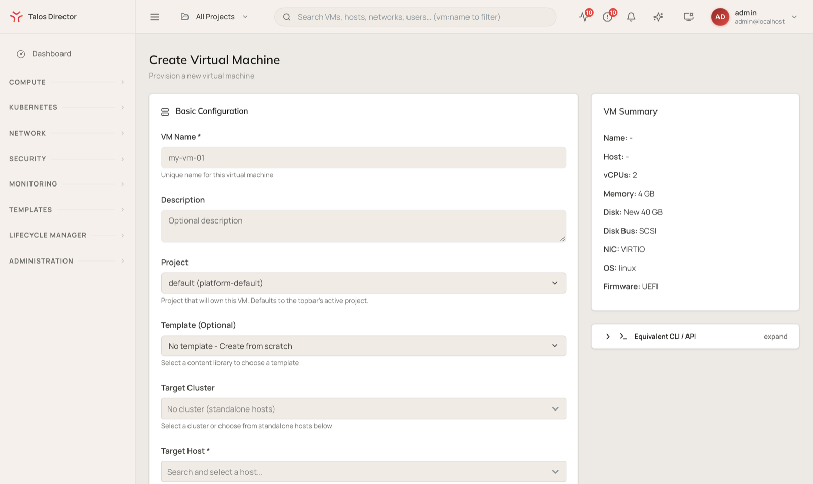
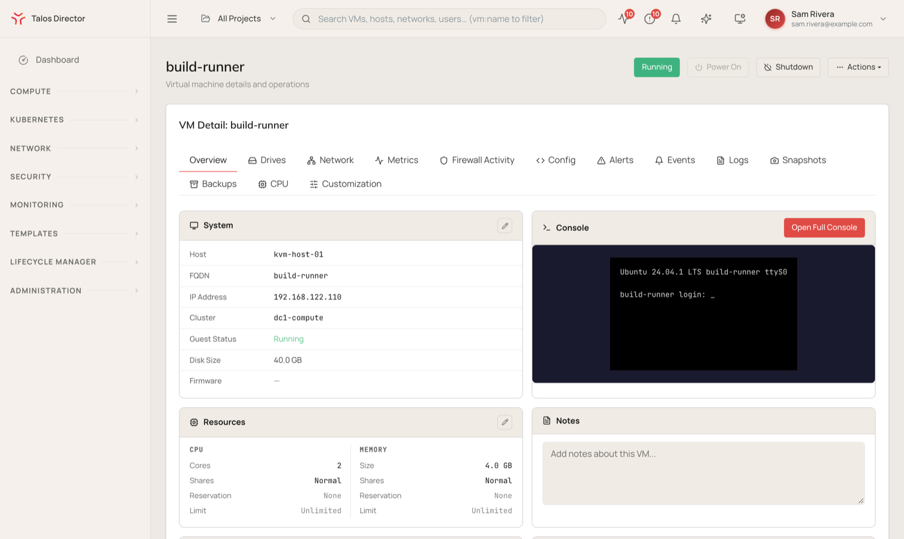

import DirectorLimitedAvailability from '/snippets/director-limited-availability.mdx';

<DirectorLimitedAvailability />

A virtual machine (VM) in Talos Director runs on a [host](/director/compute/hosts), usually inside a [cluster](/director/compute/clusters) that decides where it is placed and moves it when a host fails or is put into maintenance. The **Virtual Machines** pages are where you create VMs, find them, and operate them day to day.

## The Virtual Machines view

Navigate to **Compute** > **Virtual Machines** > **All VMs** (`/vms`) to see every VM across all clusters in one table.

### Columns

The table shows the following columns by default.

| **Column** | **Description** |
| --- | --- |
| **Name** | The VM name. Click it to open the VM detail screen. |
| **Host** | The host the VM is running on. |
| **Power State** | Whether the VM is running, for example `PoweredOn` or `PoweredOff`. |
| **Guest Status** | What the guest agent inside the VM reports, for example `Running`. `No Agent` means no guest agent is installed or connected. |
| **CPU** | The number of vCPUs allocated to the VM. |
| **Memory** | The memory allocated to the VM. |
| **Allocated Space** | The size the VM's disks are provisioned to. |
| **Consumed Space** | The space the VM's disks occupy today. |
| **Hostname** | The guest operating system's hostname, as reported by the guest agent. |
| **IP Address** | The VM's IP addresses, as reported by the guest agent. |
| **Actions** | A console shortcut and the row-level menu for VM operations. See [Row actions](#row-actions). |

Select **Columns** to show more of the available columns.

### Controls

- **Filter VMs...**: filter the table with free text or query-style expressions, for example `power_state:PoweredOn`.
- **Group**: group the table's rows.
- **Export CSV**: download the current view.
- **Columns**: choose which columns are visible.
- **Refresh**: reload VM data on demand.
- **Create VM**: create a new virtual machine. See [Create a virtual machine](#create-a-virtual-machine).

### Row actions

The **Actions** menu on each row offers **Power On**, **Shutdown (Graceful)**, **Force Off**, **Reboot**, **Move to Folder**, **Clone VM**, and **View Details**.

**Shutdown (Graceful)** asks the guest operating system to shut down. **Force Off** cuts power immediately, the equivalent of pulling the plug, and can lose data the guest has not written to disk.

## Create a virtual machine

Select **Create VM** to open the **Create Virtual Machine** form. A **VM Summary** panel beside the form updates as you fill it in, and **Equivalent CLI / API** shows the same request in a form you can script.

### Basic configuration

| **Field** | **Description** |
| --- | --- |
| **VM Name** | A unique name for the VM. |
| **Description** | An optional description. |
| **Project** | The project that owns the VM. Defaults to the project selected in the top bar. |
| **Template** | Optionally create the VM from a template in a content library, rather than from scratch. |
| **Target Cluster** | The cluster to place the VM in, or **No cluster (standalone hosts)**. |
| **Target Host** | The physical host the VM runs on. |
| **Operating System Type** | **Linux**, **Windows**, or **Other**. Windows guests need VirtIO drivers during installation. |

### CPU and memory

Pick a preset size, from **Micro** (1 vCPU, 1 GB) to **2XL** (32 vCPU, 64 GB), or choose **Custom** and set **vCPUs** and **Memory (GB)** yourself. **Advanced CPU Topology** and **Scheduling & NUMA** let you set sockets, cores, threads, and NUMA placement when a workload needs them.

Guests can scale to 1,024 vCPUs and to memory beyond 1 TiB. A VM can also be created with a virtual TPM 2.0, which Windows 11 and Windows Server 2025 require, and the scheduler places those VMs only on hosts that provide one.

### Storage

| **Field** | **Description** |
| --- | --- |
| **Storage Pool** | The [storage pool](/director/compute/storage-pools) that holds the VM's disk. The list is filtered to pools the selected cluster or host can reach. |
| **Disk Source** | Create a new disk, or use an existing disk from the storage pool. |
| **Disk Size (GB)** | The size of a new disk. |
| **Disk Format** | **Raw** (the default: fully allocated, best performance and NFS stability) or **QCOW2** (thin-provisioned, with snapshots and incremental backup). |
| **Disk Bus Type** | **VirtIO-SCSI** (recommended, especially on NFS storage), **VirtIO-blk**, **SATA** (works with Windows without extra drivers), or **IDE** (legacy). |

### Network interface

| **Field** | **Description** |
| --- | --- |
| **Network** | The [virtual network](/director/networking/virtual-networks) the VM's network interface attaches to. |
| **Network Adapter Model** | **VirtIO** (best performance), or an emulated Intel or Realtek adapter for guests without VirtIO drivers. |

### Advanced options

- **Firmware**: **BIOS (Legacy)** or **UEFI**, with **Enable Secure Boot** available for UEFI.
- **Enable VNC Console**: adds a graphical console. A serial console is always available.
- **Advanced VM Parameters**: lower-level hypervisor settings.
- **Guest customization**: off by default, so the VM boots the image unchanged. Turn it on to set the hostname, network, SSH keys, and more through cloud-init (Linux) or cloudbase-init (Windows).

Select **Create Virtual Machine** to create the VM.

## The VM detail screen

Click a VM name to open its detail screen. The header shows the VM's power state, with **Power On** and **Shutdown** buttons and an **Actions** menu that covers the rest of the VM's operations, including opening the console, editing settings, renaming, migrating the VM or its storage to another host or pool, mounting an ISO, creating a template, and cloning.

### Overview

The VM's system details (host, FQDN, IP address, cluster, guest status, disk size, and firmware), its CPU and memory allocation with shares, reservations, and limits, and its High Availability and Resource Scheduler settings. A live console preview sits beside them, with **Open Full Console** for a full-screen session. The tab also holds free-form **Notes** and the VM's **Tags**, which security groups can use to select VMs.

### Drives

The VM's virtual disks and CD/DVD drives. Disks can be added, removed, and expanded while the VM runs. **Mount ISO** attaches an ISO image to a virtual CD/DVD drive.

### Network

The VM's network interfaces, with their network, VLAN, MAC address, IP address, and state. Use **Add NIC** to attach another interface, and **Shaping** to limit an interface's bandwidth. The tab also lists the firewall policies applied to the VM and a **Connectivity Test** that checks whether a given flow from this VM is allowed, and which rule decides it. See [Security](/director/security/security).

### Metrics

CPU, memory, disk, and network metrics for the VM.

### Firewall Activity

Watch the firewall's verdicts on the VM's traffic in real time. Choose a duration, a direction, and which drop reasons to include, then select **Start live capture**. Captures stop on their own when the duration runs out.

### Config

Scheduling quality of service, CPU reservations and limits, NUMA topology, and disk I/O limits. The tab also shows the VM's full hypervisor configuration and its history, and flags it when the running VM differs from the stored definition.

### Alerts, Events, and Logs

**Alerts** lists alerts raised for the VM. **Events** is its history: power changes, guest agent connections, disk errors, and the create and migrate operations that touched it. **Logs** shows hypervisor, guest agent, and crash diagnostic logs, with a live-follow mode.

### Snapshots

Capture the VM's disk state at a point in time. Snapshots layer on top of each other, and reverting to one discards every change made after it.

### Backups

The VM's backup jobs. Select **Create backup** to set one up, or **View all** to open the full list of backup jobs.

### CPU

The CPU profile the VM uses, the CPU model it presents to the guest, and how many hosts in the cluster can run it. A VM can only live-migrate to a host whose CPU supports that profile.

### Customization

Guest customization applied to the VM. Select **Apply customization…** to set the hostname, network, SSH keys, and similar settings through cloud-init or cloudbase-init.

## Import from VMware

**Compute** > **Virtual Machines** > **Import** brings existing VMs over from VMware vCenter and converts them to run on Talos Director. See [Migrate from VMware](/director/compute/migrate-from-vmware).
