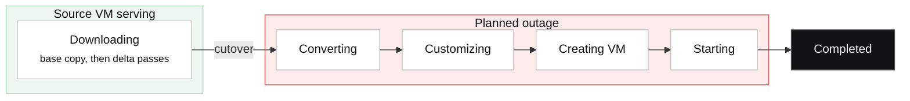

import DirectorLimitedAvailability from '/snippets/director-limited-availability.mdx';

<DirectorLimitedAvailability />

[Migrate from VMware](/director/compute/migrate-from-vmware) walks through the wizard. This page explains what the conversion engine does once you click **Convert**: where the work runs, what each stage changes, what each cutover mode means for the source VM, and what happens if something goes wrong in the middle.

## Planning a migration

For a large estate, migration assessment tooling inventories the vCenter environment and groups its VMs into waves, and mass conversion runs a wave's jobs together. Each VM in a wave is still its own conversion job, with the stages, cutover modes, and rollback described on this page.

## Where the conversion runs

A conversion is a job that runs on the Talos Director host you selected in the wizard, the one that will own the converted VM. The control plane dispatches the job and tracks its progress, while the host does the copying and conversion, because it is already attached to the destination storage pool and has the fastest path to it.

The conversion tools (the disk copier, `qemu-img`, the guest customization tooling) do not run on the host directly. Talos Linux hosts are immutable, so nothing is installed on them. Instead, each job runs in its own isolated, unprivileged tool container on the host, started for that job and removed when it finishes. The container can access only that job's source and its destination pool, cannot read storage credentials, and runs under a resource ceiling so a conversion does not starve the VMs already running on the host.

## Before anything is copied

The wizard's **Requirements** step checks the source VM before any data is copied. The conversion does not start until all three requirements are met.

- **Guest credentials.** An account in the guest OS, used to read the network configuration, remove VMware Tools, and apply post-boot configuration.
- **No existing vCenter snapshots.** The engine creates and removes its own snapshots during a warm conversion and needs a clean chain to do that safely.
- **VirtIO drivers and the QEMU guest agent in the guest.** On KVM the VM's disks and network interfaces are VirtIO devices. For Linux the engine also rebuilds the initramfs with VirtIO drivers during customization; for Windows the drivers must be present before conversion, and the step links to the driver ISO.

Warm conversions use **VMware's Virtual Disk Development Kit (VDDK)** when it is available. VDDK is the library that reads changed blocks from a running VM's disks. It is VMware software, so Talos Director does not bundle it. Upload the VDDK archive from your VMware entitlement to the content library once, and Talos Director verifies it and distributes it to hosts. A warm job on a host without VDDK falls back to vCenter's standard export. Cold conversions can use VDDK for sparse reads but do not require it.

## The stages

The diagram follows a job with scheduled or automatic cutover. Everything up to the cutover happens while the source VM is still serving. With cold cutover, the source is powered off before Downloading begins, so the whole job falls inside the outage.

The **Conversion Jobs** page shows one status per job. Each status corresponds to the following work.

| **Status** | **What is happening** |
| --- | --- |
| **Downloading** | The source VM's disks are being read from vCenter into the destination storage pool. How depends on the cutover mode (below). |
| **Converting** | The copied disks are converted to the format you chose, raw or QCOW2. With the default **Direct** method this is a `qemu-img` conversion; **virt-v2v** is available for guests that need the legacy path. |
| **Customizing** | The guest is prepared to boot on KVM without anyone logging in. The engine rebuilds the Linux initramfs with VirtIO drivers, repairs the UEFI boot path (fresh firmware variables, and on Windows a rebuilt boot configuration), removes devices that only existed on VMware, and writes the network identity it read from the source using the method you chose: cloud-init for Linux, Sysprep for Windows, the guest agent for either, or none to use DHCP. If the source had a virtual TPM, the destination gets one too. |
| **Creating VM** | A VM is defined on the destination host with the same CPU and memory, its converted disks, and network interfaces attached to the virtual networks you mapped. |
| **Starting** | The VM boots. Most of the guest cleanup, including removing VMware Tools, was done before the source VM shut down, so once the guest agent reports in, the engine applies the remaining post-boot configuration. |
| **Completed** | The VM is running on Talos Director. The source VM remains in vCenter, powered off. |

## What each cutover mode does to the source

The cutover mode decides when the source VM stops and how much of the copy happens while it is still serving. In other words, it decides the downtime of the migration.

### Cold

The source VM is powered off before the copy starts and stays off. The engine reads its disks whole, using the fastest path available: directly from the NFS datastore when the host can mount it, through vCenter's export service, or through VDDK with sparse reads that skip unallocated blocks. Downtime lasts the entire copy. Nothing on the source changes during the copy, so this is the simplest and most predictable mode, suited to workloads that tolerate a maintenance window.

### Scheduled cutover

The source VM keeps running. The engine takes a crash-consistent snapshot of it and copies that as the base. It then runs **delta passes**: take a new snapshot, ask VMware's changed block tracking which blocks changed since the last one, copy only those. Passes repeat until the copy is in sync, and the job then shows **In sync; awaiting scheduled cutover**, running further passes as needed to stay in sync.

At the scheduled time, or when you trigger it, the engine removes VMware Tools from the guest, asks the source VM to shut down cleanly, waits a grace period, copies the final delta from the shutdown snapshot, and starts the VM on Talos Director. Downtime is the shutdown plus that final, small delta, followed by the first boot. If the shutdown has not completed within the force window, the engine proceeds anyway, so the cutover completes within the planned window.

Two limits bound the wait. The snapshot chain on the source is capped (12 snapshots by default) so redo logs cannot grow without limit while the job waits, and the chain is consolidated once at the end, when no changed-block query depends on it. The engine never consolidates mid-flight, because doing so would corrupt the destination.

### Automatic cutover

Automatic cutover is the same as scheduled cutover without the wait. Delta passes repeat until the changed data in a pass drops below a small fraction of the disk, then the engine shuts the source down and cuts over immediately. This mode gives the smallest downtime without an operator present, and suits bulk moves where the exact cutover time does not matter.

| **Mode** | **Source VM during copy** | **Downtime** | **VDDK** |
| --- | --- | --- | --- |
| **Cold** | Powered off | The whole copy | Optional, for sparse reads |
| **Scheduled cutover** | Running | Shutdown plus the final delta, at a time you choose | Used when present; otherwise vCenter's standard export |
| **Automatic cutover** | Running | Shutdown plus the final delta, as soon as the copy converges | Used when present; otherwise vCenter's standard export |

<Note>
The base copy is the longest stage and runs at the speed of the storage network. Delta passes are small. The outage consists of a clean shutdown of the source, one final delta, and the first boot on KVM, followed by post-boot configuration. The application inside the VM is not changed.
</Note>

## If something goes wrong

Each job writes a checkpoint to the host as it progresses. If the host agent restarts mid-job, it reads the checkpoint, finds the job's tool container still running, and re-attaches to it rather than starting over. A long copy survives a host agent upgrade.

You can cancel a job at any stage before completion. Cancel stops the tool container, removes the partial disks from the destination pool, and, for warm jobs, consolidates the snapshots the engine created on the source. The source VM is left as the engine found it.

Progress is monitored for stalls, so a copy that stops making progress is reported as stalled rather than sitting at the same percentage indefinitely, while a job waiting for a scheduled cutover is reported as waiting. Slow vCenters are tolerated: the login and export lease have their own time budgets with retries, and a download stream that goes silent is closed and resumed from where it stopped.

The source VM is never deleted. After a cold or warm cutover it remains in vCenter, powered off, so rolling back means powering it on again. Decommission it once the converted VM is confirmed working.

## Other ways in

Conversion from vCenter is the main path, and not the only one.

- **OVF import** brings in a VM exported as an OVF package from any platform.
- **Import existing VMs** discovers VM disk images already present in a storage pool and defines VMs around them.
- **Cross-cluster migration** moves a VM between two Talos Director compute clusters, streaming its disks host to host.
- **Cross-instance migration** moves a VM between two Talos Director deployments, for example between data centers.
