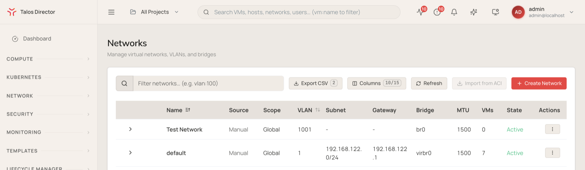

A virtual network in Talos Director is a VLAN carried on a bridge on every host. VM network interfaces attach to a virtual network, and because the network exists on all hosts, a VM keeps its connectivity when it migrates from one host to another, including between clusters.

The **Network** section of the console also holds Talos Director's firewalling (security groups, policies, and the policy simulator). Those are covered in [Security](/director/security/security).

## The Networks view

Navigate to **Network** > **Virtual Networks** (`/networks`) to see every virtual network.

| **Column** | **Description** |
| --- | --- |
| **Name** | The network name. Expand a row to see the network's status on each host. |
| **Source** | Where the network came from: created manually, or imported from Cisco ACI. |
| **Scope** | Which hosts the network is configured on. |
| **VLAN** | The VLAN ID that carries the network's traffic. |
| **Subnet** | The network's address range, in CIDR notation. |
| **Gateway** | The network's gateway address. |
| **Bridge** | The bridge on each host that the network uses. |
| **MTU** | The maximum transmission unit for the network. |
| **VMs** | The number of VMs with an interface on the network. |
| **State** | Whether the network is active. |
| **Actions** | The row-level menu for network operations. |

The controls above the table work like those on the other inventory views: **Filter networks...** (for example `vlan:100`), **Export CSV**, **Columns**, and **Refresh**, plus **Import from ACI** and **Create Network**.

## Create a virtual network

Select **Create Network** and fill in the following fields.

| **Field** | **Description** |
| --- | --- |
| **Name** | The network name. |
| **Description** | An optional description. |
| **Project** | The project that owns the network. |
| **VLAN ID** | The VLAN that carries the network, from 1 to 4094. VLAN IDs must be unique across the whole installation. |
| **Bridge Name** | The bridge on each host that the network uses. |
| **Subnet (CIDR)** | The network's address range, for example `10.20.0.0/24`. |
| **Gateway IP** | The network's gateway address. |
| **MTU** | The maximum transmission unit, for example `1500`. |
| **Enforce ACLs** | When selected, traffic on this network must be allowed by a firewall policy. See [Security](/director/security/security). |

A new network is configured on every host in every cluster, so the physical switch ports your hosts connect to must carry the VLAN.

<Warning>
Changing a network's VLAN ID or bridge means reconfiguring every host. Plan it as you would any change to the physical network the VMs depend on.
</Warning>

## Import networks from Cisco ACI

If your data center runs Cisco ACI, **Network** > **ACI Integration** connects Talos Director to your APIC controllers, read-only. Enter the address of the first APIC controller, the fabric name, and a username and password, then select **Test Connection**. With **Enable EPG Import as Talos Director Networks** turned on, saving the configuration imports your ACI endpoint groups (EPGs) as virtual networks. You can also import them later with **Import from ACI** in the Networks view.

## Services and tags

- **Network** > **Services** defines named network services (a protocol and its ports) that firewall rules can refer to, instead of repeating port numbers in every rule.
- **Network** > **Tags** manages the tags you attach to VMs. Security groups can select VMs by tag, so tagging a VM can be enough to put it under the right firewall policy.
