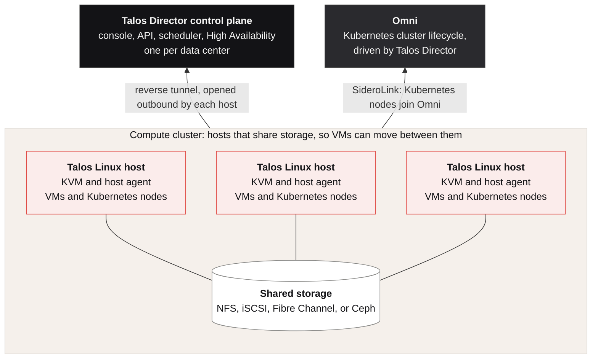

import DirectorLimitedAvailability from '/snippets/director-limited-availability.mdx';

<DirectorLimitedAvailability />

[What Is Talos Director?](/director/overview/what-is-talos-director) lists what the product does. This page explains how it does it: which pieces exist, where each one runs, and how they talk to each other. Read it before the screen-by-screen pages if you want the model the console assumes.

## The parts of a deployment

A Talos Director deployment has four parts, connected by two network paths.

| **Part** | **Where it runs** | **What it does** |
| --- | --- | --- |
| **Talos Linux hosts** | On your servers | Run the virtual machines. Each host is Talos Linux 1.14 or later with the KVM hypervisor, QEMU, and libvirt. There is no shell, no SSH, and no package manager; the host is configured entirely by its machine configuration document. |
| **Host agent** | On every host, as a Talos-managed container | Carries out instructions from the control plane: define and start virtual machines, attach disks and networks, move a running VM to another host, collect metrics, enforce firewall policy. The agent is declared in the host's machine configuration like any other Talos component, and upgrading it is a change of image digest with the guests left running. |
| **Talos Director control plane** | As a service, one per data center | The console, the API, the inventory of hosts and VMs, the scheduler, the High Availability decision logic, and conversion jobs. Keeps its own state. Operators and automation interact with this layer. |
| **Omni** | As its own service, driven by the control plane | Sidero's Kubernetes management platform. Talos Director creates the virtual machines that become Kubernetes nodes, and Omni forms them into clusters and manages their lifecycle. See [Virtual machines and Kubernetes together](#virtual-machines-and-kubernetes-together). |

Every management connection is opened by the host, outbound. The two paths work like this.

**SideroLink** is a WireGuard overlay network for the machines Talos Director manages. A new server dials it before it has any configuration, which is how Talos Director configures a server it has never seen. Kubernetes node VMs use SideroLink to join Omni.

**The reverse tunnel** is how the control plane reaches a configured host. The host agent opens an outbound connection to the control plane and keeps it open, and the control plane sends its instructions back down that connection. Hosts do not need an inbound management port. A second, host-to-host channel carries live migration traffic and cross-cluster transfers.

## Deployment options

Talos Director is self-hosted today: the control plane runs in your data center, one per data center, beside the hosts it manages. A version hosted by Sidero Labs is planned, in which Sidero Labs runs the control plane as a service and your hosts stay where they are. Because the hosts already open every management connection themselves, a hosted control plane needs no inbound access to your network. In both cases the virtual machines, their disks, and their network traffic stay on your hardware.

## The host operating system

Every Talos Director host runs **Talos Linux** with the KVM hypervisor. Talos Linux is a minimal, immutable Linux distribution that was built to run Kubernetes and now runs the KVM hypervisor as well. The properties that make it a stable Kubernetes node make it a stable hypervisor host.

A Talos Linux host has no SSH, no shell, no package manager, and no interactive login. That applies to the hypervisor host only. The virtual machines it runs are standard guests, with full operating system access through the console, RDP, or SSH.

The operating system is a read-only image. Everything about the host, from its network bonds to the hypervisor services it runs, is defined in one machine configuration document that Talos Director manages. Two hosts with the same profile are configured identically, and there is no mechanism for changing a host outside its configuration.

Talos Linux is operated through an authenticated API rather than a console session. Talos Director uses that API to configure a server it has never seen, to upgrade a host by replacing its operating system image while the virtual machines on it keep running, and to rebuild a server by applying the same configuration again.

<Note>
Talos Director hosts run standard Talos Linux 1.14 or later. The KVM, VFIO, IOMMU, vhost, hugepages, and NUMA support the hypervisor relies on is part of the Talos Linux kernel.
</Note>

## How a server becomes a host

Talos Director brings a bare-metal server under management without anyone touching a keyboard on it.

1. **Register.** Give Talos Director the server's out-of-band management address (iDRAC, iLO, or another Redfish-capable BMC) and credentials.
2. **Boot.** Talos Director instructs the BMC to boot the server once from the network, over UEFI HTTP, into a Talos Linux maintenance image prepared for that host.
3. **Dial in.** The server boots Talos in maintenance mode and dials the SideroLink overlay. It appears in **Compute** > **Hosts** > **Onboarding** as a pending host.
4. **Accept.** Accept the pending host into a compute cluster and give it a host profile: hostname, install disk, network bonds and VLANs, management and storage addresses.
5. **Configure.** Talos Director renders a complete Talos machine configuration from the cluster's profile plus the host's profile, and applies it over the overlay. The server installs Talos to disk and reboots.
6. **Connect.** On the configured system, the host agent starts, opens the reverse tunnel, and the host becomes **active**. From this point, everything about the host is defined by its machine configuration.

Servers without a Redfish-capable BMC boot the same image from an ISO or USB and receive their configuration directly. The result is the same managed host.

Because a host's entire configuration is one document that Talos Director owns, two hosts in a cluster with the same profile are the same. There is no configuration drift to audit, and replacing a host means running the same six steps again.

## Compute clusters and scheduling

A **compute cluster** is a group of hosts that share storage. Shared storage is what makes a VM movable: any host in the cluster can open the VM's disks, so the scheduler is free to place and move VMs across the whole cluster.

The scheduler in the control plane places each VM using the metrics hosts report (CPU, memory, CPU ready time), within the overcommit limits set on the cluster. A second, host-local scheduler handles placement inside the host, pinning a VM's virtual CPUs and memory to one NUMA node so it does not pay for cross-socket memory access. Placing a host in **maintenance mode** live-migrates its VMs to the other hosts before the host is taken out of service.

A **CPU profile** fixes the CPU model and feature set a VM sees, so the VM can live-migrate safely between hosts of different CPU generations, in the way Enhanced vMotion Compatibility does on vSphere. See [Virtual Machines](/director/compute/virtual-machines).

## What happens when a host fails

High Availability restarts a failed host's VMs on the surviving hosts. Before it does, Talos Director has to establish that the host has actually failed. From the control plane alone, a host that is running but unreachable looks the same as a host that has failed, and restarting its VMs elsewhere would leave two copies writing to the same disks. So Talos Director uses three sources of evidence.

- **Management heartbeat.** Does the host agent's connection to the control plane still answer?
- **Datastore heartbeat.** Every host writes a heartbeat into the shared storage pool from a small process that runs independently of the host agent. A host whose agent has crashed still writes its heartbeat; a host that has lost power does not.
- **Peer witness.** The other hosts in the cluster probe the host directly.

Only when the management channel is down, the datastore heartbeat is stale, and the peers agree the host is gone does Talos Director declare it **failed**, fence it so it cannot come back and write to shared storage, and restart its VMs elsewhere.

| **Management** | **Datastore heartbeat** | **Peers reach host** | **Verdict** | **Action** |
| --- | --- | --- | --- | --- |
| Up | Fresh | Yes | Healthy | None |
| Down | Fresh | Yes | Isolated | Alert. VMs keep running. |
| Up | Stale | Yes | Storage problem | Alert on storage. No restart. |
| Down | Stale | No | Failed | Fence, then restart VMs elsewhere. |
| Down | Stale | Yes | Ambiguous | Alert. Likely a network problem on the observer's side. |

When the evidence does not support a verdict, Talos Director alerts instead of restarting.

High Availability does not depend on the control plane being reachable. If the control plane goes offline, the hosts keep running their VMs and the compute cluster enters **local HA mode**: the hosts elect a cluster leader, and the leader decides whether a host has failed until the control plane returns.

## Storage and networking

VM disks live in **storage pools** attached to a compute cluster: NFS and iSCSI datastores, Fibre Channel LUNs, and Ceph for hyperconverged clusters where the hosts' own drives form the pool. Pools are shared across the cluster, which is what makes live migration and High Availability possible. See [Storage Pools](/director/compute/storage-pools).

VM networking is VLAN-backed. Each host carries bonded uplinks, in active/backup or LACP mode, and a **virtual network** maps to a VLAN on those uplinks. A VM's network interface attaches to a virtual network. Existing networks can be imported from Cisco ACI instead of being defined again by hand. See [Virtual Networks](/director/networking/virtual-networks).

Micro-segmentation policy is enforced on the host, in the kernel, by the host agent. A rule applies regardless of which host the VM is running on, and follows the VM when it moves. The same mechanism provides live traffic analysis and packet capture from the console. Firewall deny events can be exported to a SIEM in CEF, OCSF, or syslog format. See [Security](/director/security/security).

## Virtual machines and Kubernetes together

Kubernetes nodes in Talos Director are virtual machines running Talos Linux. They are placed on the same compute clusters as other virtual machines, scheduled by the same scheduler, and protected by the same High Availability. Talos Director forms them into clusters and manages the cluster lifecycle through Omni.

When you create a Kubernetes cluster in the console:

1. Talos Director creates the control plane and worker VMs from a Talos Linux image, sized by the node pools you defined.
2. Talos Director injects a join configuration, scoped to that one cluster, into each VM at creation, so the VM boots already knowing where to report and which cluster it belongs to.
3. Each VM joins Omni over SideroLink, is accepted by its join token, and is assigned to the correct machine set. No manual approval is required.
4. The cluster bootstrap runs exactly once, and the control plane comes up.

After creation, scaling a node pool creates or removes VMs, Talos and Kubernetes upgrades roll through the nodes one at a time with health checks between them, and etcd backups run on a schedule. Talos Director proxies the Kubernetes API, so `kubectl` access is granted through Talos Director's role-based access control with short-lived credentials (24 hours) rather than a long-lived kubeconfig. See [Kubernetes Clusters](/director/kubernetes/kubernetes-clusters).

Virtual machines and Kubernetes nodes share one inventory. A VM that is a Kubernetes node and a VM that is a database server appear in the same list, on the same hosts, under the same storage, networking, and security policy. A security group can select every Kubernetes node by tag, and the policy follows nodes as the autoscaler creates and removes them. A host entering maintenance mode live-migrates its Kubernetes nodes along with its other VMs.

Existing Talos Kubernetes clusters do not need to be rebuilt. A cluster can be brought under Talos Director management in place, keeping its certificates, credentials, and control plane address.

## Upgrades

Hosts upgrade one at a time. Talos Director live-migrates a host's VMs away, stages the new Talos image, reboots the host into it, confirms the host agent reconnects, and moves to the next host. Because the host is an immutable image, an upgrade is a whole-image swap with a known rollback, and there is no package transaction that can half-apply. See [Clusters](/director/compute/clusters).

Kubernetes clusters upgrade node by node, with health checks between nodes. The host agent and the control plane upgrade independently of the host operating system.

## What runs where

| **Concern** | **Decided by** | **Carried out on** |
| --- | --- | --- |
| Which host a VM runs on | Control plane scheduler | Host agent |
| CPU and memory placement inside a host | Host-local scheduler | Host |
| Whether a host has failed | Control plane, from heartbeats and peer witness | Fence and restart by host agents |
| Whether a host has failed, with the control plane offline | Elected cluster leader (local HA mode) | Fence and restart by host agents |
| Firewall policy for a VM | Control plane | Host kernel, by the host agent |
| Kubernetes cluster bootstrap and upgrades | Omni, driven by the control plane | Node VMs |
| Host configuration | Control plane renders the machine configuration | Talos Linux applies it |
