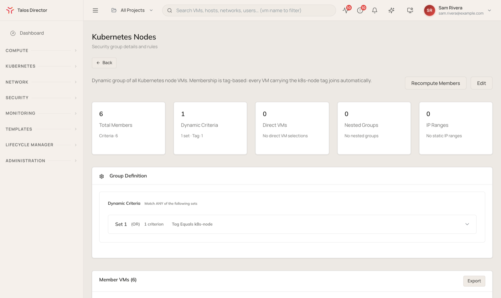

import DirectorLimitedAvailability from '/snippets/director-limited-availability.mdx';

<DirectorLimitedAvailability />

Talos Director handles security at two levels. For virtual machines, a distributed firewall enforces policy on every VM's network interface, wherever the VM runs. For Kubernetes clusters, the **Security** section brings runtime detection, admission policy, and compliance scanning from every cluster into one place.

## VM micro-segmentation

The firewall pages live under **Network** in the console. They are built from two objects: security groups, which decide which VMs a rule applies to, and policies, which hold the rules.

### Security groups

Navigate to **Network** > **Security Groups** (`/security-groups`). A security group is a set of VMs and addresses that policies can refer to by name. Members can come from:

- **Dynamic criteria**: rules that match VMs, for example every VM with a given tag. Membership updates as VMs are created, tagged, and removed.
- **Direct VMs**: specific VMs added by hand.
- **Nested groups**: other security groups.
- **IP ranges**: static addresses outside Talos Director.

Selecting VMs by tag is usually the simplest approach. Tag a VM when you create it, and it joins the right groups, and picks up the right policies, without anyone editing a rule.

### Policies

Navigate to **Network** > **Policies** (`/policies`). Each policy has a priority, a scope (the security groups it applies to), and a set of rules that allow or deny traffic. Policies are evaluated highest priority first. Select **Add Policy** to create one.

Both the Security Groups and Policies views offer **Import from NSX**, to bring existing VMware NSX groups and firewall rules across when you move VMs from VMware.

A VM's **Network** tab lists every policy applied to it. See [The VM detail screen](/director/compute/virtual-machines#network).

### Test and observe traffic

- **Network** > **Policy Simulator** answers "would this flow be allowed?" before you depend on it. Enter a source and destination (a VM or an IP address), a protocol, and a port, then select **Run connectivity test** to see the verdict and the rule responsible. The same test is on each VM's **Network** tab.
- A VM's **Firewall Activity** tab captures the firewall's live verdicts on that VM's traffic for a fixed period, so you can see what is being dropped and why.

## Kubernetes cluster security

The **Security** section covers the Kubernetes clusters Talos Director manages. It draws on four sources, each installed as a cluster add-on: CIS benchmark scans (kube-bench), Falco and Tetragon for runtime detection, and Kyverno for admission policy. See [Add-ons](/director/kubernetes/kubernetes-clusters#add-ons).

| **Page** | **What it shows** |
| --- | --- |
| **Security Posture** | An overall posture score across clusters, open findings by severity and source, the riskiest workloads, and recent high and critical findings. |
| **Findings Inbox** | Every finding across clusters, filterable by severity, source, status, cluster, and time. Acknowledge findings, mark them remediated, or request an exception. |
| **Workload Risks** | Workloads ranked by a risk score from 0 to 10 that combines vulnerabilities, exposure, and runtime behavior. |
| **Policy Authoring** | The Kyverno, Falco, and Tetragon policies on each cluster. |
| **Compliance** | Scores for each cluster against frameworks including CIS Kubernetes, PCI DSS, HIPAA, NIST 800-53, and SOC 2, with **Generate Report** and **Download Evidence** for audits. |
| **Audit Log** | A read-only record of every change to security policy, and every decision on a finding, with who made it and when. |

Each cluster's own **Security** tab shows the same information for that cluster alone. See [The cluster detail screen](/director/kubernetes/kubernetes-clusters#security).

## Certificates

**Security** > **Certificates** lists the TLS certificates Talos Director uses between its components and hosts, with their purpose, host, issue and expiry dates, and status. Summary tiles count certificates that are expiring soon. Pending certificate signing requests and the certificate authorities in use are on their own tabs.
