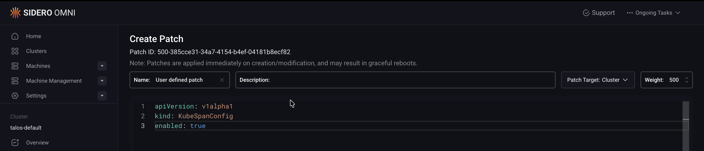
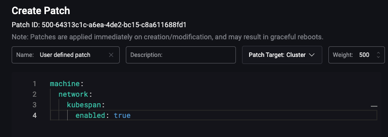

import { version } from '/snippets/custom-variables.mdx';

A hybrid cluster is a Kubernetes cluster whose nodes span multiple networks or infrastructure types, for example, a mix of bare metal machines, cloud virtual machines, or on-premises virtual machines.

Kubernetes requires all nodes can reach each other directly without NAT. When nodes are spread across different networks, this assumption breaks down. <a href={`../../talos/${version}/networking/kubespan`}>Kubespan</a> addresses this by establishing an encrypted WireGuard tunnel between every node in the cluster. The tunnel flattens the network so all nodes can communicate securely regardless of where they are hosted.

## Prerequisites

Before proceeding, create a cluster with nodes across your intended infrastructure. To learn how to create a cluster, follow the [Getting Started with Omni guide](../getting-started/getting-started).

## Enable KubeSpan

Once your cluster is created with nodes spanning multiple networks, enable KubeSpan to allow those nodes to communicate.

KubeSpan can be enabled via a config patch, applied either through the Omni UI or a cluster template.

<Tabs>
<Tab title="Cluster Templates">

To enable KubeSpan using a cluster template, add the following patch to your cluster template definition:

```yaml
patches:
  - name: kubespan-enabled
    inline:
      apiVersion: v1alpha1
      kind: KubeSpanConfig
      enabled: true
```

On Talos versions earlier than v1.13, you can use the older configuration field:

```yaml
patches:
  - name: kubespan-enabled
    inline:
      machine:
        network:
          kubespan:
            enabled: true
```

For more information on patching Omni clusters inline or with patch files, see the [Cluster Template reference documentation](../reference/cluster-templates#patches).

</Tab>
<Tab title="UI">

To enable KubeSpan using the UI:

1. Navigate to your cluster in Omni.
2. Click the **...** button next to the cluster you want to patch.
3. Select **Config Patches** from the dropdown.
4. Click **Create Patch** to open the **Create Patch** page.
5. Apply the following patch:

```yaml
apiVersion: v1alpha1
kind: KubeSpanConfig
enabled: true
```



On Talos versions earlier than v1.13, you can use the older configuration field:

```yaml
machine:
  network:
    kubespan:
      enabled: true
```



</Tab>
</Tabs>

Once this patch is applied, all node-to-node traffic in the cluster will be encrypted using WireGuard, allowing nodes to communicate with each other securely regardless of which network they are on.

<Note> WireGuard encryption adds overhead that reduces network throughput compared to a native network connection. If nodes on the same network need native throughput performance, configure <a href= {`../../talos/${version}/networking/kubespan#filtering-advertised-networks`}>`filters.excludeAdvertisedNetworks`</a> to exclude same-network traffic from the WireGuard tunnel.</Note>
