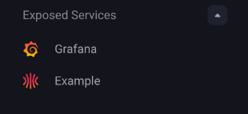

Omni's workload service proxying feature lets you expose HTTP services running inside your managed clusters directly through Omni.

Exposed services are protected by Omni's authentication, so only users with at least `Reader` access to the cluster can access them. This is useful for cluster-internal tools like Grafana or the Kubernetes dashboard that you want to access without setting up a separate ingress or VPN.

On self-hosted Omni, workload proxy requires DNS, TLS, and routing to be configured before it works. See [Enable Workload Proxy](../self-hosted/enable-workload-proxy).

To expose a workload via service proxy you must:

- Enable workload service proxying on the cluster.
- Annotate the Kubernetes service you want to expose.
- Access the exposed service from the Omni left navigation.

<iframe
  width="560"
  height="315"
  src="https://www.youtube.com/embed/N9qpCcxzPlI"
  title="Using Omni Workload Service Proxy"
  frameborder="0" allow="accelerometer; autoplay; clipboard-write; encrypted-media; gyroscope; picture-in-picture; web-share"
  referrerpolicy="strict-origin-when-cross-origin"
  allowfullscreen>
</iframe>

<Info>
Workload service proxying only supports HTTP services. Raw TCP and UDP are not supported.
</Info>

## Enable workload service proxying

Workload service proxying must be enabled on a cluster before you can expose services from it.

To enable workload service proxying on new and existing clusters using cluster templates or the Omni UI:

<Tabs>
<Tab title="Cluster templates">

Add the following to your cluster template YAML:

```yaml
features:
  enableWorkloadProxy: true
```

For more information on configuring cluster features with cluster templates, see the [Cluster Template reference documentation](../reference/cluster-templates).

</Tab>
<Tab title="New cluster">

On the **Create Cluster** page, check **Workload Service Proxying** under **Cluster Features**.


</Tab>
<Tab title="Existing cluster">

Open the cluster overview page and check **Workload Service Proxying** in the features section.


</Tab>
</Tabs>

Once enabled, an **Exposed Services** section will appear in the left navigation when that cluster is selected.

## Expose a Kubernetes service

To expose a service, annotate it with `omni-kube-service-exposer.sidero.dev/port` set to an unused port on your nodes. The following example deploys a sample Nginx workload and exposes it through the workload proxy.

The Deployment below is a minimal Nginx workload used for demonstration purposes. The Service is what controls how the workload is exposed through Omni, pay attention to the annotations.

```yaml
cat <<EOF | kubectl apply -f -
apiVersion: apps/v1
kind: Deployment
metadata:
  name: example-workload
  namespace: default
spec:
  selector:
    matchLabels:
      app: example-workload
  template:
    metadata:
      labels:
        app: example-workload
    spec:
      securityContext:
        runAsNonRoot: true
        runAsUser: 1000
        runAsGroup: 1000
        fsGroup: 1000
        seccompProfile:
          type: RuntimeDefault
      containers:
        - name: example-workload
          image: ghcr.io/siderolabs/example-workload
          imagePullPolicy: Always
          resources:
            requests:
              cpu: 100m
              memory: 128Mi
            limits:
              cpu: 500m
              memory: 256Mi
          securityContext:
            allowPrivilegeEscalation: false
            runAsNonRoot: true
            capabilities:
              drop:
                - ALL
---
apiVersion: v1
kind: Service
metadata:
  name: example-workload
  namespace: default
  annotations:
    omni-kube-service-exposer.sidero.dev/port: "50080"
    omni-kube-service-exposer.sidero.dev/label: Example Workload
    omni-kube-service-exposer.sidero.dev/prefix: example
spec:
  selector:
    app: example-workload
  ports:
    - name: http
      port: 8080
      targetPort: 8080
EOF
```

### Service annotations

The following annotations control how a service is exposed through the workload proxy:

| Annotation | Description |
|---|---|
| `omni-kube-service-exposer.sidero.dev/port` | **Required.** A comma-separated list of host port entries.<br/>Each entry is either a bare host port (e.g. `30080`) or a `host-port:service-port` pair<br/>where the service port is a port number or a port name (e.g. `30443:8080` or `30444:https`).<br/>Each host port must be unused on all nodes.<br/>The selected Kubernetes Service port must use the TCP protocol. |
| `omni-kube-service-exposer.sidero.dev/label` | A human-readable name shown in the Omni left navigation.<br/>Defaults to `<service-name>.<service-namespace>`. |
| `omni-kube-service-exposer.sidero.dev/prefix` | A fixed URL prefix.<br/>If not set, a random alphanumeric string is used. |
| `omni-kube-service-exposer.sidero.dev/icon` | An icon displayed next to the service in the Omni left navigation.<br/>Accepts a base64-encoded SVG or a base64-encoded GZIP of an SVG. |

When the bare host port form is used, the entry maps to the first port defined on the Service. To select a specific service port on a Service that defines several, use the `host-port:service-port` form.

To encode an SVG icon for use with the annotation:

```bash
gzip -c icon.svg | base64
```

### Exposing multiple host ports

<Info>
Exposing a Service on multiple host ports requires Omni 1.8.0 or later. On earlier versions, the `port` annotation accepts only a single bare host port, and the per-host-port suffixed variants of `label`, `prefix`, and `icon` are ignored.
</Info>

A single Service can be exposed on multiple host ports by listing several entries in the `port` annotation. Each entry produces its own exposed service with its own URL in Omni.

A common case is a workload that serves a user-facing UI on one port and a Prometheus metrics endpoint on another. For example, given a Service that defines port `8080` (named `http`) and port `9090` (named `metrics`):

```yaml
metadata:
  annotations:
    omni-kube-service-exposer.sidero.dev/port: "30080:http,30090:metrics"
```

The `label`, `prefix`, and `icon` annotations accept per-host-port suffixed variants in the form `<base>-<host-port>`. The suffixed variant wins for that host port, and the unsuffixed annotation is used as a fallback for any host port that does not have a suffixed variant set.

```yaml
metadata:
  annotations:
    omni-kube-service-exposer.sidero.dev/port: "30080:http,30090:metrics"
    omni-kube-service-exposer.sidero.dev/label: My App
    omni-kube-service-exposer.sidero.dev/label-30090: My App (metrics)
    omni-kube-service-exposer.sidero.dev/prefix-30080: my-app
    omni-kube-service-exposer.sidero.dev/prefix-30090: my-app-metrics
```

When the unsuffixed `prefix` annotation is set on a service exposed on multiple host ports, it is claimed by the lowest host port. Other host ports get an automatically generated alias derived from it, so there is no duplicate-prefix conflict.

Bad or duplicate entries in the `port` annotation are skipped individually rather than failing the whole annotation. Check `omnictl get exposedservices` for any per-entry errors.

## Access an exposed service

Once annotated, the service will appear under **Exposed Services** in the left navigation when the cluster is selected. A Service exposed on multiple host ports shows up as one entry per host port. Click the service name to open it in Omni.



The service URL uses the suffixed `prefix-<host-port>` annotation if set, otherwise the unsuffixed `prefix` annotation, otherwise a randomly generated prefix. For a service exposed on multiple host ports, the unsuffixed `prefix` only applies to the lowest host port, and the other host ports get an automatically generated alias derived from it.

## Examples: exposing cluster tools with the workload proxy

The workload proxy is particularly useful for cluster-internal tools that you want to access through Omni without exposing them publicly or setting up a separate ingress.

The following examples show how to install and expose two common tools, Grafana and the Kubernetes dashboard, using Helm and the workload proxy annotations.

### Grafana

[Grafana](https://grafana.com/) is an open-source dashboarding and observability tool commonly used to visualise metrics from Prometheus and other data sources running in a cluster.

To install Grafana and expose it through the workload proxy, run this command to create a `values.yaml`:

```yaml
cat <<EOF > values.yaml
service:
  annotations:
    omni-kube-service-exposer.sidero.dev/port: "53000"
    omni-kube-service-exposer.sidero.dev/label: Grafana
    omni-kube-service-exposer.sidero.dev/prefix: grafana
EOF
```

Then install the Grafana Helm chart:

```bash
helm repo add grafana https://grafana.github.io/helm-charts
helm install -f values.yaml grafana grafana/grafana
```

### Kubernetes dashboard

The Kubernetes dashboard is a web-based UI for managing and inspecting resources in a cluster. To install it and expose it through the workload proxy, create the following `values.yaml`:

```yaml
cat <<EOF > values.yaml
web:
  serviceAnnotations:
    omni-kube-service-exposer.sidero.dev/port: "58888"
    omni-kube-service-exposer.sidero.dev/label: Dashboard
    omni-kube-service-exposer.sidero.dev/prefix: dashboard
    omni-kube-service-exposer.sidero.dev/icon: H4sICHhlYmAAA2xvZ28uc3ZnALVaXW/jypF9n1/B9X1JsCLV3x/yeILFXgQIkKdNFvssS7QtjD4Mih7P3F+fc6qblDyenZtgsQ5yRySb3dVVp06daunjn74e9s2XfjjvTse7G92pm6Y/bk7b3fHx7ua///7nNt0053F93K73p2N/d3M83fzp04eP/9a2zX8O/Xrst83rbnxq/nL8fN6sn/vmD0/j+LxaLl9fX7tdvdmdhsflH5u2/fThw8fzl8cPTdNg3eN5td3c3dQXnl+GvQzcbpb9vj/0x/G81J1e3lyGby7DN1x996XfnA6H0/Esbx7Pv1wNHrYP82ha82plkM45L5VZGtNiRHv+dhzXX9u3r8LGH71qlFJLPLuM/OdGrc5w6DP+Pw+fbnTn08uw6R/wXt8d+3H5699/nR+2qtuO26tpJn++WfWNk4/rQ39+Xm/683K6L++/7rbj091NNKZLzke599TvHp9G3FS6yyHYcne3vbuB8UYuroChy9M66Wp+ojqXOtcMOdssQybrV9vThubc3exPj6ducsg8Q//1+TSM7cNu35dhy6fToV+OT6fN591xeR42y88v9/0Ar2A3x/61ez7+eIqv22d41gXVZa+U/uGYb9+N+YRBH7f9w5mDy6555W6apTyad0Hbtl92/etl4P36XLzaNM/rRyBwfxrubn55kL/64P40bPthehTk782jE6K0G7+VnKtzTzZz1vm5+vHz89N6e3q9uzHfP/ztdDpg1tDprLzK3z/efMU7MXY+JK/fPaQ9Hg+dy+77h4jnC7OyfTnuRiD/+eu711+GgQP26289tv1olZ/MOz+dXh8Heu9hvZ/dN7/5ujtiN22Fqfb6nd11xATaZN5tvI7A/t5vrD7D9oz/X54d1l93h91vPUx85/Dzcf3cPu5P9+v92w087Ea8ODzuju14eobl6v2Dff8w/vjJUPbyo0f3p3GUOKoJkYd+XG/X4/qCw+lOFDRjCPhs9V+//rlc4XqzWf3PafhcL/HHAev70wsWvfk03/643azAQIf1+Gl3ALRIXv8Oxvm4vDx4M3j89txfJi3TDn2hsh/y+XZz2PGl5d/G3X7/Fy5St3U16W7c95ebH5fV+rq35dXmPi6nrcvV43fR2q/ve8Tpr0Rh8w4Kj8Pp5flw2pKYOOLm4lC5nl4Yh/XxzN3f3cjHPYrdH9rQWRNUdmbR6ui66I374+T+x2k/nKuAf97N83p8urjsPH7bY31w3371Cybc9P6WF23N+pW+PY/D6XO/qqxSL0uCrNR0Ca/2wx6wHVduuvf9FO12Da4YhvW31REl/OZiBSHU2OA7q41f6OS6hA/NunGhi8YFoxf4ZJ3B50bJ/7DpLquA4a7zfK3ZN61xDqNsxBygnfg7MxjfGa6zsLrjS81fG0zqFz7nLooB//GT141FAeNSwRa7fzY2dByXYaMOueOaRquy+k9ttKFsbgHDqole2Y7LphC64MPvWOltrm5KLneGE0SVUGWTWI5PnPVnM0Sdikc0XqGTUbm4fmuC6X4vSLOL28nHU5Q4A4NEQ366/ntY/HaFHAKciAbG/fXtuRCcjsd+M56GFiXhy3p8GfoLq74Z+U4FXBf6H48t5d541f148TcVvw674pW3mfgvmHzZc36fRLGL1oawMCAFDAim2TRt6lQMOSxSZ/rWIXlcB0zgRuxM9FlPdxaICDys+9YvVKdtjLZB2TfJ4NKEbB0vEQ5cOsKqgTRUWueF7ozONsg1ELYwiGyq1xxvmY6YMgM2C9/pGBoNBlN5kbmOy41ZaFuwiifGYtEFc0RBrzRAWtA6AgNdCNHyXVpranpwlaBTyFg2B48NQl1iAiC3CzE67I8MuaDYKEyhKk9AnBCA4qIYg+wzmqijEEzQxmIV+DFFThoEw2CcsnULCoouaLg1GKNT00bYERW3nzCxVZgme1l04cFTkmwtbNfekLc7reA0GuecVhZZAm7IGktJ3sgNvgFnam4fVnv4Tx57hWTBDD6ZTOslo7EvISVkqUgnveDcygcsok3nuRGsS6kcuLCuec0aUpILK1rlcuLSXjmduVjIycLegMlhMfYk3uc8RtzHZbOOhutHOCDSZOONT9xkUs7LxHzHTF6wcGJGhHDHuegjTQ5ZRdmzcQq7xPzFODvtCpvJPmWuo0FtjhtPBh/giaBsond1oUWCTKIN+xXcphFri5cSl3aGmNSeRKh8Y4tRIOUCEGJYMA7PRaLWRcVLrVRMTd01r+voHMBYRE7SiI7BeIfc0ri22mJ2JQRmCgO6TgcECxmBnIRjCCJ4F/nntQP2jdSH2CnxE2DpIvbilE66ocWIRUTSpKQSEkMT17rSLPMEnYXBUvAJQAzgwCkJWweUM02TfaaJi12BjZuzAISNdSEqgO0YbKC3QM0qJJAHoZRBzK3JEhAkrC4FhGVBzNa1cm4KzJ1l9iTkCL2esncae7HBMZ1CwXgoqYjk6YAYzTcs3E1O4m6dcXAVAOGzZGDxvSslF4BICt5lZuSsPfGAN1CyEByoIy/EVtyvO3mD/zBDGUXJWTKVigwfKCRGGloqpqpsRApzJhAOKstVgk2kRS38pmUsF5GHCC4vtZc3tXdeXnVR3p2gU2YmcSjtxEmGA2At2p7oSH1KBcla0TM1PQumyNsIv7WNMKTFDMxugDU2oEiugAdSWmWlsBCadiRzpIAvlwLtYk9laY7OUdJLoQRzdELI5Trk3KipmitBJ3lapSTXJnhLno4GRYM3fID5tsDhwkuAl7LWkRaszaAleiAgf4V3YgazW3GoZC13DK6JdQCykBsEL4NsLPmIQAGqQbELwgfrsU4kMch7ZxpyStSaDtYMVyplS+pE0TOhapGab5uGlTAi2xYOWZdQ+hp+0A5eT8wvEG+TZp2pqvjbC5CEeGRGTMQOPzomI/jNMfmUtpIAwA+dZxWsZ00GFxupWTYBPBEJQiwhAwG4yOzWFh8ABuwP7sWUcGy2M3qT1CTUEikNyBhvMYsGv2hOk6okLohgbGJixVbkUmYEEKVZsmMUQ7QgyHYTUUefkoOdyAJWdM2lgiMm2Vo0U04aVZM/Eg0yg8sxpYaiIoHkhbYzfNCYidlTV+hWVYhqERjGx3KZ06Q3rhCqnFzVXKxXhvNcjfIelC4l1gEJdLaz8Ar95ZxAt+rSKmwRnGhYcR0JVzFa8B5qOyuM9sCym3IFUSjaB4wGUQXbUEWZxg35Ckm4YF3NOivkJ0WO1EFSF5QIOLxznmGGbRFljvUBQilpqYSkLOBHGfZ1UiKDA7ZskcBtAKwsA0MGgh3KgKEjSNhAJVG8eVHOWmUJYW2RmGQeecAlIY+85BDsdY7b9eB03xTijyWPalUD6BILK0jZspQgtSyAlhCepmSppxBoRFj4DFaDpwBKT7p2rMnAC9yC3qWWmaLWsIGE6o1EAXQRYhQYWLxA4qWANCOp1Yo5aSb6LNrEGTKUEEss1BpzJ2CAZWz8Yo4L5A1oiOurpLPISXAwNqAge6bIi7JiTUKOE9vJJcfiy/JhmCwRHVYkUkvYUy2xkULXFzoCYyPQESJwQaKOqEFzNrRzOjDhkEFZ0OgT5R1REQWNUFRBbpSa005ZByxo1FoJEBYITGyIi8j4QOG6dEnsWfJwjLeAMUGLaOWqoUwWuIF3POubruSH5e0k4DTzETzJfABEpDIoSnDWdRakRhdaTl2YtmSjEG2wTmbF9lMSwWmMJGfRO2TygkKnGEUnyyYMDWhFOwMoYJfoJVFOoWSTq1DXKnS1GUhZ6q2Bnw3ABSHkeZ0iG44goa/sDVwgA6W8gKcjcYFoleqC/Adxz4qyVJdSR42IA6loJGc2DuBTrGdLbWFpofTEwlQ4aE5YSVhQCCNDkaenhKg2K+yUGWHQBWRmCIZRF3hAcy6LqhR1qboiNzFGiq61C9Ggbi65teKyEHt5qNkhU4FqeahDvhKmQoIIFRalDgWSmQaiKZMT2EWEe9IK7SQWCHrFCNEtoJ5C/s4KeCBSqf2rILk0DMwuS66lqaAKkfYkvdINZCpuyc9WixZHpyB0juoPMQ3uhDtzaR1M0FeCrZ0UGyY2VFGsPFFzPvaB2coQ5Gu4VobtJA3JnsnIW6Bik0rXJG2WY9oZkaAc60VKTMcTfkpFXUvDhgoeDR6mMoaCTmo5PMsXoQ2MZkmT9YSjJ6bATNYl8JzkWXKxbI6CFWnskNjAHtvKWEVJG2w1A30Iao7YwHqfG56YIKGFH8CVWtKg7DZUuoYy0EEKnKH0JwgotDzD5cnftd6KbQgnQiWPHYpvJn5hl8ksZgAHWLm0Fu3cW1CZahY3Nmxo7ti4JEk2J/BL0rqIAmqn7kUxPAUJQGCURt4UJgSpQdHbmS0r07MwoUmjYR4IEYEIlVH4y4CjzdyttVO7JloxpKIItVNJ/IwFtDStGRoVqDRTydfddGaQhXwAPAwRzoVEQHZpcgA2WFrWq44VZZaFAyFhbmAxdmwLli9ns7TFsv1LX8xiYcADUErGSzcCmkDVj1KsME+86sF1nNpcKsGgdKm9SpaCq6WlhEZm1kjiKulRqo5t6zmDrXfQgVlBMFt56mLFHjs6uMNBK7Q8jzDeSYuhCUDCzYtSsNK4WBFlTLAUpbPBDSd0DiTzgGQ6Q2nnUxhWMaBQmn6Qo/RnaE+KlgGAUX2pr0oY4hwG9JlaCltCt0oaA7xErfCM2wElU0vfzgc+PGcppxuYVc6SQFyEDfplqCdUAtFpueoB5awILh1D2Z1iJOln9Dd6PqRq3XRmgFD2reN0KDosZjxPSdSackKGbm0+Mit3mt+ag/BS6TVLeMUBxUkxVDah2wqhl6U20hVSFVMPAfGC52wl3GbqjbUpXd18g8oB6mahRPEHk0UGg1p5GhTnDCnKq5x41TIi+0O9rSznJo2FziejKbN0DD5Bi6OfdnLWRU9b8psCzKMpQGttrsFAYqI7L/omGSVdKZwWhI0Ujxe1v1gkBtFbth5gYw+iaqGI0CNgwWzQhQR8QA1HEmSqJjg8RfG3k2PnvewBV26G0aWVZaXcSEa46KQ38qyPRISFXLE8e3E8j5dDvso/9WwuosIYXkPFMMsNu7Ao2IBQsKJrJgBfObc4s1beggVX7I1UKnBSOcFfeF1Wqq8UNMBaEjrPVCjIodXZSzioJAm5idnVI08YPNvJ1hL6RgnM0OeoRDmCtk8qW5XcRRLvrxakt6ItB6gs3kIV7Hoo96xj86YpnSzKObMbaIoWItXoUvmzryDkNtHbVNKve9+AsT3bXM2+BsKbDXVm27EwqPXgBSe6o5ykhqrDMFaB6aSFYdPd8LzWAVMCO/rDloLncn1jTzKTGjDFfwpBdShdIFlO3tfKiZBAmaJUgYmeR3VtniqWrn082cgokeY8MZfTPDSXhryntYEb3NQohUrX+wt/TEmNYJdDjCJhKh7UdDJZ14IsKN/uqGY6fr/SDgyPqRrLFPWtp/nlxiTdCq34crxa3+CK0RfEhZKw5UQCf6W3RvUApKCWvRxX2cziXPqCqXztm0Ia87ZiqO4qdCSnfOywvXyHBhnMYz4ed2ATCwDD8dRSvjEqE+N9P50XAgxVK+i5baNjF4Wp5DASYPZswdkRZzl/Qk8ixB7RKFftT/4t1Ao5QKCJlIzKaaqLqGrjlSOI3pXzT2rWdAmMifOJ35yMgEyUQz5ofnbxit9O8aBUeyOHtOX0p4JRUKP59QNA46nhWbjQDUBklWQvJT5Ox6UXqV7jzdwQrpiKN4wCHVLR8UtJJ6WTXx1m9oDO8gwJTEvfTvVU+iXH2aMciGkztRdv6w3P4pzXJaze8UQCvhH9bpEmpoJyYlRxUphaFiuxTJiGHZtzhfSik7xAyyxOBPmzq5/OXaezaQ8JpOVUAB1Dw9OAEMnFOlqdKUlTaaGqg0rf09hYfQUiKrggE6M7ozxCj2uZxRBkKi9Ew1b5V8+1a7oAi4GnYkFqJbIlyGGbEbp16PPbNO/blfpiaw4H+beZ6FN2bkykEuZRvoMDMas3PN8C5YC0IwtgLa/h/XeW03fup+PYnne/9atDv929HG7LDT5cHflbh32582U97NbH8c29V/nxyZtb53Hox83TdG/sv47t7rjt8aYqV+v97vG4Oo/rYSw3tv3mNKzH3ekoX8jf7nfHvv6uZZpm349jP7T8Jdfu+DjdfT0N2+/vyYzzTxXKhNvd0G9k/v043N7vT5vP7fNwehz6M3+ztRrvb1+H3YhZWv4OYrUfWtwqxh43T6ehWsvfOYlx56fdw7iaLm/lV02rX5T83ZYfMdSfKfwrP2JAvP8Pv2O4PayHz/1QPn/ZnXf3uz2Hy8c9nXB+3mPs7ig2n770w8P+9Do/749r/NPerzef+YuQ43a13mxeDi/8mUcJ7cP6sNt/W/0Nvr1tp++J2xL1536ze9htShQ54hpo80/H4Fz+6uV8d7Opf+fyn/O5fpzuzRfXt86X8d+PPl9P9v3b72c8X/33/d/b4fPVP/V1fbecvhP/f/zW/uPysfzsB/985K+TPn34ByiQtmK5KgAA
EOF
```

Then install the Kubernetes dashboard Helm chart:

```bash
helm repo add kubernetes-dashboard https://kubernetes.github.io/dashboard
helm install dashboard -f values.yaml kubernetes-dashboard/kubernetes-dashboard
```

## Troubleshoot exposed services

To view the status of all exposed services and check for configuration errors, run:

```bash
omnictl get exposedservices
```

Check the `ERROR` column in the output for any issues with a specific service. A common cause of errors is a port conflict — the value of `omni-kube-service-exposer.sidero.dev/port` must be unused on all nodes in the cluster.

Omni deploys a workload proxy component into each cluster with workload service proxying enabled. You can inspect its logs for lower-level troubleshooting:

```bash
kubectl logs -n kube-system -l app.kubernetes.io/name=omni-kube-service-exposer
```
