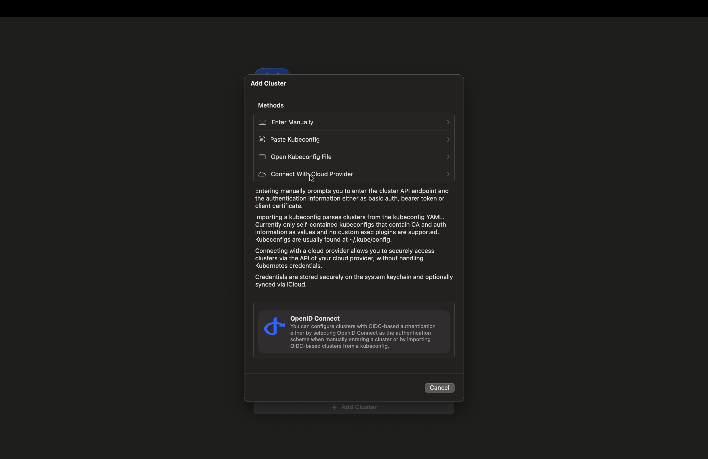
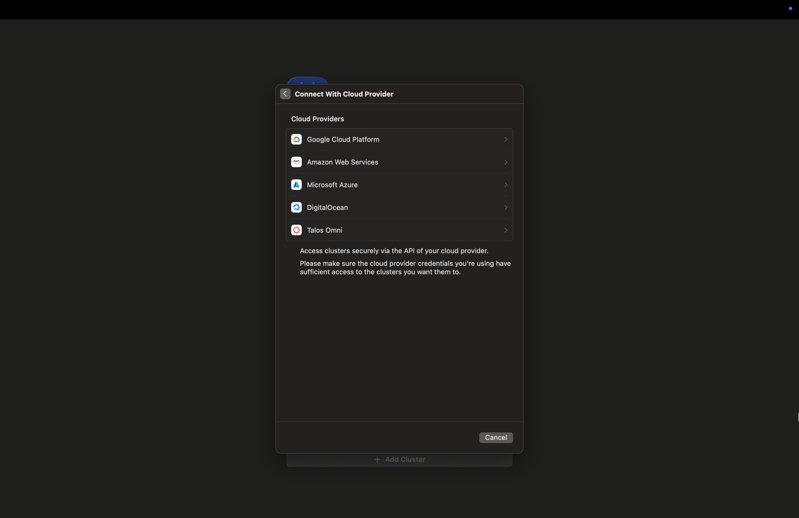
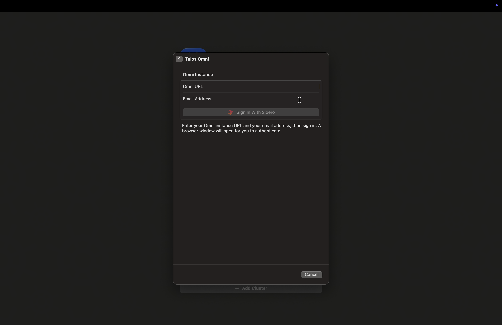
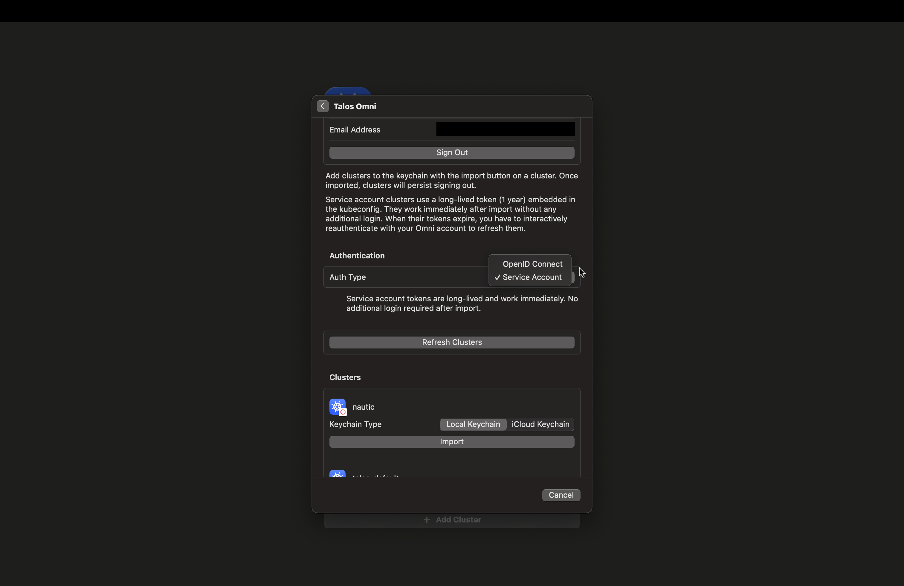
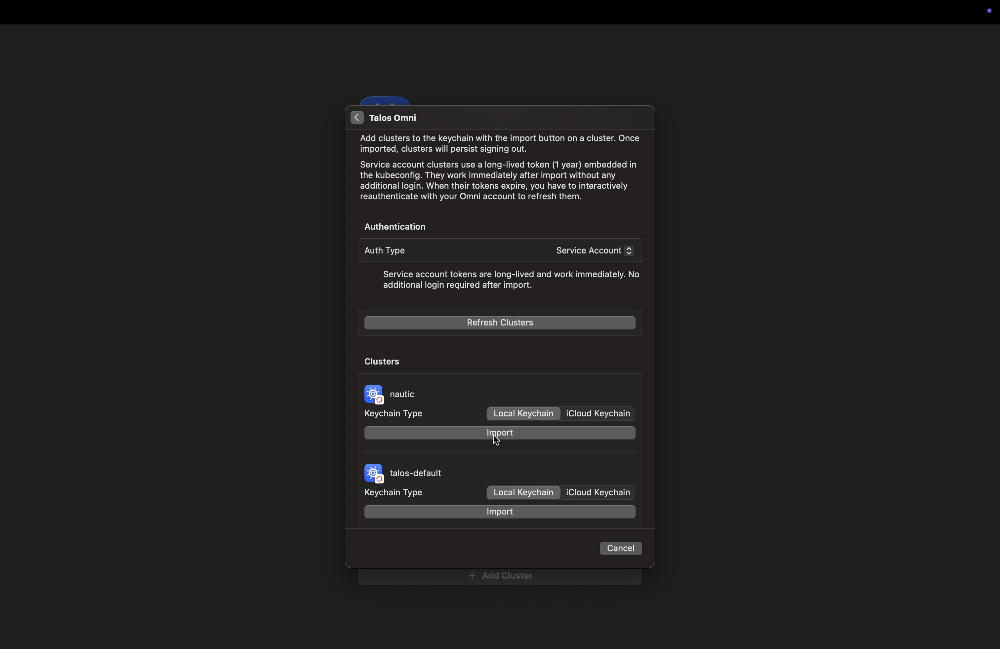
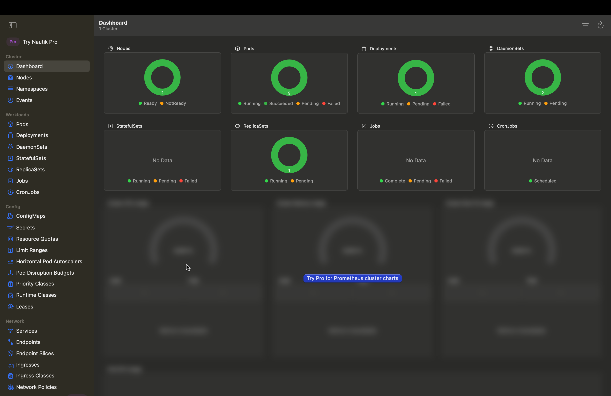

[Nautik](https://nautik.io) is a native Kubernetes client for Apple platforms. It has a built-in Talos Omni integration that lets you authenticate and import clusters directly through a browser-based sign-in flow, without manually handling kubeconfig files.

This guide walks you through connecting Nautik to your Omni instance and importing a cluster.

## Prerequisites

Before you begin, ensure you have the following:

- A macOS, iOS, or iPadOS device with [Nautik](https://nautik.io/) installed.
- An active [Omni](https://www.siderolabs.com/omni-signup) account with at least one cluster created.

## Add a cluster to Nautik

Nautik connects to your Omni instance using a browser-based sign-in flow. Once authenticated, it lists the clusters available to your account so you can import them directly into the app.

To add a cluster:

1. Open Nautik and click **+ Add Cluster**.
2. Click **Connect with Cloud Provider**.

3. Select **Talos Omni** from the list of providers.

4. Enter your **Omni URL** and **Email Address**.

5. Click **Sign In With Sidero**. A browser window will open for you to authenticate.
6. Once authenticated, select your preferred **Auth Type**:
   - **OpenID Connect**: Short-lived credentials. You will need to re-authenticate when they expire.
   - **Service Account**: Long-lived token embedded in the kubeconfig. Works immediately after import with no additional login required.

7. Click **Import** next to the cluster you want to add.

Nautik stores your credentials securely in the device keychain. You can choose between **Local Keychain** and **iCloud Keychain** at import time, iCloud Keychain syncs your cluster credentials across your Apple devices automatically.

8. Close the modal and you should see information on your cluster in the Nautik dashboard.

## Remove a cluster from Nautik

If you need to remove a cluster from Nautik, you can do so at any time. Removing a cluster immediately and permanently deletes all stored credentials for that cluster from the device keychain.

To remove a cluster, right-click the cluster name in the cluster picker and select **Delete**.
