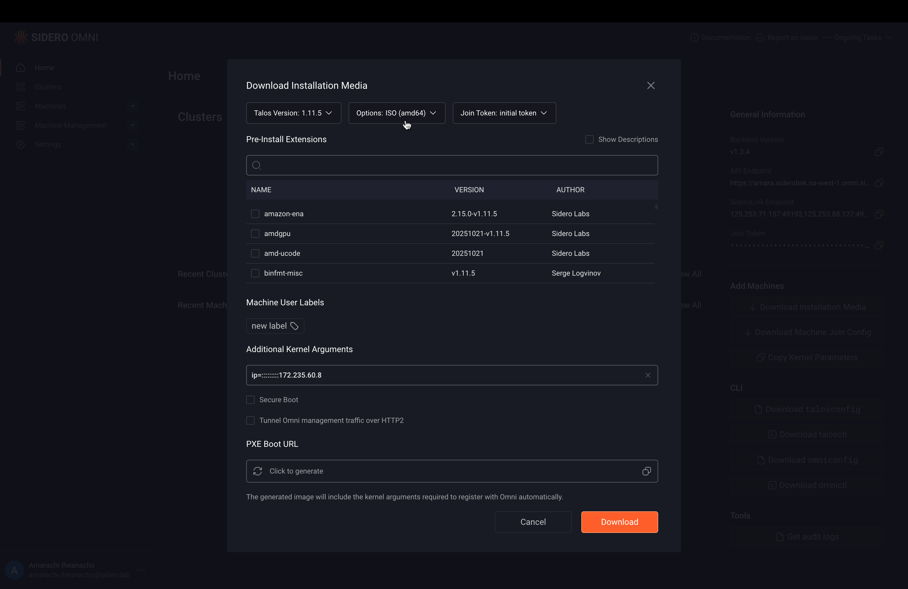

Talos Linux uses `time.cloudflare.com` as the default NTP server for time synchronization.

You can override this default in two ways:

* Using kernel parameters
* Using cluster configuration patches

## Kernel parameters

Use kernel parameters when you need to override NTP before the machine configuration is loaded, for example, during a bare-metal ISO, PXE boot, or when a node cannot reach the default NTP server early in the boot process.

Kernel parameters can be used to configure initial network settings such as interfaces, routes, DNS, and NTP servers. For more details, see the [kernel documentation](../../talos/v1.11/reference/kernel).

The kernel parameter uses the following syntax:

```bash
ip=<client-ip>:<server-ip>:<gw-ip>:<netmask>:<hostname>:<device>:<autoconf>:<dns0-ip>:<dns1-ip>:<ntp0-ip>
```

Each field corresponds to a specific network or time-synchronization setting and can be left empty if it is not being overridden.

For example, to override the default NTP server (`time.cloudflare.com`) with `172.235.60.8`, you can specify only the NTP field and leave the rest empty:

```bash
ip=:::::::::172.235.60.8
```

You can then supply this `ip` value as a kernel parameter during boot to override the NTP server early in the startup process. 

To do this first download the installation media baked with the `ip` value:

<Tabs>
<Tab title="UI">

Download the installation media with the `ip` kernel parameter using the Omni UI:

1. In the Omni UI, select **Download Installation Media**.

2. Choose the appropriate image for your machine.

3. Enter the `ip` value in the **Additional Kernel Arguments** field.

    

4. Click **Download**.

</Tab>
<Tab title="CLI">

Download the installation media with the `ip` kernel parameter using the Omni CLI:

```bash
omnictl download iso --extra-kernel-args "ip=:::::::::172.235.60.8"
```
</Tab>
</Tabs>

Boot your machines using the installation media you just downloaded, then create your cluster with those machines.

Finally verify that the NTP server has been overridden by replacing `<NODE_IP>` with your node’s IP address and running:

```bash
talosctl get timeservers -n <NODE_IP>
```

## Config patches

Use config patches to override NTP servers after boot on a running cluster.

For example, to replace the default NTP server with 172.235.60.8, apply the following patch to your cluster using the [cluster machine patch workflow](../omni-cluster-setup/create-a-patch-for-cluster-machines).

```yaml
machine:
  time:
    servers:
      - 172.235.60.8
```

After the patch is applied, verify that the NTP server has been successfully overridden by replacing `<NODE_IP>` with the IP address of one of your nodes:

```bash
talosctl get timeservers -n <NODE_IP>
```
