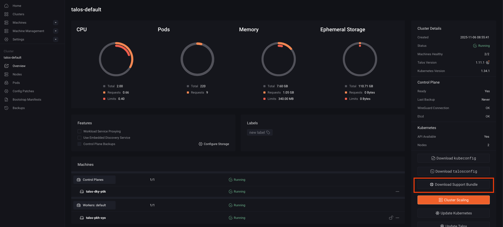

A **Support Bundle** is a downloadable archive that contains detailed diagnostic information about your Omni-managed clusters. It includes data such as cluster and machine statuses, load balancer configurations, Kubernetes and Talos service logs, provisioning details, and network or device information.  

Support Bundles are primarily used for troubleshooting. When something goes wrong, you can share the bundle with the [SideroLabs team](https://www.siderolabs.com/support-and-services/) to help identify and resolve issues.  

While the bundle does **not** include sensitive data like secrets, it may contain elements such as IP addresses, port information, system identifiers, and non-sensitive service logs that provide essential context for debugging.  

## Download the support bundle

You can download the Support Bundle in two ways, from the Omni UI or through the CLI:

<Tabs>
<Tab title="Omni UI">
To download the Support Bundle from the UI:

1. Log in to your **Omni dashboard**.
2. Select the cluster you want diagnostic information for.
3. Click **Download Support Bundle** on the right side of the dashboard.



</Tab>
<Tab title= "CLI">
Run the following command to download the Support Bundle using the CLI:
```bash
omnictl support --cluster <cluster-name>
```
Replace `<cluster-name>` with the name of the cluster whose Support Bundle you want to download.
</Tab>
</Tabs>
