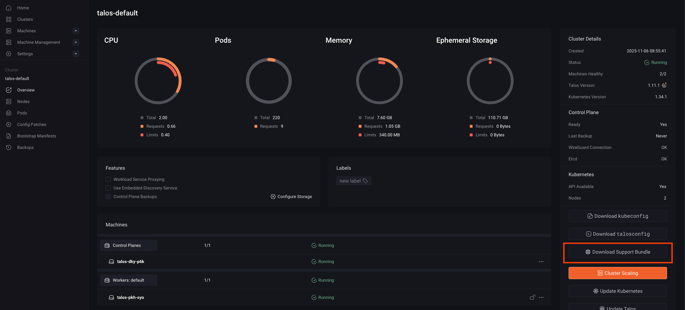
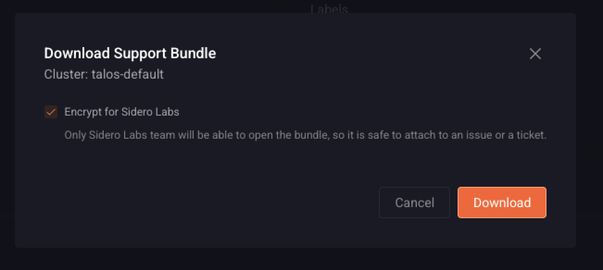
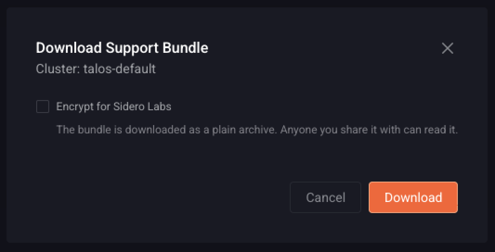

A **Support Bundle** is a downloadable archive that contains detailed diagnostic information about your Omni-managed clusters. It includes data such as cluster and machine statuses, load balancer configurations, Kubernetes and Talos service logs, provisioning details, and network or device information.

Support Bundles are primarily used for troubleshooting. When something goes wrong, you can share the bundle with the [Sidero Labs team](https://www.siderolabs.com/support-and-services/) to help identify and resolve issues.

Secrets are excluded from the collected resources, but logs and configuration may still reveal details about your environment, such as hostnames, IP addresses, and workload names. This is why support bundles are encrypted by default.

## Download the support bundle

You can download the Support Bundle in two ways, from the Omni UI or through the CLI:

<Tabs>
<Tab title="Omni UI">
To download the Support Bundle from the UI:

1. Log in to your **Omni dashboard**.
2. Select the cluster you want diagnostic information for.
3. Click **Download Support Bundle** on the right side of the dashboard.

   

4. Leave **Encrypt for Sidero Labs** checked, then click **Download**.

   

The bundle is saved as `support.zip.age`.

The UI encrypts to the public SSH keys of the public members of the `siderolabs` GitHub organization only. To encrypt to your own key as well, use `omnictl` as described in [Encrypt to yourself as well](#encrypt-to-yourself-as-well).
</Tab>
<Tab title="CLI">
Run the following command to download the Support Bundle using the CLI:

```bash
omnictl support --cluster <cluster-name>
```

Replace `<cluster-name>` with the name of the cluster whose Support Bundle you want to download.

The bundle is written to `support.zip.age` in the current directory. Use the `--output` (`-O`) flag to write it somewhere else.

Once the bundle is written, `omnictl` prints the recipients able to decrypt it:

```text
Support bundle encrypted to the following recipients:
  - alongwill (Andy Longwill)
  - ...
```
</Tab>
</Tabs>

## Encryption options

By default the bundle is encrypted with [age](https://age-encryption.org/), so that the archive can be safely attached to a public GitHub issue or a support ticket.
The default recipients are the public SSH keys of the public members of the `siderolabs` GitHub organization, built into Omni and `omnictl`, so a bundle produced with the defaults can only be decrypted by the Sidero Labs team.

Encrypted bundles are written with an `.age` extension appended to the archive name.

The flags in the two sections below are `omnictl` only, and have no equivalent in the UI. `omnictl` encrypts the bundle locally after downloading it, so they also work against an older Omni instance.

### Encrypt to yourself as well

To be able to read the bundle yourself while still allowing Sidero Labs to decrypt it, add your own recipients with `--encryption-recipients`.
Each value is a single age recipient (`age1...`) or an SSH public key (`ssh-ed25519 ...` or `ssh-rsa ...`), and the flag can be repeated:

```bash
omnictl support --cluster <cluster-name> \
    --encryption-recipients "$(cat ~/.ssh/id_ed25519.pub)" \
    --encryption-recipients age1ql3z7hjy54pw3hyww5ayyfg7zqgvc7w3j2elw8zmrj2kg5sfn9aqmcac8p
```

### Encrypt to your recipients only

To keep the bundle for internal use, drop the default recipients with `--encryption-no-default-recipients`.
At least one `--encryption-recipients` value is required in this case:

```bash
omnictl support --cluster <cluster-name> \
    --encryption-no-default-recipients \
    --encryption-recipients "$(cat ~/.ssh/id_ed25519.pub)"
```

### Disable encryption

Both the Omni UI and `omnictl` can write the bundle as a plain, unencrypted archive.

<Tabs>
<Tab title="Omni UI">
Uncheck **Encrypt for Sidero Labs** in the download dialog before clicking **Download**. The bundle is saved as a plain `support.zip` archive.


</Tab>
<Tab title="CLI">
Use `--no-encryption` to write a plain `.zip` archive, for example to inspect the contents right away:

```bash
omnictl support --cluster <cluster-name> --no-encryption -O support.zip
```

`--no-encryption` can't be combined with `--encryption-recipients` or `--encryption-no-default-recipients`.
</Tab>
</Tabs>

Handle unencrypted bundles as sensitive data: keep them local, and don't attach them to public issues.

## Decrypt a support bundle

Decrypt the archive with the [age](https://github.com/FiloSottile/age) CLI, using the private key matching one of the recipients the bundle was encrypted to:

```bash
age --decrypt --identity ~/.ssh/id_ed25519 --output support.zip support.zip.age
```

The result is a regular ZIP archive which can be extracted with any ZIP tool.
