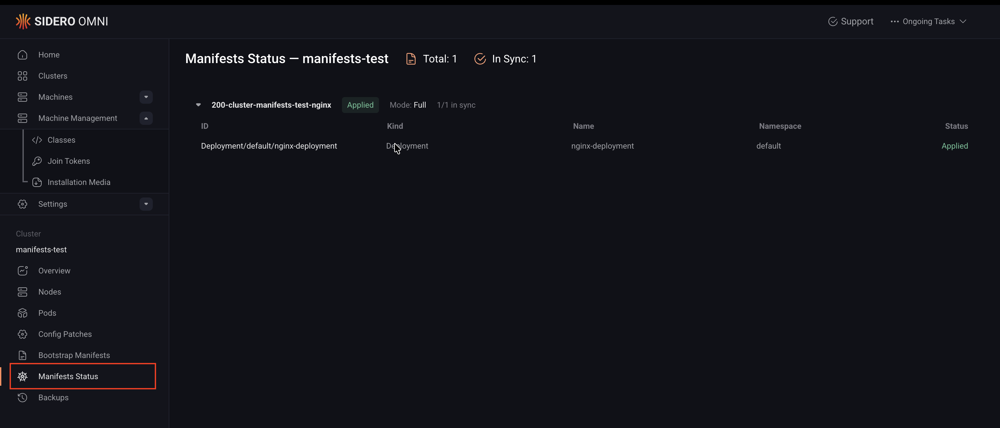

Omni's manifest sync feature lets you define Kubernetes workloads directly inside a [cluster template](../reference/cluster-templates).
When you apply a cluster template with manifests, Omni stores the manifest data in its state and synchronizes it to the cluster once the Kubernetes API is available and the cluster is healthy.

This is useful for bootstrapping workloads like Argo CD, custom CNI, or any other application you want running immediately after a cluster is created.

## Prerequisites

Before you get started, you must have the following:

- An Omni account with permission to manage clusters.
- `omnictl` installed and configured. See [Install and configure omnictl](../getting-started/install-and-configure-omnictl).

## How manifest sync works

Omni pushes manifest data to its internal state and applies it to the cluster asynchronously.
Omni waits until the Kubernetes API is available and the cluster is healthy before attempting to apply manifests.
If a manifest fails to apply due to a transient error, Omni retries continuously until it succeeds.
If a manifest contains a configuration error (for example, an invalid field), Omni reports the error in the `ClusterKubernetesManifestsStatus` resource and keeps retrying.

### Sync modes

Manifest sync supports two operation modes:

- `one-time`: The manifest is applied once. After a successful apply, Omni does not track or re-apply changes to the manifest. Use this for tools that manage themselves after bootstrapping, like Argo CD.
- `full`: Omni continuously syncs the manifest. Any change to the manifest in the cluster template is applied to the cluster. This is similar to how a GitOps controller reconciles state.

## Add manifests to a cluster template

Manifests are defined under the `manifests` field of the [`Cluster` document](../reference/cluster-templates#cluster) in a cluster template.
Each manifest entry requires a `name`, a `mode`, and either an `inline` list of Kubernetes resources or a `file` path to an external YAML file.

### Inline manifest

Use `inline` to embed Kubernetes resource definitions directly in the cluster template.
The `inline` field accepts a list of standard Kubernetes manifests.
All standard Kubernetes fields are supported and are forwarded to the Kubernetes client without modification.

```yaml
kind: Cluster
name: manifests
kubernetes:
  version: v1.35.0
  manifests:
  - name: nginx
    mode: full
    inline:
      - apiVersion: apps/v1
        kind: Deployment
        metadata:
          name: nginx-deployment
          namespace: default
        spec:
          selector:
            matchLabels:
              app: nginx
          replicas: 2
          template:
            metadata:
              labels:
                app: nginx
            spec:
              containers:
                - name: nginx
                  image: nginx:1.28.0
                  ports:
                    - containerPort: 80
```

### External file manifest

Use `file` to reference an external YAML file.
The file path is relative to the working directory when running `omnictl`.

Replace `<path-to-manifest-file.yaml>` with the actual path to your manifest file.

```yaml
kind: Cluster
name: manifests
kubernetes:
  version: v1.35.0
  manifests:
  - name: another
    file: <path-to-manifest-file.yaml>
    mode: full
```

### Multiple manifests

You can define multiple manifest entries under the `manifests` field.
Each entry is applied independently and can use a different mode.

Replace `<path-to-manifest-file.yaml>` with the actual path to your manifest file.

```yaml
kind: Cluster
name: manifests
kubernetes:
  version: v1.35.0
  manifests:
  - name: nginx
    mode: full
    inline:
      - apiVersion: apps/v1
        kind: Deployment
        metadata:
          name: nginx-deployment
          namespace: default
        spec:
          selector:
            matchLabels:
              app: nginx
          replicas: 2
          template:
            metadata:
              labels:
                app: nginx
            spec:
              containers:
                - name: nginx
                  image: nginx:1.28.0
                  ports:
                    - containerPort: 80
  - name: another
    file: <path-to-manifest-file.yaml>
    mode: full
```

A single manifest entry can also contain multiple Kubernetes resource definitions.
This is useful when a service ships multiple resources (for example, a Namespace, Deployment, and Service) as a single manifest.

## Apply the cluster template

Once the cluster template is updated with manifests, apply it using `omnictl`:

```bash
omnictl cluster template sync --file clustermanifests.yaml
```

Omni stores the manifest definitions and begins synchronizing them to the cluster.
If the cluster is not yet healthy, Omni waits until the Kubernetes API is available before applying.

### Verify manifest sync status

You can inspect a cluster's manifest sync status from either the CLI or the Omni UI.

<Tabs>
<Tab title="CLI">
Use `omnictl` to read the `ClusterKubernetesManifestsStatus` resource:

```bash
omnictl get clusterkubernetesmanifestsstatuses <cluster-name>
```

The output shows the state of each manifest.
</Tab>
<Tab title="Omni UI">
Open the cluster you want to inspect to bring up its cluster page, then select the **Manifest Status** tab in the sidebar. Choose any manifest to view its status:


</Tab>
</Tabs>

A manifest that fails to apply because of a configuration error — such as a mistyped field name or an invalid API version — reports that error in its status.

## Limitations

Here are some limitations with using the Kubernetes manifest sync feature:

- Helm and Kustomize are not supported at this time. Only raw Kubernetes manifests can be applied.
- Manifest sync does not support fetching manifests from remote URLs (for example, `https://`).
- The Omni UI displays the sync status of synced manifests, but does not allow editing or managing them from the UI.
