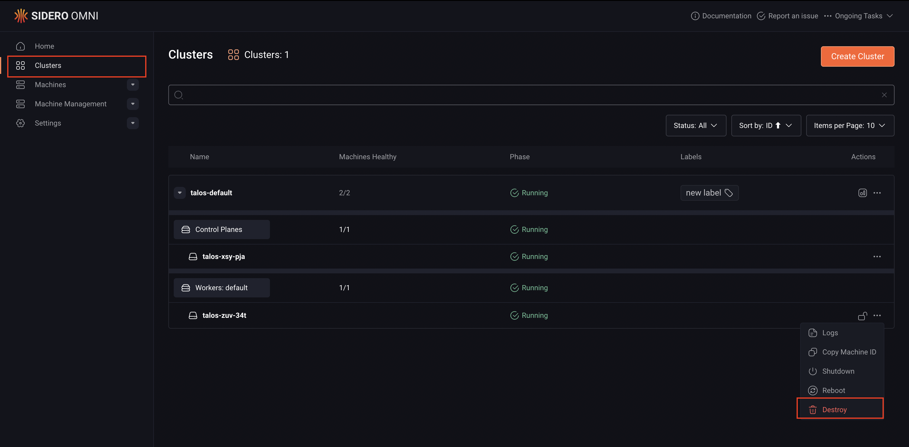

This document describes how machine removal and reset are handled in Omni. It explains the different behaviors that occur depending on whether Omni can communicate with a machine at the time it is removed, and clarifies the distinction between resetting machine state and wiping disks.

## How Omni wipes a machine

When a machine is removed from a cluster, Omni attempts to reset it before detaching it. This reset wipes the Talos state partition, removing the machine configuration and cluster credentials. The machine then reboots into maintenance mode.

If Omni cannot communicate with the machine, this reset step is skipped. In that case, the machine may still retain cluster state but is no longer manageable by Omni, and recovery must be performed outside of Omni.

These two paths are commonly referred to as graceful and non-graceful removal.

### Graceful removal (recommended)

A graceful removal occurs when a machine is removed from a cluster while Omni can still communicate with it. This allows Omni to reset the machine as part of the removal process.

Although this flow is sometimes described as “graceful scale down,” no automatic scaling is involved. The term simply describes a controlled removal where Omni performs cleanup before detaching the machine.

When this flow is used, Omni calls the Talos reset API on the node, wipes the state partition, and reboots the machine. After reboot, the machine enters maintenance mode and appears in Omni as an available, unassigned machine. At this point, the machine is no longer configured with a machine configuration, but it remains connected and managed by Omni. A machine without a cluster machine configuration still retains configuration from kernel arguments and system extensions.

### How to perform a graceful removal

To remove a machine gracefully using the Omni UI:

1. Navigate to the **Clusters** view and open the cluster that contains the machine.

2. Locate the machine within the cluster’s machine list.
3. Open the machine actions menu and select **Destroy**.
4. Confirm the action.

When this action is initiated from within the cluster context, Omni treats it as a cluster-level removal rather than a hard deletion. As long as the machine is reachable, Omni resets it before removing it from the cluster.

After the operation completes, the machine reboots into maintenance mode and remains managed by Omni as an available machine. It must be added to a cluster before Omni configures it again.

### Non-graceful removal

A non-graceful removal occurs when Omni is unable to reset the machine before it is removed. This typically happens when the machine is unreachable. When a machine is part of a cluster but unreachable Omni will not be able to delete the cluster until the machine is connected to Omni or forcefully deleted from the Machines page.

In this case, Omni drops its record of the machine without performing a reset. The machine itself may still believe it is part of a cluster and may retain cluster configuration and certificates, but Omni no longer has the credentials required to communicate with it.

Because Omni cannot talk to the machine, it cannot recover it automatically. The machine must be reset outside of Omni to remove the existing state.

Recovery usually involves wiping the Talos state partition through out-of-band mechanisms. The easiest way to reset a machine is to boot from Talos installation media and select **Reset system disk** from the boot menu. Once the state partition is wiped and the machine reboots, it returns to maintenance mode and can be discovered by Omni again.

## Disk wipe vs. state reset

Resetting a machine in Omni wipes the Talos state partition, which removes cluster configuration and credentials. This is sufficient to return the machine to maintenance mode and make it eligible for reuse.

Disk wiping is a separate concern. If a machine used additional disks for workloads storage, those disks are not automatically erased when the state partition is reset. Any data stored on user disks may remain intact.

Whether disks need to be wiped depends on the intended reuse of the machine. In many cases, returning the machine to maintenance mode is enough. If the machine is being repurposed and existing data must be removed, disks can be wiped after the machine has been successfully reset and is reachable again.
