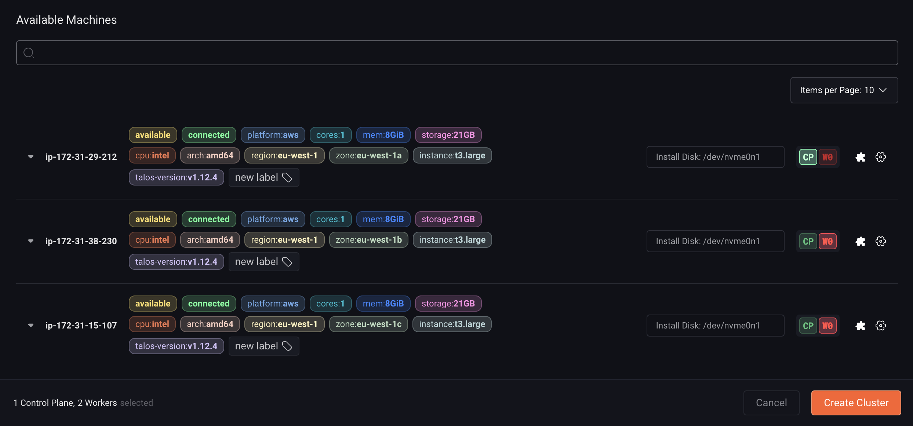

This guide shows you how to create a cluster from registered machines.

<Tabs>
  <Tab title="UI">
    First, click the "Clusters" section button in the sidebar. Next, click the "Create Cluster" button.

    You may name the cluster, as well specify the version of Talos Linux and Kubernetes that the cluster should be created with. You may also enable optional cluster features, such as [Disk Encryption](../security-and-authentication/omni-kms-disk-encryption) or [Workload Service Proxying](../cluster-management/expose-an-http-service-from-a-cluster).

    <Info>
      Note that disk encryption can only be enabled during cluster creation. Enabling this checkbox will configure the cluster to use Omni as a [Key Management Server](../security-and-authentication/omni-kms-disk-encryption), and local disk access will not be possible unless the machine is connected to Omni.

      It is not possible to rename a cluster after it has been created.
    </Info>

    From the Available Machines list, select the role (CP for control plane, WX (where X is a number) for workers) for each machine you would like to be a member of the cluster. Optionally, choose the install disk for the OS from the dropdown menu for each machine. 

    

    Finally, click “Create Cluster”

    <Info>For HA clusters, 3 control plane nodes are required.</Info>

  </Tab>

  <Tab title="CLI with manual machine allocation">
  
    Create a file called `cluster.yaml` with the following content:

    ```yaml
    kind: Cluster
    name: example
    kubernetes:
      version: v1.27.0
    talos:
      version: v1.5.2
    ---
    kind: ControlPlane
    machines:
      - <control plane machine UUID>
    ---
    kind: Workers
    machines:
      - <worker machine UUID>
    ---
    kind: Machine
    name: <control plane machine UUID>
    install:
      disk: /dev/<disk>
    ---
    kind: Machine
    name: <worker machine UUID>
    install:
      disk: /dev/<disk>
    ```

    > If enabling optional features such as disk encryption, add them to the Cluster document e.g.:

    ```yaml
    kind: Cluster
    name: example
    kubernetes:
      version: v1.27.0
    talos:
      version: v1.5.2
    features:
      diskEncryption: true
    ```

   <Info>Be sure to update the UUIDs and install disks with the UUIDs and disks of the machines in your account.</Info>

    Now, validate the document:

    ```bash
    omnictl cluster template validate -f cluster.yaml
    ```

    Create the cluster:

    ```bash
    omnictl cluster template sync -f cluster.yaml --verbose
    ```

    Finally, wait for the cluster to be up:

    ```bash
    omnictl cluster template status -f cluster.yaml
    ```

  </Tab>

  <Tab title="CLI with machine classes">

    Create a file called `cluster.yaml` with the following content:

    ```yaml
    kind: Cluster
    name: example
    kubernetes:
      version: v1.28.0
    talos:
      version: v1.5.4
    ---
    kind: ControlPlane
    machineClass:
      name: control-planes
      size: 1
    ---
    kind: Workers
    machineClass:
      name: workers
      size: 1
    ---
    kind: Workers
    name: secondary
    machineClass:
      name: secondary-workers
      size: unlimited
    ```

    Be sure to create machine classes `control-planes`, `workers` and `secondary-workers` beforehand. See [machine classes how-to](../omni-cluster-setup/create-a-machine-class).

    Now, validate the document:

    ```bash
    omnictl cluster template validate -f cluster.yaml
    ```

    Create the cluster:

    ```bash
    omnictl cluster template sync -f cluster.yaml --verbose
    ```

    Finally, wait for the cluster to be up:

    ```bash
    omnictl cluster template status -f cluster.yaml
    ```
  
  </Tab>

</Tabs>

