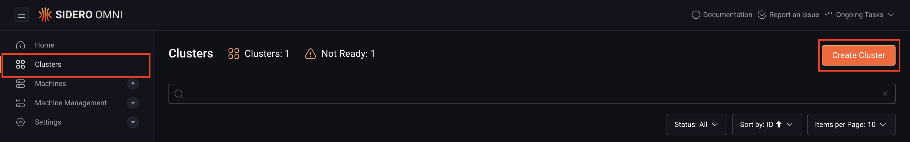
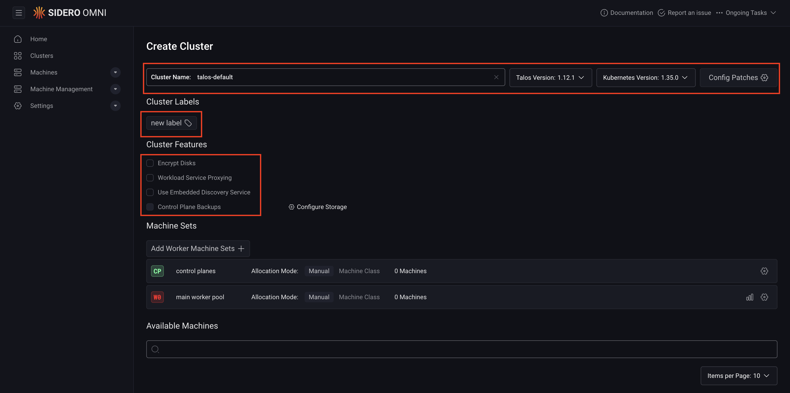
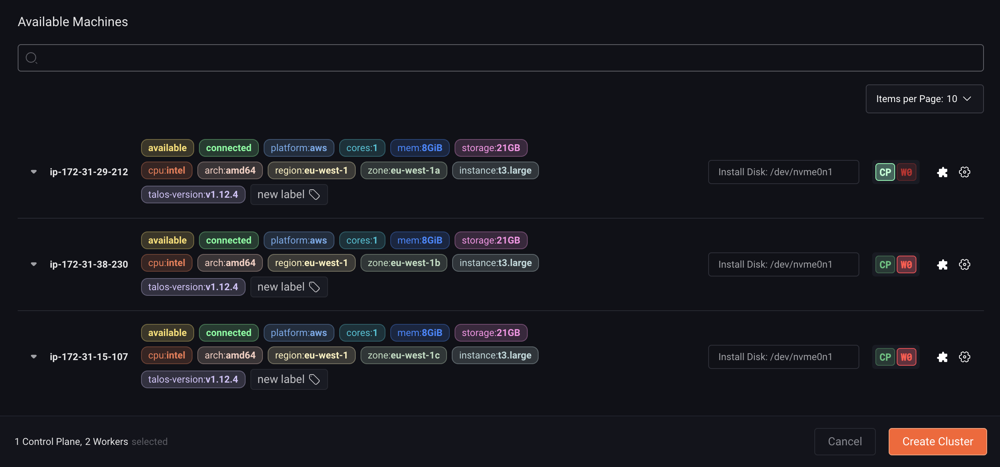
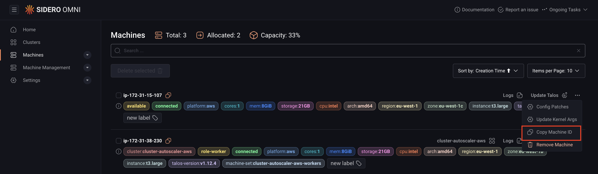

This guide shows you how to create a cluster from registered machines.

## Prerequisities

To follow this guide you must have machines registered to your Omni instance. Refer to the [Register machines with Omni](../omni-cluster-setup/registering-machines/register-machines-with-omni) section to understand how to register your specific machine to Omni.

You can create a cluster in Omni using this registered machines through the Omni UI, or using cluster templates through manual or dynamic machine allocation.

<Tabs>
  <Tab title="UI">

    To create a cluster in Omni using the UI:

    ### Step 1: Open the cluster creation form

    Select the **Clusters** tab in the sidebar, then click **Create Cluster**.

    

    ### Step 2: Fill in the cluster details

    - **Name**: Give your cluster a unique name. Note that a cluster cannot be renamed after it is created.
    - **Talos version**: Select the version of Talos Linux to run on your cluster.
    - **Kubernetes version**: Select the Kubernetes version for your cluster.
    - **Labels**: Optionally add labels to your cluster.
    - **Features**: Optionally enable additional features such as [disk encryption](../security-and-authentication/omni-kms-disk-encryption) or [workload service proxying](../cluster-management/expose-an-http-service-from-a-cluster).

    

    <Info>
    Disk encryption can only be enabled at cluster creation time and cannot be turned on afterwards. Enabling it configures Omni as the cluster's [Key Management Server](../security-and-authentication/omni-kms-disk-encryption), which means local disk access will not be possible unless the machine is connected to Omni.
    </Info>

    ### Step 3: Assign machines

    From the **Available Machines** list, assign a role to each machine you want in the cluster:

    - **CP** — control plane
    - **WO** — worker

    ### Step 4: (Optional) Select an install disk

    Use the dropdown next to each machine to select the OS install disk.

    

    ### Step 5: Create the cluster

    Click **Create Cluster** to provision your cluster.

    ### Step 6: (Optional) Export the cluster template

    If you want to manage the cluster using cluster templates later, you can export the template from an existing cluster instead of creating it manually.

    Run this command to export the cluster into a cluster template:

    ```bash
    omnictl cluster template export --cluster <CLUSTER_NAME> -o cluster.yaml
    ```

    For more details, see the [Export a cluster template documentation](../cluster-management/export-a-cluster-template-from-a-cluster-created-in-the-ui).

  </Tab>

<Tab title="CLI through manual machine allocation">

  When creating a cluster using cluster templates with manually allocated machines, first identify the unique ID of each machine so the template can reference them.

  ### Step 1: Get the machine UUID

  For each machine you want to include in the cluster:

  1. Select the **Machines** tab.
  2. Click the **...** button on the machine.
  3. Click **Copy Machine ID**.

  Repeat this for each control plane and worker machine you plan to use.

  

  ### Step 2: Create a cluster template file

  A [cluster template](../reference/cluster-templates) is made up of multiple documents separated by `---`. Each document defines a different aspect of your cluster, the cluster itself, control plane nodes, worker nodes, and per-machine install settings.

  Create a file called `cluster.yaml` and populate it with the following, replacing each placeholder with your own values:

  ```yaml
  kind: Cluster
  name: example
  kubernetes:
    version: <kubernetes-version>
  talos:
    version: <talos-version>
  ---
  kind: ControlPlane
  machines:
    - <control-plane-machine-uuid-1>
  ---
  kind: Workers
  machines:
    - <worker-machine-uuid>
  ---
  kind: Machine
  name: <control-plane-machine-uuid>
  install:
    disk: /dev/<disk>
  ---
  kind: Machine
  name: <worker-machine-uuid>
  install:
    disk: /dev/<disk>
  ```

    - `<kubernetes-version>`: The Kubernetes version for your cluster.
    - `<talos-version>`: The Talos Linux version for your cluster.
    - `<control-plane-machine-uuid>`: The UUID of the control plane machine.
    - `<worker-machine-uuid>`: The UUID of the worker machine.
    - `<disk>`: The name of the install disk on each machine (e.g. `sda`).

  ### Step 3: (Optional) Enable additional features

  To enable features such as disk encryption or workload proxying, add a `features` block to the `Cluster` document:

  ```yaml
  kind: Cluster
  name: example
  kubernetes:
    version: <kubernetes-version>
  talos:
    version: <talos-version>
  features:
    enableWorkloadProxy: true
    diskEncryption: true
  ```

  You can also [patch your cluster template](../reference/cluster-templates#patches) to apply further configuration changes. See the [cluster templates reference](../reference/cluster-templates) for the full list of available options.

  ### Step 4: Validate the cluster template

  ```bash
  omnictl cluster template validate -f cluster.yaml
  ```

  ### Step 5: Create the cluster

  ```bash
  omnictl cluster template sync -f cluster.yaml --verbose
  ```

  ### Step 6: Wait for the cluster to be ready

  ```bash
  omnictl cluster template status -f cluster.yaml
  ```
  </Tab>

  <Tab title="CLI through dynamic machine allocation">

    Dynamic allocation lets you create a cluster without knowing individual machine UUIDs in advance, useful in autoscaling scenarios where machines may not yet exist when you define the cluster. Instead of assigning machines directly, you define machine classes that group machines by label, and the cluster automatically draws its control plane and worker nodes from those classes.

    Before proceeding, make sure you have at least one machine class set up. See the [machine class documentation](../omni-cluster-setup/create-a-machine-class) for instructions.

    ### Step 1: Create a cluster template file

    Create a file called `cluster.yaml` with the following content, replacing each placeholder with your own values:
    ```yaml
    kind: Cluster
    name: example
    kubernetes:
      version: <kubernetes-version>
    talos:
      version: <talos-version>
    ---
    kind: ControlPlane
    machineClass:
      name: <control-plane-machine-class>
      size: <number-of-control-planes>
    ---
    kind: Workers
    machineClass:
      name: <worker-machine-class>
      size: <number-of-worker-machines>
    ```

    - `<kubernetes-version>`: The Kubernetes version for your cluster.
    - `<talos-version>`: The Talos Linux version for your cluster.
    - `<control-plane-machine-class>`: The machine class whose members will serve as control plane nodes.
    - `<number-of-control-planes>`: The number of control plane nodes. Use an integer (e.g. `3`) or `unlimited` to automatically include every machine in the class. For high availability without sacrificing performance, three control planes is recommended.
    - `<worker-machine-class>`: The machine class whose members will serve as worker nodes.
    - `<number-of-worker-machines>`: The number of worker nodes. Accepts any integer or `unlimited`.

    ### Step 2: Validate the cluster template

    ```bash
    omnictl cluster template validate -f cluster.yaml
    ```

    ### Step 3: Create the cluster

    ```bash
    omnictl cluster template sync -f cluster.yaml --verbose
    ```

    ### Step 4: Wait for the cluster to be ready

    ```bash
    omnictl cluster template status -f cluster.yaml
    ```
  </Tab>
</Tabs>

