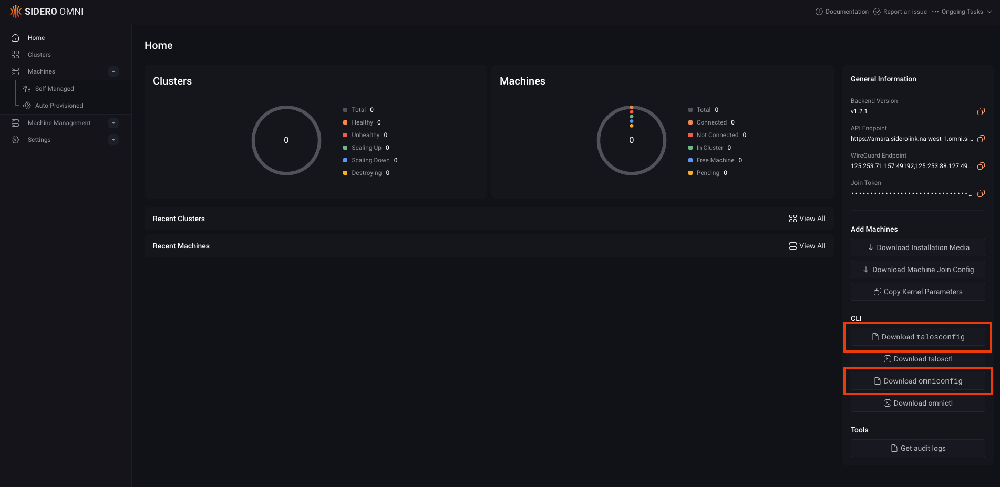
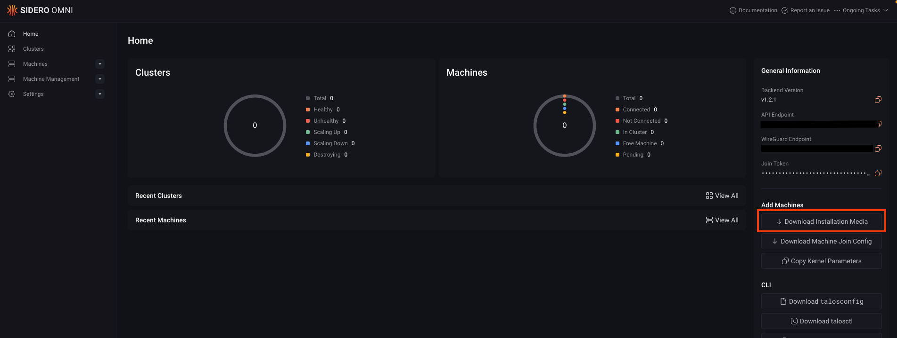
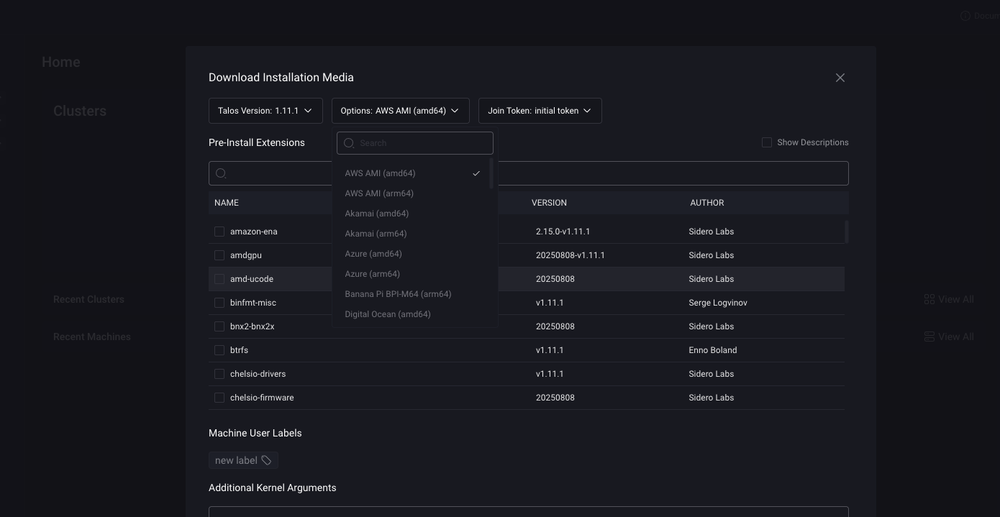
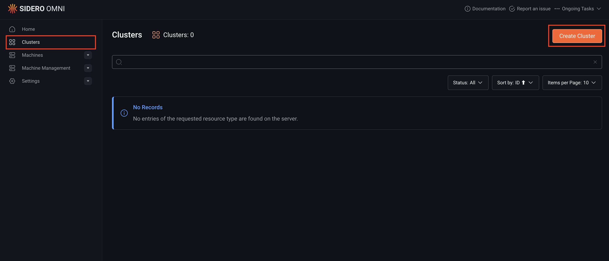
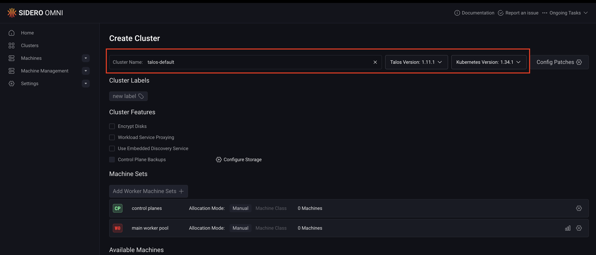
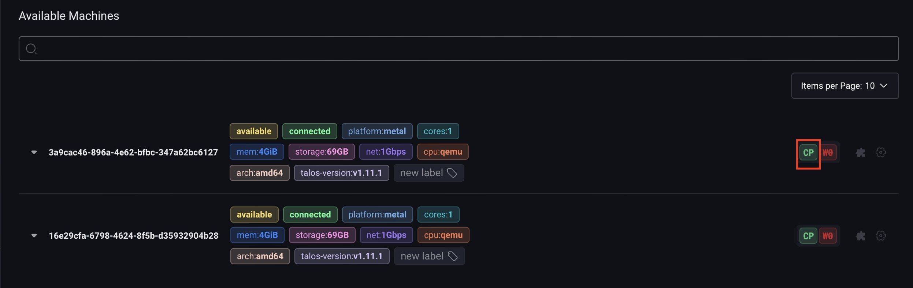
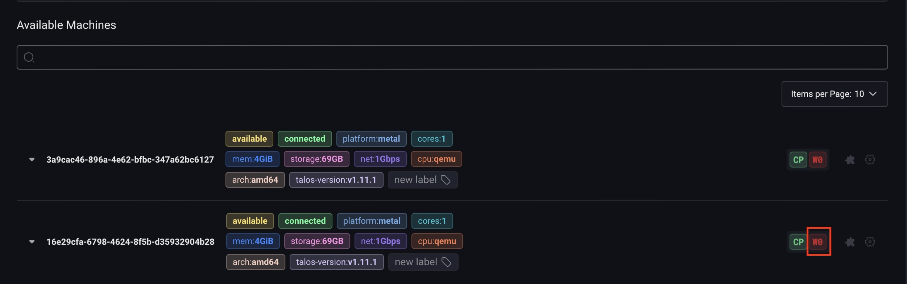
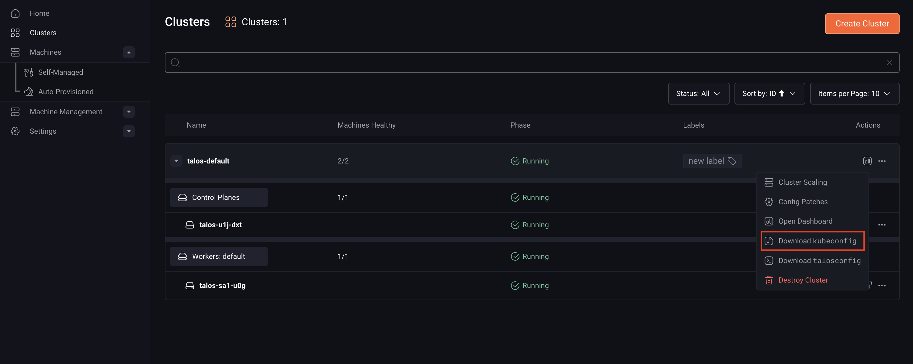

import { version } from '/snippets/custom-variables.mdx';

This guide walks you through creating a high-availability Kubernetes cluster managed by [Omni](https://www.siderolabs.com/omni/) using [Talos Linux](https://talos.dev).  
While the example uses UTM/QEMU for local virtualization, the same process applies to bare metal machines, cloud instances, or edge devices.

If you prefer a visual walkthrough, you can follow this short video tutorial:

<iframe 
  className="w-full aspect-video rounded-xl"
  src="https://www.youtube.com/embed/0gPF0_fLins?si=GxvIplSRlN0v68qs" 
  title="YouTube video player" 
  frameborder="0" 
  allow="accelerometer; autoplay; clipboard-write; encrypted-media; gyroscope; picture-in-picture; web-share" referrerpolicy="strict-origin-when-cross-origin" 
  allowfullscreen>  
</iframe>

## Prerequisites

You must have the following to create a cluster with Omni:

- **Network access**: Your machines must have outbound internet access and be able to reach the **WireGuard endpoint** shown on your Omni Home panel.  

    This endpoint lists an IP address and port (e.g., `199.99.99.100:10001`) that nodes connect to.

    Machines need to reach that address over:
    - **UDP** on the specified port (for WireGuard)
    - **TCP** on port `443` (for Omni communication)


- **Virtual or physical machines**: You can use any virtualization platform that supports booting from an ISO image, for example, UTM, Proxmox, or VMware Fusion.

  Alternatively, you can deploy on cloud platforms or physical hardware. Bare metal systems can boot using a CD, USB drive, virtual media, or PXE.

- **CLI tools**: To work effectively with Omni, you’ll need the CLI tools `omnictl`, `talosctl`, and `kubelogin`. Download `talosctl`, `kubectl`, `kubectl-oidc-login`, and `omnictl` for macOS and Linux systems by running this command:

  ```bash
  brew install siderolabs/tap/sidero-tools
  ```

  For manual and Windows installation, refer to the <a href={`../../talos/${version}/getting-started/talosctl#alternative-install`}>alternate installation methods</a> in the Talos documentation.

- `talosconfig` **and** `omniconfig` **files**: Download the `talosconfig` and `omniconfig` configuration files from your Omni dashboard.

  These files let you manage your Talos nodes and connect to Omni from your local environment.

  

  Alternatively, you can download the `talosconfig` file from the CLI by running the following command. 
  Replace the `<cluster-name>` placeholder with your cluster’s name:

  ```bash
  omnictl talosconfig --cluster <cluster-name>
  ```

  Once you’ve set up these prerequisites, you can move on to creating your cluster with Omni.

## Step 1: Download Installation Media

Omni is a Bring Your Own Machine platform. You only need to boot a machine from a Talos image configured to connect to your Omni instance.

You can download this Omni image from either the Omni UI or the CLI:

<Tabs>
<Tab title="Omni UI">
To download the Omni image from the Omni dashboard:

1. Log in to your Omni dashboard.
2. Click the **Download Installation Media** button to open its modal.



3. Choose the appropriate image for your machine.



4. Click **Download** to begin downloading the Omni image.

</Tab>
<Tab title="CLI">

Run this command to download the installation media:

```bash
omnictl download iso
```
</Tab>
</Tabs>

> **Note**: Some platforms (like cloud providers) require additional steps to import the image, for example, uploading to an S3 bucket or creating a VM image. Follow the platform-specific instructions if prompted.

## Step 2: Boot your machines

Boot each machine you want to add to the cluster using the Omni image you downloaded in Step 1.

After the machines have booted, they’ll appear in the **Machines** section.

Depending on your environment, you can use the following methods:

<Tabs>
<Tab title="Local (QEMU / UTM)">
To create temporary VMs on your local system (requires Talosctl v1.12+), replace the `$COPY_FROM_OMNI` placeholder with the API endpoint from your Omni dashboard, then run:

```bash
talosctl cluster create qemu --omni-api-endpoint $COPY_FROM_OMNI
```
This command boots virtual machines locally and connects them to your Omni instance.
</Tab>
<Tab title="AWS EC2">
If you have `omnictl` configured, you can create EC2 instances directly:

```bash
aws ec2 run-instances \
  --image-id $(aws ec2 describe-images --owners 540036508848 \
  --filters "Name=architecture,Values=x86_64" \
  --query "Images[0].ImageId" --output text) \
  --count 3 \
  --instance-type t3.small \
  --associate-public-ip-address \
  --user-data "$(omnictl jointoken machine-config)"
```

This launches three EC2 instances that automatically join your Omni cluster.

</Tab>
<Tab title="PXE Boot">
To PXE boot physical machines:

```bash
docker run --rm --network host \
  ghcr.io/siderolabs/booter:v0.3.0 \
  --extra-kernel-args "$(omnictl jointoken kernel-args)"
```

This runs the SideroLabs Booter utility, which provisions PXE-booted machines using your Omni join token.
</Tab>
</Tabs>

## Step 3: Create Cluster

Now that your machines are visible in Omni, you can create your cluster by following these steps:

1. In the Omni sidebar, go to **Clusters** → **Create Cluster**.

    

2. Enter a cluster name and select the Talos Linux and Kubernetes versions.

    

3. (Optional) Add configuration patches. See [Create a Patch for Cluster Machines](../omni-cluster-setup/create-a-patch-for-cluster-machines) to learn how to create and apply patches.

4. Under the **Available Machines** section, select at least one machine as a control plane by clicking **CP**.
    
  <Note>For high availability, use an odd number of control plane nodes. We suggest using 3 nodes.</Note>

    

5. Select one or more worker machines by clicking **W0**, **W1**, etc.

    

6. Click **Create Cluster**.

You’ll be redirected to the **Cluster Overview** page, where you can monitor the cluster’s creation progress.

## Step 4: Download the `kubeconfig` file

Click the **⋯** button next to your cluster, then select **Download kubeconfig** to download the file.



Alternatively, you can download the `kubeconfig` file from your CLI with this command:

```bash
omnictl kubeconfig --cluster <cluster-name>
```

Replace the `<cluster-name>` placeholder with the name of your cluster.

## Step 5: Merge your configuration

To make `omnictl`, `talosctl`, and `kubectl` automatically detect your cluster configuration, merge each configuration file into its default location:

```bash
# Merge Omni configuration
omnictl config merge $HOME/Downloads/omniconfig.yaml

# Merge Talos configuration
talosctl config merge $HOME/Downloads/talosconfig.yaml

# Merge kubeconfig (combine and flatten)
export KUBECONFIG=~/.kube/config:$HOME/Downloads/talos-default-kubeconfig.yaml
kubectl config view --flatten > ~/.kube/config
```

## Step 6: Access your Kubernetes cluster

Once your cluster is created, you can confirm that your nodes are registered in Kubernetes by running:

```bash
kubectl get nodes
```

> **Note**: The first time you run `kubectl`, a browser window will open prompting you to sign in with your identity provider (Google or GitHub).
> 
> If you see the error `error: unknown command "oidc-login"`, ensure you’ve installed the kubectl-oidc-login plugin as described in the [prerequisites section](#install-cli-tools).

## Explore Omni

Congratulations, you have successfully created a Talos Linux cluster with Omni!

From here, you can explore what else Omni can do, such as:

* [etcd backup and restores](../cluster-management/etcd-backups)
* [Omni cluster upgrades](../cluster-management/upgrading-clusters)
* [Expose an HTTP service from a cluster](../cluster-management/expose-an-http-service-from-a-cluster)
* [Scale your clusters up or down](../cluster-management/scale-your-cluster/scale-a-cluster-up-or-down)
* [Machine classes](../omni-cluster-setup/create-a-machine-class)
* [Cluster templates](../reference/cluster-templates)
* [Infrastructure providers](../infrastructure-and-extensions/infrastructure-providers)

## Example: Deploy a Kubernetes workload on your Omni cluster

You can find an example of a more advanced managed cluster, complete with a monitoring stack and application management, in our [community contrib repo](https://github.com/siderolabs/contrib/blob/main/examples/omni).

This example includes components such as:

* [Cilium](https://cilium.io/get-started/) for cluster networking
* [Hubble](https://docs.cilium.io/en/stable/gettingstarted/hubble\_intro/) for network observability
* [ArgoCD](https://argo-cd.readthedocs.io/en/stable/) for application management
* [Rook/Ceph](https://rook.io/docs/rook/latest-release/Getting-Started/intro/) for persistent storage
* [Prometheus](https://prometheus.io/docs/introduction/overview/) for metrics collection and alerting
* [Grafana](https://grafana.com/docs/grafana/latest/introduction/) for metrics visualization
