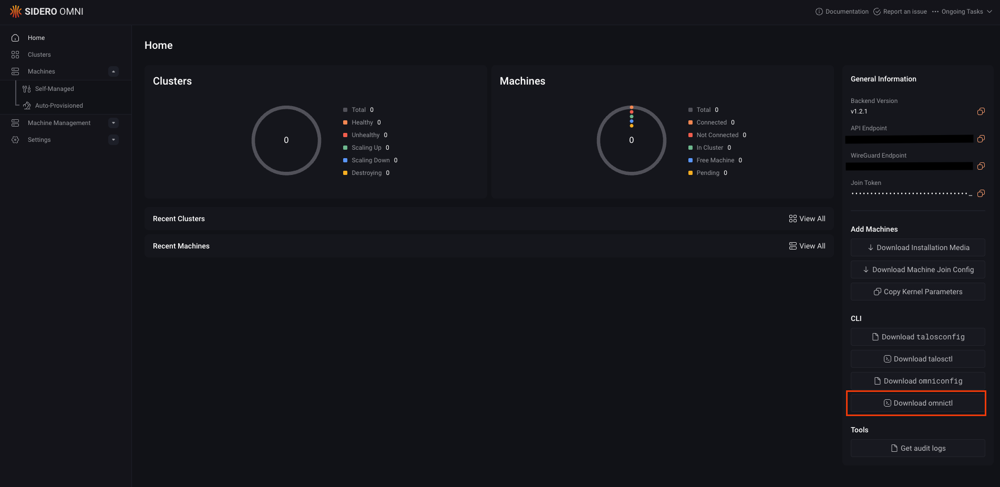
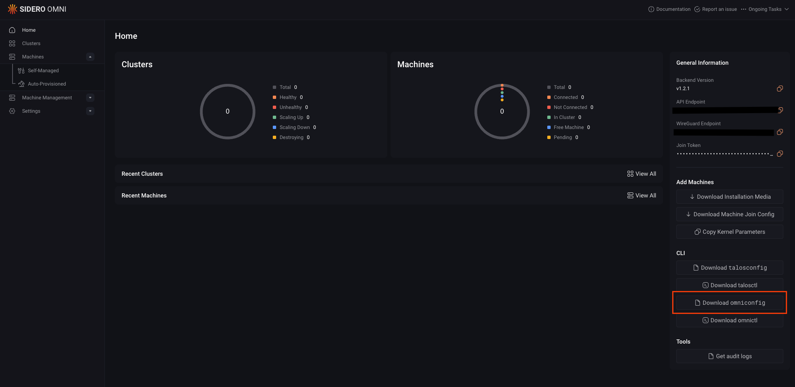

`omnictl` is the command-line tool for Omni. It lets you authenticate, manage, and interact with Talos-based Kubernetes clusters through Omni’s centralized API.  

Follow the steps below to install and configure `omnictl` for your operating system.

## Step 1: Install `omnictl`

You need to install `omnictl` to use Omni from your terminal. 

There are two main installation options, depending on your setup:

* macOS and Linux (recommended)
* Manual installation

### macOS and Linux (recommended)

On macOS and Linux, the easiest way to install `omnictl` is using [Homebrew](https://brew.sh/).

This command installs `omnictl` and keeps it up to date. It also installs `talosctl` and the `kubectl oidc-login` plugin.

```
brew install siderolabs/tap/sidero-tools
```

### Manual installation

If you prefer not to use Homebrew, you can install `omnictl` manually by downloading the binary from the Omni dashboard or from GitHub releases.

<Tabs>
<Tab title="Omni UI">
Navigate to your Omni dashboard and download the binary for your platform.


</Tab>
<Tab title="GitHub Releases">
Visit the [Omni releases page](https://github.com/siderolabs/omni/releases) to download the latest version of `omnictl`.

Alternatively, you can download the latest release using `curl`:

```bash
curl -LO "https://github.com/siderolabs/omni/releases/latest/download/omnictl-$(uname -s | tr '[:upper:]' '[:lower:]')-$(uname -m | sed 's/x86_64/amd64/; s/aarch64/arm64/')"
```
</Tab>
</Tabs>

The downloaded file is named based on your operating system and architecture, for example `omnictl-linux-amd64` or `omnictl-darwin-arm64`.

After downloading the binary, rename it, make it executable, and move it into a directory on your system `PATH`.

<Tabs>
  <Tab title= "macOs and Linux">
    On macOS and Linux, create a variable that points to the downloaded `omnictl` binary. Replace `<path-to-downloaded-binary>` with the actual path to the file:
    
    ```bash
    export PATH_TO_FILE=<path-to-downloaded-binary>
    ```
   
    Then rename the binary, make it executable, and move it to `/usr/local/bin`:

    ```bash
    mv "$PATH_TO_FILE" omnictl
    chmod +x omnictl
    sudo mv omnictl /usr/local/bin/
    ```
  
  </Tab>
  <Tab title= "Windows">
    On Windows:

    1. Rename the file in File Explorer or PowerShell:
       ```powershell
       Move-Item omnictl-windows-amd64.exe omnictl.exe
       ```
    2. Move the file to a folder that’s in your `PATH`.
    3. Verify your installation:
       ```powershell
       omnictl --version
       ```

  </Tab>
</Tabs>

After completing these steps, you should be able to run `omnictl` from any terminal window.

## Step 2: Configure `omnictl`

Next, configure omnictl by adding your `omniconfig.yaml` file to the default configuration directory.

First, download the `omniconfig.yaml` file from your Omni dashboard to your local machine.



`omnictl` stores its configuration in a standard location depending on your operating system:

- **Linux/macOS**: Follows the [XDG Base Directory Specification](https://specifications.freedesktop.org/basedir-spec/latest/).

- **Windows**: Uses the `%LOCALAPPDATA%` directory.

| OS      | Omniconfig Path                                                                |
| ------- | ------------------------------------------------------------------------------ |
| Linux   | `~/.talos/omni/config`                                                         |
| MacOS   | `~/Library/Application Support/omni/config`                                    |
| Windows | `%USERPROFILE%\.talos\omni\config`, e.g., `C:\Users\myuser\.talos\omni\config` |

Copy the downloaded file to the appropriate location for your operating system:

```bash
cp omniconfig.yaml <LOCATION_FOR_YOUR_OS_ABOVE>
```

If you already have an existing Omni configuration and want to merge the new file into it, run:

```bash
omnictl config merge ./omniconfig.yaml
```

To confirm that the configuration was added successfully, list the available contexts:

<Tabs>
  <Tab title= "Command">

    ```bash
    omnictl config contexts
    ```
  </Tab>
  <Tab title= "Output">

    ```bash
    CURRENT   NAME         URL
              ...
              example      https://example.omni.siderolabs.io/
              ...
    ```
  </Tab>
</Tabs>

## Step 3: Authenticate and verify

The final step is authentication, which connects your local CLI to your Omni account.

Run the following command:

```bash
omnictl get clusters
```

A browser window should open automatically for sign-in. If it does not, print the authentication URL and open it manually:

```bash
BROWSER=echo omnictl get clusters
```

After signing in, your credentials are cached locally, and you can begin managing your clusters with `omnictl`.
