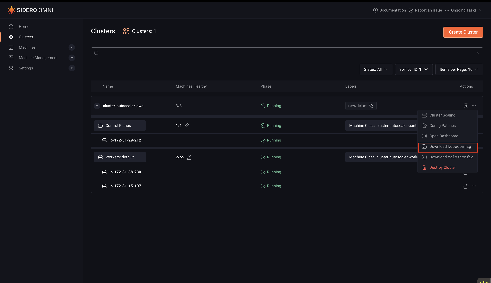
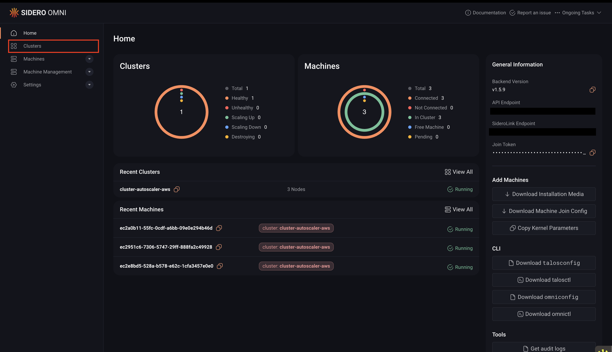

You can use `kubectl` with an Omni-managed cluster the same way you would with any Kubernetes cluster. The main difference is that you must:

- Use the `kubeconfig` file downloaded from Omni
- Install the `oidc-login` plugin for `kubectl`

All `kubectl` requests are routed through the Kubernetes API endpoint created by Omni. Omni validates access using the configured OpenID Connect (OIDC) provider or other authorization mechanism.

This means that possessing a `kubeconfig` file alone does not grant access. The user must also authenticate through Omni’s configured identity provider.

## Prerequisites

Before you begin, you need `omnictl`, `omniconfig`, and the `oidc-login` plugin installed and configured.

**On macOS and Linux**: Install `omnictl` and `oidc-login` with a single command:

```bash
brew install siderolabs/tap/sidero-tools
```

**On Windows or for manual installation**: Follow the
[Install and Configure omnictl](./install-and-configure-omnictl#manual-installation) guide, then install the `oidc-login` plugin separately using the [kubelogin getting started guide](https://github.com/int128/kubelogin#getting-started).

Once installed, follow the [Configure omnictl](./install-and-configure-omnictl#step-2-configure-omnictl) guide to set up your `omniconfig`.

## Step 1: Download the kubeconfig file

You can download the `kubeconfig` file for your cluster using either the Omni UI or the CLI:

<Tabs>
<Tab title="UI">

To download the `kubeconfig` file using the Omni UI:

1. Log in to your Omni account.
2. Click **Clusters** in the sidebar.

3. Select your cluster.
4. Click **Download kubeconfig** in the cluster dashboard.

</Tab>

<Tab title="CLI">

To download the `kubeconfig` file using the CLI, run the following command. Replace `<cluster-name>` with the name of your cluster:

```bash
omnictl kubeconfig --cluster <cluster-name>
```
</Tab>
</Tabs>

## Step 2: Merge your configuration

Merge the downloaded `kubeconfig` with your existing Kubernetes configuration so `kubectl` can detect the cluster automatically:

1. Define the path to the downloaded kubeconfig file:

```bash
DOWNLOADED_KUBECONFIG=<path-to-kubeconfig-file>
```

2. Merge the configuration:

```bash
export KUBECONFIG=~/.kube/config:$DOWNLOADED_KUBECONFIG
kubectl config view --flatten > ~/.kube/config
```

## Step 3: Access the cluster with kubectl

Verify that you have configured `kubectl` correctly by running:

```bash
kubectl get nodes
```

The first time you run a command, a browser window will open and prompt you to authenticate with your identity provider.

Authentication for `omnictl`, `talosctl`, and `kubectl` lasts for 8 hours. After that period, you must authenticate again.

<Note>
If you see the error below, the OIDC plugin is not installed or not available in your PATH:

```bash
error: unknown command "oidc-login" for "kubectl"
Unable to connect to the server
```

Install the `oidc-login` plugin and ensure it is available in your shell environment.
</Note>

## Switch between authenticated users

If you have multiple contexts in your kubeconfig that authenticate to the same cluster within the same Omni instance, switching between those contexts does not change the authenticated user.

This is a [known limitation](https://github.com/int128/kubelogin/issues/29) of the OIDC-based login used by `kubelogin`. 

The plugin reuses the existing authentication token that is cached for the cluster, so the previously authenticated user remains active.

To authenticate as a different user, you must first clear the authentication cache. 
Run one of the following commands:

```bash
kubectl oidc-login clean
```

**or**

```bash
rm -rf "${KUBECACHEDIR:-$HOME/.kube/cache}/oidc-login"
```

After clearing the cache, run a `kubectl` command again. This will trigger the OIDC login flow, where you can authenticate as a different user using the Switch User option.

## Using OIDC authentication over SSH

If you need to run kubectl on a remote host over SSH, you can authenticate using one of the following methods:

* Download a kubeconfig that uses keyboard authentication
* Tunnel the local authentication ports over SSH

### Option 1: Download kubeconfig using keyboard authentication

This method avoids opening a browser automatically.

First ensure that `omnictl` and your Omni configuration are installed.

Then run:

```bash
omnictl kubeconfig --cluster <CLUSTER_NAME> --grant-type=authcode-keyboard
```

The configuration will be merged with the file defined in the KUBECONFIG environment variable.

When authentication is required, the command prints a login URL and prompts for a one-time code:

```
Please visit the following URL in your browser: https://<endpoint>
Enter code:
```

Open the URL in your browser, sign in to Omni, and copy the provided code into the terminal.

### Option 2: Use SSH port forwarding

You can also forward the authentication ports used by `oidc-login` over SSH.

Run the following command when connecting to the host:

```bash
ssh -L 8000:localhost:8000 -L 18000:localhost:18000 $HOST
```

This command creates a tunnel for the default ports used by oidc-login.

You can keep this connection open in a separate terminal while authenticating.

#### Automatically enable SSH port forwarding

To automatically forward these ports when connecting to a host, add the following configuration to your `~/.ssh/config` file:

```
Host myhost
  LocalForward 8000 127.0.0.1:8000
  LocalForward 18000 127.0.0.1:18000
```

#### Disable automatic browser opening

You also need to disable automatic browser opening. Otherwise, `oidc-login` may attempt to open a browser on the SSH host, or fail if a browser is not installed.

To disable this behavior, add `--skip-open-browser` to the oidc-login arguments in your `$KUBECONFIG` file:

```yaml
args:
  - oidc-login
  - get-token
  - --oidc-issuer-url=https://$YOUR_ENDPOINT.omni.siderolabs.io/oidc
  - --oidc-client-id=native
  - --oidc-extra-scope=cluster:not-eks
  - --skip-open-browser
command: kubectl
env: null
```
