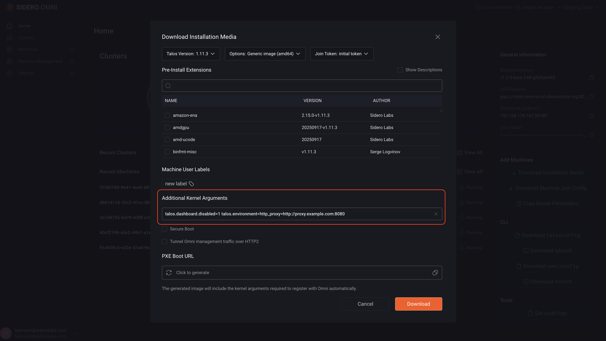
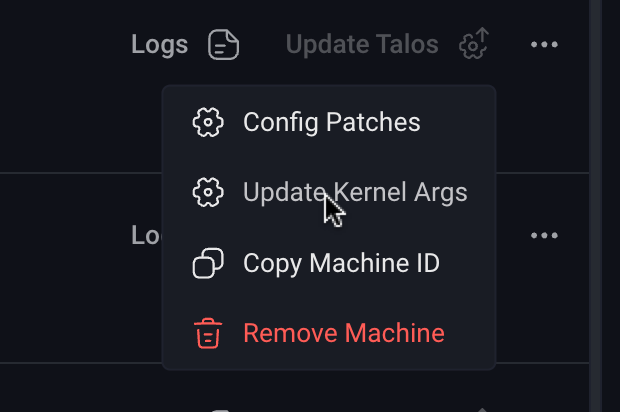

You can add extra kernel arguments to Talos when creating the installation media, or modify them later on existing machines.

<Note>
  Some kernel arguments are added automatically by Omni (for example, the SideroLink arguments), while others are provided by Talos.

  These automatically added arguments are **not user-editable** and modifying them is **not supported**.

  This document describes how to modify _additional_ kernel arguments only.
</Note>

## Add additional kernel arguments during installation media creation

On the overview page, click **Download installation media** on the right.

Add the kernel arguments you want to pass to Talos Linux in the **Additional kernel arguments** field:



Click **Download**.

When a machine boots from that installation media, it includes the additional kernel arguments in its kernel command line.

If the additional arguments are not empty, Omni creates a `KernelArgs` resource for that machine.
This resource can be viewed and modified later to update the kernel arguments.

For example:

```bash
omnictl get kernelargs $MACHINE_ID -o yaml
```

Example output:

```yaml
metadata:
  namespace: default
  type: KernelArgs.omni.sidero.dev
  id: $MACHINE_ID
  version: 1
  owner:
  phase: running
  created: 2025-10-29T12:58:17Z
  updated: 2025-10-29T12:58:17Z
spec:
  args:
    - talos.dashboard.disabled=1
    - talos.environment=http_proxy=http://proxy.example.com:8080
```

## Update kernel arguments on existing machines

<Warning>
  Modifying kernel arguments on existing machines triggers an upgrade and reboots the machine.
</Warning>

<Note>
  Some conditions must be met for kernel argument updates to take effect.
  If these conditions are not met, they appear in the `unmetconditions` field of the `KernelArgsStatus` resource and in the UI.
</Note>

<Tabs>
  <Tab title="UI">
    1. Go to the **Machines** tab.

    2. Click the three dots next to the machine you want to modify and select **Update kernel args**.

    

    3. In the popup, click the pencil icon to edit the current kernel arguments.

    4. Click **Update**.

    
  </Tab>

  <Tab title="CLI">
    1. Save the existing arguments to a file:

       ```bash
       omnictl get kernelargs $MACHINE_ID -o yaml > kernel-args.yaml
       ```

    *Alternatively, you can create a new file manually.*

    2. Modify the file as needed. For example, to set `talos.environment=foo=bar`, update the `spec.args` section:

       ```yaml
       metadata:
         namespace: default
         type: KernelArgs.omni.sidero.dev
         id: $MACHINE_ID
       spec:
         args:
           - talos.environment=foo=bar
       ```

    3. Apply the file using omnictl:

       ```bash
       omnictl apply -f kernel-args.yaml
       ```

    4. Monitor the update status:

       ```bash
       omnictl get kernelargsstatus $MACHINE_ID -o yaml --watch
       ```

       Example output:

       ```yaml
       event: updated
       metadata:
         namespace: default
         type: KernelArgsStatuses.omni.sidero.dev
         id: $MACHINE_ID
         version: 5
         owner: KernelArgsStatusController
         phase: running
         created: 2025-10-29T12:58:17Z
         updated: 2025-10-29T13:28:32Z
       spec:
         args:
           - talos.environment=foo=bar
         currentargs:
           - console=tty0
           - console=ttyS0
         unmetconditions: []
         currentcmdline: talos.platform=metal console=tty0 console=ttyS0 init_on_alloc=1 slab_nomerge pti=on consoleblank=0 nvme_core.io_timeout=4294967295 printk.devkmsg=on selinux=1 siderolink.api=grpc://omni.example.org:8090?jointoken=w7uVuW3zbVKIYQ....VfCfSCD talos.events.sink=[fdae:41e4:649b:9303::1]:8090 talos.logging.kernel=tcp://[fdae:41e4:649b:9303::1]:8092
       ```
  </Tab>
</Tabs>
