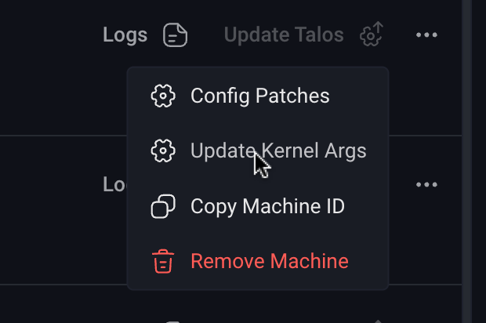
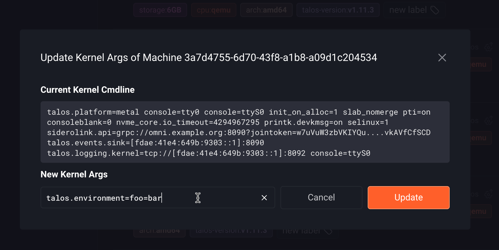

import { version } from '/snippets/custom-variables.mdx';

You can add kernel arguments when creating installation media, or modify them later on existing machines. For a full list of available kernel arguments, refer to the <a href= {`../../talos/${version}/reference/kernel)`}>Kernel argument reference documentation</a>.

<Note>
  Some kernel arguments are added automatically by Omni (for example, the SideroLink arguments), while others are provided by Talos.

  These automatically added arguments are **not user-editable** and modifying them is **not supported**.

  This document describes how to modify _additional_ kernel arguments only.
</Note>

## Add kernel arguments during installation media creation

You can include additional kernel arguments into your Talos Omni image using either cluster templates, the Omni CLI or the Omni UI.

<Tabs>
<Tab title="Cluster templates">

  You can add kernel arguments to your machines by defining them in the machine configuration within your cluster template.

  Use the `kernelArgs` field in your cluster template to specify which extensions to install. For more details, see the [Cluster Templates reference documentation](../reference/cluster-templates).

  The code block below defines the configuration for a cluster named `my-cluster`, including kernel arguments for both control plane and worker machines.

  ```yaml
  kind: Cluster
  name: my-cluster
  kubernetes:
    version: v1.35.0
  talos:
    version: v1.12.2
  ---
  kind: ControlPlane
  machines:
    - ec2d0bff-ea56-3ee5-cae3-d56663de6272
  ---
  kind: Workers
  machines:
    - ec2fe180-8445-eea2-410f-af334b831fcb
  ---
  kind: Machine
  name: ec2d0bff-ea56-3ee5-cae3-d56663de6272
  install:
    disk: /dev/xvda
  kernelArgs:
    - talos.dashboard.disabled=1
  ---
  kind: Machine
  name: ec2fe180-8445-eea2-410f-af334b831fcb
  install:
    disk: /dev/xvda
  kernelArgs:
    - console=ttyS0,115200n8
  ```

  After defining your cluster template, validate it using:

  ```bash
  omnictl cluster template validate -f cluster.yaml
  ```

  If the validation succeeds, sync the template to apply the configuration to your Omni instance:

  ```bash
  omnictl cluster template sync -f cluster.yaml --verbose
  ```

  After syncing, the control plane machine will boot with the `talos.dashboard.disabled=1` kernel argument, while the worker machine will boot with the `console=ttyS0,115200n8` kernel argument.
</Tab>
<Tab title="CLI">

You can bake kernel arguments into your image by adding the `--extra-kernel-args` flag when creating a preset, then downloading from it.

For example, to download a Talos Omni ISO image with the kernel argument `talos.dashboard.disabled=1`, run:

```bash
omnictl media preset create kernel-args-preset --arch amd64 --extra-kernel-args talos.dashboard.disabled=1
omnictl media download kernel-args-preset
```

When you no longer need the preset, delete it:

```bash
omnictl media preset delete kernel-args-preset
```

You can then boot your machines with this downloaded Talos Omni image.
</Tab>
<Tab title="UI">

To add kernel arguments to your machines:

  1. Log in to your Omni dashboard.

  2. Click the **Download Installation Media** button to open the **Create New Media** wizard.

  3. On each page of the **Create New Media** wizard, select the appropriate options for your setup, then click **Next** to continue.

     The **Create New Media** wizard is identical to the [Image Factory](https://factory.talos.dev/) and it is split across multiple pages. Each page presents a different set of configuration options, such as architecture, hardware type, and Talos Linux version, that you can use to customize your Talos Omni image.

  4. Select the kernel arguments you would like to boot your machines with in the **Extra kernel command line arguments** section, click **Next** and continue with your setup.

  5. Select the appropriate boot option for your machine on the **Schematic Ready** page to download the Talos Omni image.

  6. Boot your machines using the downloaded image. The selected kernel arguments will already be installed.
</Tab>
</Tabs>

Once you boot your machine with kernel arguments, Omni automatically creates a `KernelArgs` resource for that machine. You can view and update this resource later to modify the kernel arguments.

To retrieve the resource, run:

```bash
omnictl get kernelargs $MACHINE_ID -o yaml
```

**Example output:**

```yaml
metadata:
  namespace: default
  type: KernelArgs.omni.sidero.dev
  id: $MACHINE_ID
  version: 1
  owner:
  phase: running
  created: 2025-10-29T12:58:17Z
  updated: 2025-10-29T12:58:17Z
spec:
  args:
    - talos.dashboard.disabled=1
    - talos.environment=http_proxy=http://proxy.example.com:8080
```

## Update kernel arguments on existing machines

<Warning>
  Modifying kernel arguments on existing machines triggers an upgrade and reboots the machine.
</Warning>

<Note>
  Some conditions must be met for kernel argument updates to take effect.
  If these conditions are not met, they appear in the `unmetconditions` field of the `KernelArgsStatus` resource and in the UI.
</Note>

<Tabs>
  <Tab title="UI">
    1. Go to the **Machines** tab.

    2. Click the three dots next to the machine you want to modify and select **Update kernel args**.

    

    3. In the popup, click the pencil icon to edit the current kernel arguments.

    4. Click **Update**.

    
  </Tab>
  <Tab title="CLI">
    1. Save the existing arguments to a file:

       ```bash
       omnictl get kernelargs $MACHINE_ID -o yaml > kernel-args.yaml
       ```

    *Alternatively, you can create a new file manually.*

    2. Modify the file as needed. For example, to set `talos.environment=foo=bar`, update the `spec.args` section:

       ```yaml
       metadata:
         namespace: default
         type: KernelArgs.omni.sidero.dev
         id: $MACHINE_ID
       spec:
         args:
           - talos.environment=foo=bar
       ```

    3. Apply the file using omnictl:

       ```bash
       omnictl apply -f kernel-args.yaml
       ```

    4. Monitor the update status:

       ```bash
       omnictl get kernelargsstatus $MACHINE_ID -o yaml --watch
       ```

       Example output:

       ```yaml
       event: updated
       metadata:
         namespace: default
         type: KernelArgsStatuses.omni.sidero.dev
         id: $MACHINE_ID
         version: 5
         owner: KernelArgsStatusController
         phase: running
         created: 2025-10-29T12:58:17Z
         updated: 2025-10-29T13:28:32Z
       spec:
         args:
           - talos.environment=foo=bar
         currentargs:
           - console=tty0
           - console=ttyS0
         unmetconditions: []
         currentcmdline: talos.platform=metal console=tty0 console=ttyS0 init_on_alloc=1 slab_nomerge pti=on consoleblank=0 nvme_core.io_timeout=4294967295 printk.devkmsg=on selinux=1 siderolink.api=grpc://omni.example.org:8090?jointoken=w7uVuW3zbVKIYQ....VfCfSCD talos.events.sink=[fdae:41e4:649b:9303::1]:8090 talos.logging.kernel=tcp://[fdae:41e4:649b:9303::1]:8092
       ```
  </Tab>
</Tabs>
