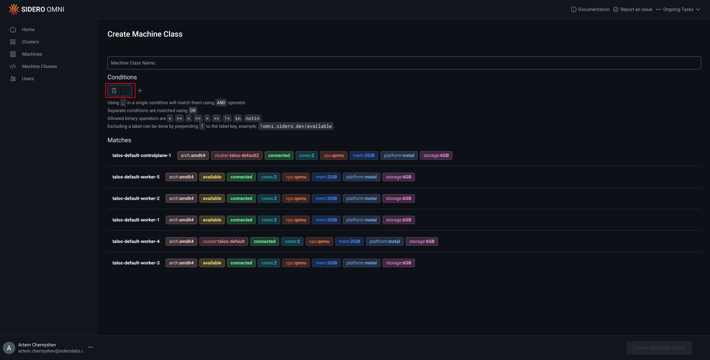
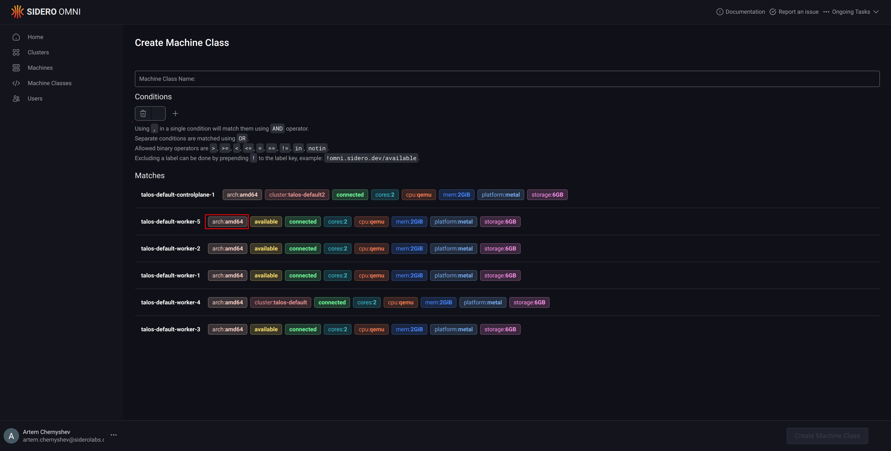
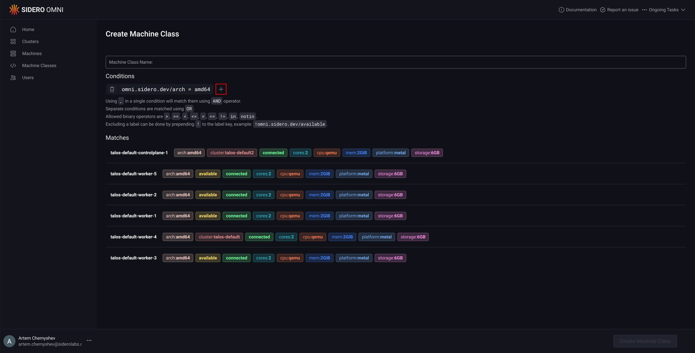
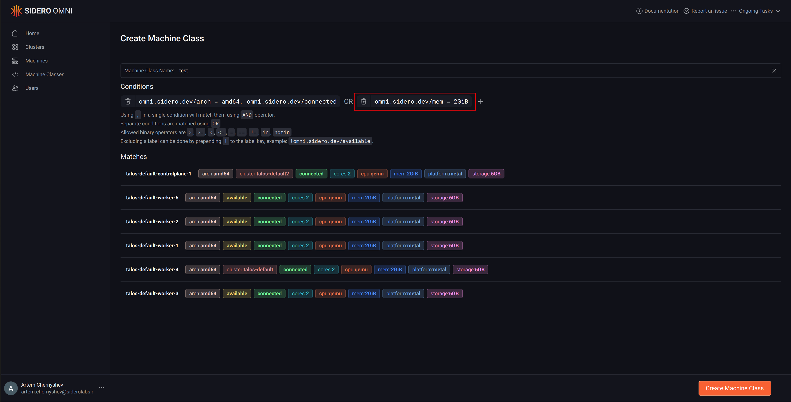

A machine class is a reusable group of machines defined by labels and conditions. It allows you to match machines based on criteria like architecture and core count (e.g., `amd64` architecture with more than 2 cores). 

Machine classes are used for automated cluster allocation, instead of selecting individual machines, you reference a machine class, and Omni picks matching machines automatically.

You can create a machine class them via the CLI with `omnictl apply` or through the UI under the **Machine Classes** section.

<Tabs>
  <Tab title="CLI">

    This example creates a machine class named test using the CLI.

    It selects machines that meet both of the following conditions:

    - `omni.sidero.dev/arch = amd64` — The machine must use an amd64 (x86_64) architecture
    - `omni.sidero.dev/cores > 2` — The machine must have more than 2 cores

    ```yaml
    metadata:
      namespace: default
      type: MachineClasses.omni.sidero.dev
      id: test
    spec:
      matchlabels:
        # matches machines with amd64 architecture and more than 2 cores
        - omni.sidero.dev/arch = amd64, omni.sidero.dev/cores > 2
    ```

    Apply the configuration with:

    ```bash
    omnictl apply -f machine-class.yaml
    ```
  </Tab>

  <Tab title="UI">
    1. Click **Machine Classes** in the left sidebar.
    2. Click **Create Machine Class**.
    3. Add match conditions by typing them into the input box, or click a label
      in the machine list to add it automatically.

    
    

    4. To match machines using additional condition blocks joined by `OR`, click **+**.

    
    

    5. Give the machine class a name, then click **Create Machine Class**.
  </Tab>

</Tabs>
