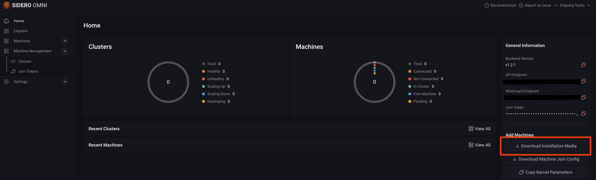
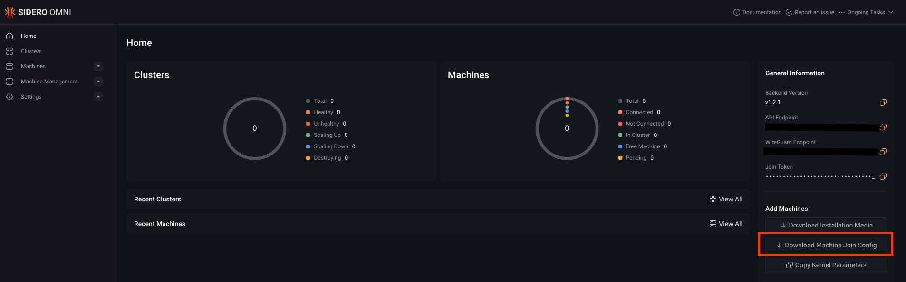
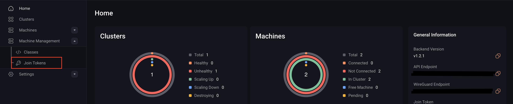
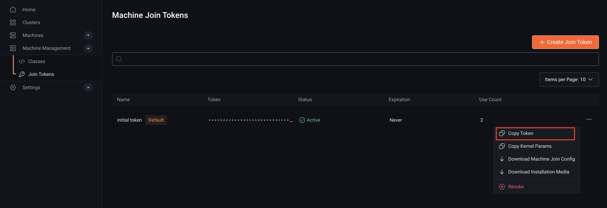

Omni lets you connect existing Talos machines, whether they’re running on bare metal or as VMs, to your Omni environment so it can automatically take over their management.

You can register a machine to Omni in two ways:

1. Boot the machine with a preconfigured SideroLink configuration from Omni or the Image Factory. 

2. Boot the machine using standard Talos Linux installation media and provide a Machine Join Config.

> **Note:** Once a machine joins Omni, it is managed entirely through Omni.  
> The local Talos API is disabled for security reasons, and all future configuration changes must be made through Omni. If you want to access the Talos APIs you will need to re-provision the machine from Talos installation media.

The following section explains how to use both methods to add Talos machines to Omni.

## Pre-configured SideroLink configuration

To join a machine using pre-configured SideroLink configuration:

1. Download the installation Media. You can do this from either the Omni UI or the CLI.

<Tabs>
<Tab title="Omni UI">

To download the installation media from the Omni UI:

a. Log in to your Omni dashboard.

b. Click **Download Installation Media** to open its modal.



c. Choose the appropriate image for your machine.


d. Click Download to begin downloadng the Omni image

</Tab>
<Tab title="CLI">

Run this command to download the installation media:

```bash
omnictl download iso
```
</Tab>
</Tabs>

2. Boot each machine you want to add to the cluster using the Omni image you downloaded.  After the machines have been booted, they will appear in your Omni dashboard.

## Machine Join Config

The Machine Join Config is a configuration that lets you register existing Talos nodes with Omni.
Use this approach for nodes you booted machines from a standard Talos Linux installation media, for example, an ISO or VM disk.

These machines must be in **maintenance mode**, meaning no machine configuration (`controlplane.yaml` or `worker.yaml`) has been applied yet.

### Download the Machine Join Config

You can download the Machine Join Config in two ways, through the Omni UI or by using a join token in the CLI:

<Tabs>
<Tab title="Omni UI">
To download the Machine Join Config from the UI:

1. Log in to your **Omni dashboard**.
2. Click **Download Machine Join Config** to download the configuration file.


</Tab>
<Tab title= "CLI">
To download the Machine Join Config using a join token:

1. Log in to your Omni dashboard.
2. Go to **Machine Management → Join Tokens**.



3. Click the **⋯** button next to the token and select **Copy Token**.



4. In your terminal, run the following command:

```bash
omnictl jointoken machine-config
```

If you have multiple join tokens, you can specify a particular one by adding the `--join-token` flag:

```bash
omnictl jointoken machine-config --join-token <token-id>
```
Replace the `<join-token>` with the token you copied in step 3.
</Tab>
</Tabs>

### Supplying the Machine Join Config

The recommended way to use the join config is to provide it as userdata on your platform. For example:

- **Proxmox**: Use the NoCloud (cloud-init) datasource.

- **AWS / GCP / Azure**: Add it as instance user-data when launching a VM.

For Bare metal systems use the premade ISO or PXE boot the machine with the image downloaded from the Omni dashboard.

This ensures that the machine automatically joins Omni during its first boot.
