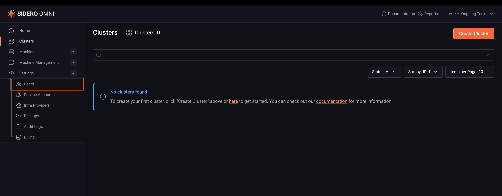
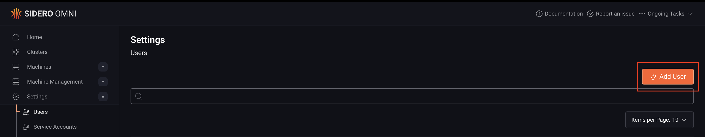
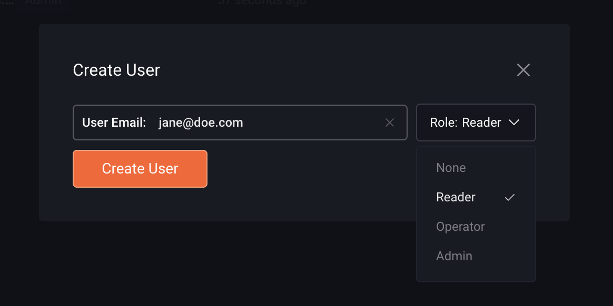
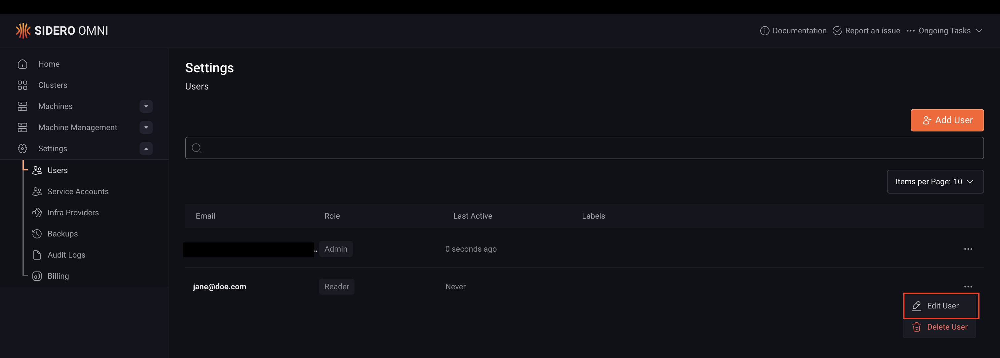
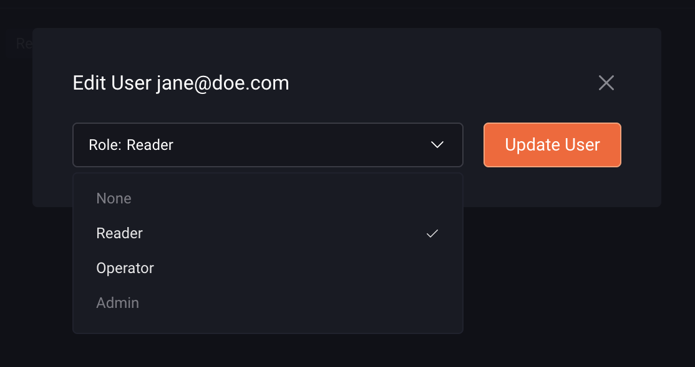
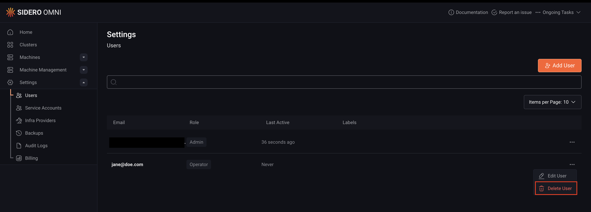

This guide explains how to create, update, and remove users in Omni.

Before assigning a role, review the available account roles and their permissions to determine the appropriate level of access for the user. See [Account roles](../security-and-authentication/security-model#account-roles).

## User account creation by authentication method

User account creation in Omni depends on the authentication method being used. 

With Auth0 and OIDC, an Omni administrator must first add the user before they can log in. 

With SAML, the user account is created automatically on the first login, so no manual setup is required.

## Prerequisites

Before managing users in Omni, add the user to your identity provider (Auth0, OIDC provider, or SAML IdP) and ensure they have permission to access Omni.

## Create a user

<Note>
If SAML is enabled, skip this step. The user account is created automatically the first time the user logs in.
</Note>

You can create a user in Omni via the CLI or the Omni UI.

<Tabs>
<Tab title="CLI">

Run this command to create a user, replacing the placeholders `<user-email-address>` and `<role>` with their actual values:

```bash
omnictl user create <user-email-address> --role <role>
```
</Tab>
<Tab title="UI">

To create a user via the Omni UI:

1. Navigate to **Settings > Users**.



2. Select **Add User**.



3. Enter the user's email in the **Create User** modal.
4. Select a role from the **Role** dropdown.
5. Click **Create User**.


</Tab>
</Tabs>

## Update a user's role

You can update a user's role in Omni via the CLI or the Omni UI.

<Tabs>
<Tab title="CLI">

Run this command to update a user's role, replacing the placeholders `<user-email-address>` and `<new-role>` with their actual values:

```bash
omnictl user set-role <user-email-address> --role <new-role>
```
</Tab>
<Tab title="UI">

To update a user's role in the Omni UI:

1. Navigate to **Settings > Users**.
2. Click the ellipsis menu (**⋯**) next to the user and select **Edit User**.



3. Select a role from the **Role** dropdown: **None**, **Reader**, **Operator**, or **Admin**.
4. Click **Update User** to save the changes.


</Tab>
</Tabs>

<Note> SAML users are assigned the `None` role by default on first login. Update their role to grant the appropriate level of access.</Note>

## Delete a user

Removing a user from the identity provider prevents them from logging in but does not remove their account from Omni. To fully revoke access and clean up orphaned resources, the user must also be deleted from Omni.

<Tabs>
<Tab title="CLI">

Run this command to delete a user, replacing the placeholders `<user-email-address>` and `<new-role>` with their actual values:

```bash
omnictl user delete <user-email-address>
```
</Tab>
<Tab title="UI">

To delete a user:

1. Navigate to **Settings > Users**.
2. Click the ellipsis menu (**⋯**) next to the user and select **Delete User**.



3. Click **Delete** to confirm.


</Tab>
</Tabs>
