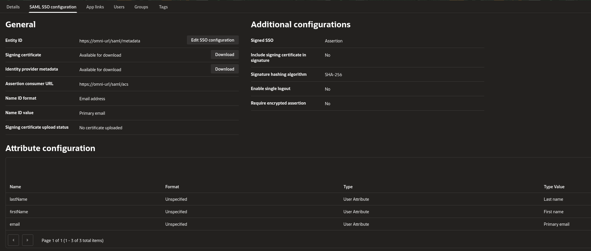

This section describes how to use Oracle Cloud SSO with Omni via SAML.

## 1. Login to Oracle Cloud.

On the left menu, select *Identity & Security* > *Domains*.

Click your desired domain, then select *Integrated Applications*.

Click *Add Application* > *SAML Application* > *Launch Workflow*.

Give the application a name ("Omni" for example) and leave all other fields blank.

Select *Submit*.

Select the created application, then click *SAML SSO Configuration* > *Edit SSO Configuration*.

We can now define our application configuration.

Only update the fields mentioned in the table below.

| Option                      | Value                                  | Description                                                             |
| --------------------------- | -------------------------------------- | ----------------------------------------------------------------------- |
| Entity ID                   | https://\<fqdn for omni>/saml/metadata | The fully-qualified domain name for metadata retrieval
| Assertion consumer URL      | https://\<fqdn for omni>/saml/acs      | The fully-qualified domain name for acs
| Name ID Format              | Email address                          |
| Name ID Value               | Primary email                          |
| Enable single logout        | Disabled                               |

At the bottom of this section, you’ll see an "Attribute configuration" block, here the mappings from Oracle to Omni fields needs to be entered as below. Use the “Add attribute" button to create new ones.

| Name      | Name Format | Value      | Description              |
| --------- | ----------- | ---------- | ------------------------ |
| email     | Unspecified | Primary email      | The user’s email address |
| firstName | Unspecified | First name | The user’s first name    |
| lastName  | Unspecified | Last name  | The user’s last name     |



Once saved, head to the "Users" configuration section.

Add any users that you wish to have access to Omni.

Once complete, head back to the "SAML SSO Configuration" tab and hit "Download" on the "Identity Provider Metadata" field.

A copy of this file needs to be on the host which will run the Omni container as we’ll feed it in to the container at runtime. You can copy paste contents or download/upload the file whichever is easiest. For the remainder of this guide, we’ll assume this file ends up at the following location on your container host: `~/oraclemetadata.xml`

This completes the configurations required in Oracle Cloud.

## 2. Configure Omni SAML

To get Omni to use Oracle as a SAML provider, the following flags should be passed to Docker & the Omni container on launch.

| Scope  | Flag                                               | Description                                       |
| ------ | -------------------------------------------------- | ------------------------------------------------- |
| Docker | `-v $PWD/oraclemetadata.xml:/oraclemetadata.xml` | Make available the IDP metadata file in container |
| Omni   | `--auth-saml-enabled=true`                         | Enable SAML authentication.                       |
| Omni   | `--auth-saml-metadata-/oraclemetadata.xml`        | The path to the IDP metadata file.                |
| Omni   | `--auth-saml-name-id-format=urn:oasis:names:tc:SAML:1.1:nameid-format:emailAddress` | Ensures Omni process the email address correctly. |

For example;

```bash
docker run \
...
-v $PWD/oraclemetadata.xml:/oraclemetadata.xml
...
ghcr.io/siderolabs/omni:latest \
  --auth-saml-enabled=true
  --auth-saml-metadata-/oraclemetadata.xml
  --auth-saml-name-id-format=urn:oasis:names:tc:SAML:1.1:nameid-format:emailAddress
```
