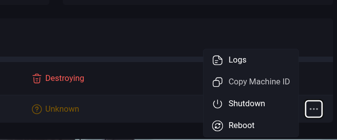

This guide will assume you already have Omni available and running in your environment either self-hosted or using the Omni SaaS.
The sections are unordered and can be used to troubleshoot your specific situation or error messages.

## Removing stuck machines

Machines connected to Omni can get in states where Omni can no longer cleanly remove them. This may be because the machine is no longer available, the machine has errors, or other reasons.

This may block the ability to delete a cluster as Omni tries to cleanly remove machines before deleting the clutser resoures. Sometimes trying to force delete the machine from the Omni UI also does not remove the machine.

To delete a machine from Omni via `omnictl` you will first need to identify what SideroLink it is using.

Identify the UUID of the machine that is stuck deleting by copying it from the menu.



The machine UUID should also match a SideroLink UUID from

```bash
omnictl get links
```

Once you verify one of the link UUIDs match you can delete the link (and machine) with:

```bash
omnictl delete link $UUID
```
