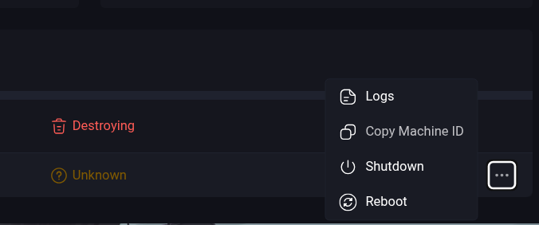

This guide will assume you already have Omni available and running in your environment either self-hosted or using the Omni SaaS.
The sections are unordered and can be used to troubleshoot your specific situation or error messages.

## Removing stuck machines

Machines connected to Omni can sometimes become stuck and cannot be removed cleanly. This may happen because the machine is no longer reachable, has entered an error state, or another cleanup operation failed.

Depending on how the machine was created, the removal process differs.

### Machines managed directly by Omni

For machines managed directly by Omni, first identify the SideroLink associated with the machine.

Copy the machine UUID from the UI.



Verify that the UUID matches a SideroLink:

```bash
omnictl get links
```

Delete the link:

```bash
omnictl delete link $UUID
```

Deleting the link also removes the associated machine.

### Machines managed by an infrastructure provider

The same `omnictl delete link` workflow applies to machines created by an infrastructure provider, such as the Bare Metal Provider, including machines left in a broken state.

If the cluster still requests the machine from the infrastructure provider, the deleted link is immediately recreated and the machine reappears. Deleting the link alone is therefore not sufficient to remove the machine permanently.

To permanently remove the machine, first remove it from the cluster so it is no longer requested. If the infrastructure provider is no longer needed, deleting its provider registration also removes the machines it owns.
