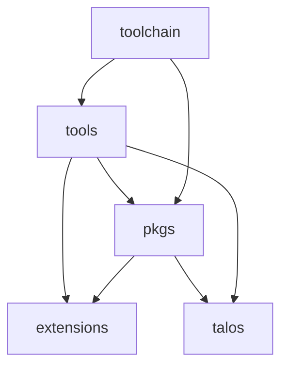

import { VersionWarningBanner } from "/snippets/version-warning-banner.jsx"

<VersionWarningBanner />

Talos development relies on several internal tools and repositories that work together to build the operating system and its components.

These tools are typically invoked through `make` targets within Talos repositories rather than being used directly.

Most Talos repositories include a `make help` target which lists available development commands:

```bash
make help
```

This section is intended for developers working on Talos itself or building custom Talos components. These tools are not required when consuming pre-built Talos images or system extensions.

## Development Ecosystem

Talos is built from packages defined in the [`pkgs`](https://github.com/siderolabs/pkgs) repository. Development tools build these packages, which are then used to assemble Talos itself or optional system extensions.



## Development Tools

Development tools provide the utilities used to build packages and maintain Talos repositories.

### bldr

[`bldr`](https://github.com/siderolabs/bldr) is the package build system used to produce the container images that make up Talos components.

Packages are defined in the [`pkgs`](https://github.com/siderolabs/pkgs) repository using a `pkg.yaml` specification. `bldr` reads this definition and builds container images containing the resulting filesystem artifacts.

**Repository:**

https://github.com/siderolabs/bldr

### kres

[`kres`](https://github.com/siderolabs/kres) is a repository templating and automation tool used across SideroLabs projects.

Repositories using `kres` define their configuration in a `.kres.yaml` file. The tool generates common repository files such as Makefiles, CI configuration, and project scaffolding.

Generated files can be refreshed using:

```bash
make rekres
```

**Repository:**

https://github.com/siderolabs/kres

## Related Repositories

The following repositories contain the package definitions and extensions used when building Talos components.

### pkgs

The [`pkgs`](https://github.com/siderolabs/pkgs) repository contains the package definitions used to build Talos components.

Each package describes how software should be compiled and what filesystem artifacts should be produced.

### extensions

The [`extensions`](https://github.com/siderolabs/extensions) repository contains system extensions which add additional functionality to Talos.
