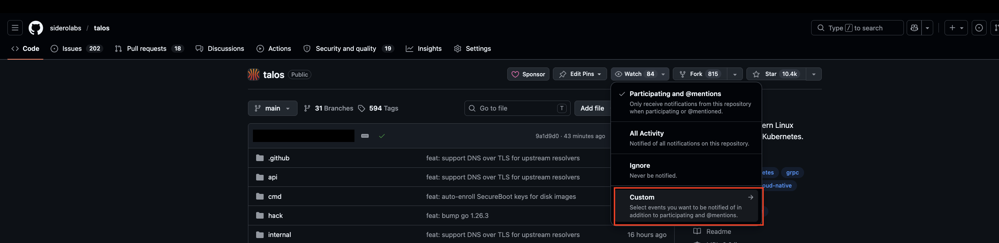
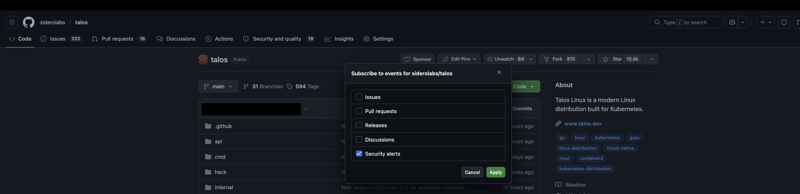

import { VersionWarningBanner } from "/snippets/version-warning-banner.jsx"

<VersionWarningBanner />

Talos Linux publishes security advisories on GitHub when CVEs are disclosed. You can subscribe to receive notifications directly so you're informed as soon as a new advisory is published.

To receive security advisory notifications for Talos Linux:

1. Navigate to the [Talos Linux repository](https://github.com/siderolabs/talos) on GitHub.

2. Click the **Watch** button in the top-right area of the page.

3. Select **Custom** from the dropdown menu.

4. Check **Security alerts**.

5. Click **Apply**.

You will now receive a GitHub notification whenever a new security advisory is published for Talos Linux.

<Note>
You need a GitHub account to subscribe to notifications. You can manage your [notification preferences (email, web, etc.)](https://github.com/settings/notifications) in your GitHub notification settings.
</Note>

## What a security advisory Contains

Security advisories include the CVE identifier, affected Talos versions, severity rating, and the version the fix is available in. You can also view all published advisories at any time under the Security tab of the Talos repository.