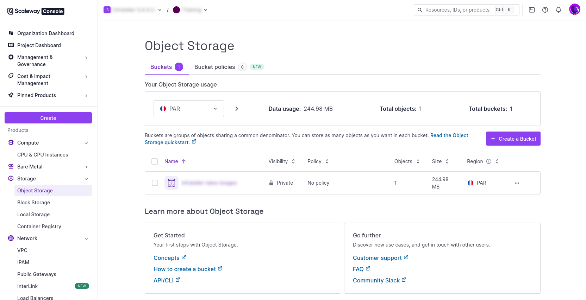
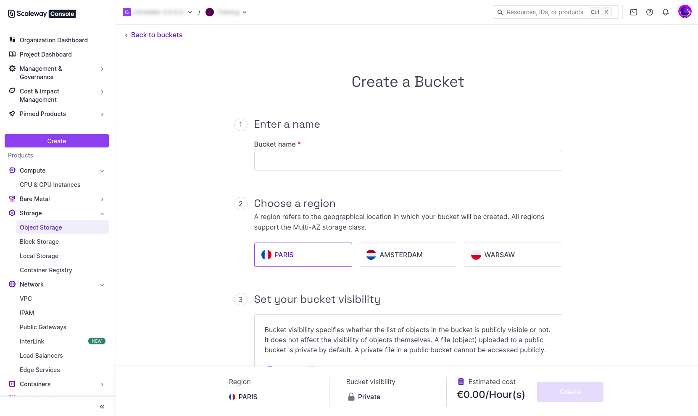

import { release_v1_13, version_v1_13 } from '/snippets/custom-variables.mdx';

The process to run a Talos cluster, on a single node in Scaleway is as follows:

## Prerequisites

- Enable block storage on your Scaleway account (Scaleway will only allow snapshots from their block storage, not URLs)
- Configure the `scw` CLI to access your account (optional - you can use the console instead)
- Have `qemu-img` and `wget` installed for image conversion

## Image preparation

1. **Download the image disk** of the Talos version you wish to run:

  <CodeBlock lang="sh">
    {`
   wget "https://factory.talos.dev/image/18d0321d7fb289f707a76e1deeaa5c97e62209722cbf4bc533a5d51eb666885f/v{ release_v1_13 }/scaleway-amd64.raw.zst"
   `}
   </CodeBlock>

   > You can create your own brew on [Talos Factory](https://factory.talos.dev) if you need a custom image.
   > A working extra kernel command line arguments is as follow : `-console talos.platform=scaleway console=ttyS0,115200 talos.dashboard.disabled=0`

2. **Decompress and convert the image**:

   ```bash
   zstd --decompress scaleway-amd64.raw.zst
   qemu-img convert -O qcow2 scaleway-amd64.raw scaleway-amd64.qcow2
   ```

3. **Create an S3 bucket** (if it doesn't exist):
   Go to Object Storage in the Scaleway console and create a new bucket.





4. **Upload to S3-compatible object storage**:
   Use the Scaleway console Object Storage interface to upload the QCOW2 file directly.

## Snapshot creation

1. Go to the Scaleway Web console.

2. Go to the QCOW2 object in your S3 bucket.

3. Click on the extra action *Import object as snapshot*.


4. Name the snapshot *scaleway-amd64-v{ release_v1_13 }*, and use a Local Storage snapshot type.

## Instance deployment

1. Create instance using the snapshot/image via GUI, CLI, or Infrastructure as Code tools.

2. Open the Security Group in order to open `TCP/50000` and `TCP/6443`.

3. The Talos disk image used to boot is 4.5GB, and is not enough for the EPHEMERAL partition.

4. Add an extra Disk of 25GB (Local Storage) for Talos EPHEMERAL partition. The Talos OS (4.5GB) will be on `/dev/vda` and the extra disk for EPHEMERAL partition will be on `/dev/vdb`. At this point, you can debug and communicate with the instance on --insecure mode :
```
VM_IP=<instance_public_ip>
talosctl -n $VM_IP version --insecure
talosctl -n $VM_IP get disks --insecure
talosctl -n $VM_IP get links --insecure
```

## Talos configuration

As any other Talos instance, generate the Talos machineconfig, with the following patch :
```
# controlplane.patch.yaml
machine:
    install:
        disk: /dev/vdb
        wipe: true
    network:
        interfaces:
            - interface: eth0
              dhcp: true

cluster:
  allowSchedulingOnControlPlanes: true
  apiServer:
    extraArgs:
      "advertise-address": "0.0.0.0"
    apiServer:
        certSANs:
            - 127.0.0.1
            - <public_ip>
```

Generate the Talos config :
```
talosctl gen config talos-cluster https://$VM_IP:6443 --config-patch=@controlplane.patch.yaml --output-dir _out/ --with-docs=false --with-examples=false
```


Also add a VolumeConfig for the EPHEMERAL partition of Talos :
```
---
apiVersion: v1alpha1
kind: VolumeConfig
name: EPHEMERAL
provisioning:
  diskSelector:
    match: disk.dev_path == '/dev/vdb'
  minSize: 2GB
  maxSize: 40GB
  grow: false
```

Apply the machineconfig + the VolumeConfig on your Talos Scaleway instance.
```
talosctl --nodes $VM_IP apply-config --file _out/controlplane.yaml --insecure
```

At this point, you should be able to communicate with your Talos instance with the right certificates, and debug the Talos instance :
```
talosctl --talosconfig=./_out/talosconfig --nodes $VM_IP -e $VM_IP version
talosctl --talosconfig=./_out/talosconfig --nodes $VM_IP -e $VM_IP dashboard
```

## Talos cluster bootstrap

One last command to bootstrap your Talos Cluster :
```
talosctl --talosconfig=./_out/talosconfig -e $VM_IP -n $VM_IP bootstrap
```

You can follow the logs with the dashboard, and after couple of minutes, your first Talos standalone single instance cluster on Scaleway will be ready to use.

## Notes

- Because the STATE partition will be written to `/dev/vda` during the installation, the instance works correctly with Scaleway's reboot functionality
- `talosctl reset` performs the reset operation but don't start the maintenance mode automatically
- If you give a bigger disk (let's say 25GB) for the Talos disk image for the Scaleway Instance, unfortunately Talos won't be able to expand its volume to 25GB and still see 4.5GB which is not enough for the EPHEMERAL partition
