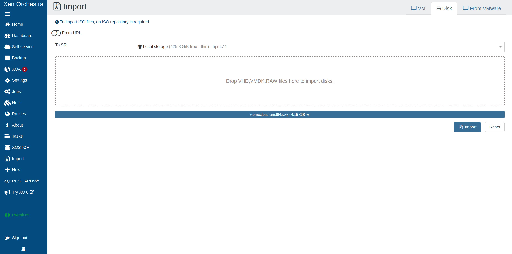
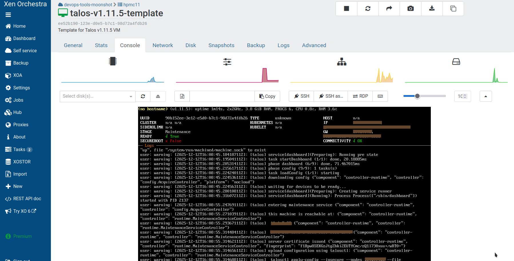

import { release_v1_13 } from '/snippets/custom-variables.mdx';

In this guide, we will create a Kubernetes cluster using Xen Orchestra.

<Info>
  This guide does not cover XCP-ng without Xen Orchestra installed, or XO Lite, even though some of the steps may be similar.
</Info>

## Installation

### How to get Xen Orchestra

It is assumed that you already have XCP-ng and Xen Orchestra installed.

If necessary, visit the [XCP-ng downloads page](https://xcp-ng.org/) and [Xen Orchestra documentation](https://xen-orchestra.com/).

### Install talosctl

You can download `talosctl` on MacOS and Linux via:

```bash
brew install siderolabs/tap/talosctl
```

For manual installation and other platforms, see the [talosctl installation guide](../../getting-started/talosctl).

### Download the RAW disk image

To install Talos in Xen Orchestra, you will need the RAW image from [Image Factory](../boot-assets/#image-factory). To work with XCP-ng the image needs to be built for the Nocloud platform with the system extension `siderolabs/xen-guest-agent`. See this <a href={`https://factory.talos.dev/?arch=amd64&board=undefined&cmdline-set=true&extensions=-&extensions=siderolabs%2Fxen-guest-agent&platform=nocloud&target=cloud&version=${release_v1_13}`}>example Talos image</a> you can use.

For example version {release_v1_13} for `linux`, download and extract the image:

<CodeBlock lang="sh">
  {`
mkdir -p _out/
curl https://factory.talos.dev/image/53b20d86399013eadfd44ee49804c1fef069bfdee3b43f3f3f5a2f57c03338ac/${release_v1_13}/nocloud-amd64.raw.xz -L -o _out/nocloud-amd64.raw.xz
xz -d _out/nocloud-amd64.raw.xz
  `}
</CodeBlock>

**Xen Guest Agent**

It is recommended to use the Talos image with the system extension `siderolabs/xen-guest-agent`. It should work without it but some features, like IP addresses reported in Xen Orchestra, will be missing.

## Create the template VM

This section explains how to create a reusable Talos VM template in Xen Orchestra.

### Recommended Configuration for VMs

Before you begin, familiarize yourself with Talos' [system requirements](../../getting-started/system-requirements) and allocate resources  
accordingly.

| Parameter | Recommended Value | Notes |
| --- | --- | --- |
| **Boot Mode** | UEFI | Modern firmware, Secure Boot support |
| **vCPUs** | 2+ (control plane), 4+ (workers) | Minimum 2 cores required |
| **Memory** | 4GB+ (control plane), 8GB+ (workers) | Minimum 2GB required |
| **Storage Repository** | Local Storage or Shared Storage | Depending on your infrastructure |
| **Cloud-Init** | Enabled | To automatically pass the Talos configuration |
| **Advanced settings > Boot VM** | false | To not start the template VM after creation |

### Via Xen Orchestra web UI

Follow these steps to create a Talos template using the Xen Orchestra web interface.

#### Step 1: Upload disk image to Xen Orchestra

1. Log in to Xen Orchestra.
2. Navigate to (**Sidebar Menu** >) **Import** > **Disks**.
3. Select the destination Storage Repository (SR).
4. Drop the RAW file.
5. Click the blue button below which displays the name of the disk.
6. Change the **Name** to "talos-nocloud-amd64". Add a description.
7. Click **Import**.
8. Wait until the download is complete.



#### Step 2: Create a new VM

Create a new VM with the following settings:

1. Click (**Sidebar Menu** >) **New** > **VM**.
2. Select the pool you want to create the VM on.
3. Select **Template** as **Generic Linux UEFI**.
4. Set **Name** to <code>{`talos-${release_v1_13}-template`}</code> (for the control plane).
5. Configure the following:

**System configuration**
- Boot firmware: **UEFI**
- vCPUs: 2 minimum (4+ recommended for workers)
- RAM: 4096 MB minimum (4GB)
- Topology: (Default)

**Install settings**
- Select PXE or any ISO/DVD, we won’t use it

**Network**
- Select your network

**Disk**
- Do not create a new disk
- We will attach the imported Talos VDI

**Advanced options**
- Boot firmware : **UEFI**
- Boot VM after creation : Off

6. Click on **Create**


#### Step 3: Attach the Talos VDI

After creating the VM, attach the Talos disk image:

1. If the VM page isn't automatically open after creation, navigate to (**Sidebar Menu** >) **Home** > **VMs**, clear the filters, and type **{`talos-${release_v1_13}-template`}**.
2. Open the **Disk** tab.
3. Remove any existing disk.
4. Click **Attach disk**.
5. Select **talos-nocloud-amd64**.
6. Click **Attach** below the dropdown field.


#### Step 4: Finalize template creation

Complete the template setup:

1. Open the **Advanced** tab.
2. Change the **Boot order** to set the **Hard-Drive** first (instead of Network/PXE or DVD drive).
3. Verify that the VM boots by starting it and opening the **Console** tab.



#### Step 5: Convert to template

Convert the VM to a template:

1. Stop the VM if it's running.
2. Open the **Advanced** tab.
3. Click **Convert to template** and confirm.

Navigate to (**Sidebar Menu** >) **Home** > **Templates** and search for "talos" to verify your new template appears.


### Alternative

This template building can also be done using the [XCP-ng Packer.io builder](https://github.com/vatesfr/packer-plugin-xenserver).

## Create the Talos cluster

Now that you have a template, you can quickly create Talos VMs with different configurations using cloud-init.

In this guide we will create a simple Kubernetes cluster with one control plane and one worker node.

### Prerequisites

This guide uses the virtual IP (VIP) functionality built into Talos to provide a stable IP for the Kubernetes control plane. Choose an IP on your VM network to designate for this purpose and note it for use in the following steps.

### Step 1: Generate Talos configurations

Generate the base configuration files for the Talos machines using the control plane IP. We will use a patch to provide the control plane nodes with the virtual IP information.

Create `cp.patch.yaml` with the content:

```yaml cp.patch.yaml icon="file-code"
- op: add
  path: /machine/network
  value:
    interfaces:
      - interface: enX0
        dhcp: true
        vip:
          ip: <VIP>
```

<Tip>
    In order to use static IP addresses for both the control plane and the worker, this patch needs to be edited and an additional patch needs to be created for the worker configuration. 
    Read the [related Talos documentation](https://docs.siderolabs.com/talos/v1.8/configure-your-talos-cluster/system-configuration/patching#machine-network).
</Tip>

With the patch in hand, generate machine configs with:
```shell
export VIP_IP=<YOUR_VIP_IP>
export PORT=6443
```

Generate the configurations:
```shell
talosctl gen config talos-xcp-cluster https://${VIP_IP}:${PORT} --config-patch-control-plane @cp.yaml
```

This creates:
- `controlplane.yaml` - Configuration for control planes
- `worker.yaml` - Configuration for workers
- `talosconfig` - Talosctl configuration file

You can modify the generated configurations if needed. You can also specify additional patches by adding to the `cp.patch.yaml` file created earlier or by creating your own patch files.

Validate the configuration files:

```shell
talosctl validate --config controlplane.yaml --mode cloud
talosctl validate --config worker.yaml --mode cloud
```

### Step 2: Create the control plane from the template

Create the control plane VM using the Xen Orchestra web interface.

#### Via Xen Orchestra web UI

Create the control plane VM:

1. Click **+ New VM**.
2. Select the pool you want to create the VM on.
3. In the **Info** section:
    - Select the template <code>{`talos-${release_v1_13}-template`}</code>.
    - Change the **Name** to something like `demo-talos-cp`.
4. In the **Performance** section:
    - Adjust VM settings according to requirements.
5. In the **Install settings** section:
    - Click **Custom config**.
    - Paste the content of `controlplane.yaml` into **User config**.
    - Add at least a comment `#` in **Network config** to avoid form validation errors.
6. In the **Interfaces** section:
    - Select your network.
7. In the **Disks** section:
    - Expand disk size to match your needs.
8. Click **Create**.


The VM will start and automatically apply the Talos configuration via cloud-init!

<Info>
    Once the machine has started, check the VM dashboard, int the **Network** tab: the guest agent should have reported the VM IP address.

    Take note of this IP address, which will be referred to as `$CONTROL_PLANE_IP` for the rest of this guide.
</Info>
<Tip>
    If you wish to export this IP as a bash variable, simply issue a command like `export CONTROL_PLANE_IP=1.2.3.4`
</Tip>

#### Alternative with Terraform

The [Terraform provider for Xen Orchestra](https://registry.terraform.io/providers/vatesfr/xenorchestra/latest) can be used as an alternative to the Web UI, enabling declarative and automated infrastructure management. 

An example is provided in the contrib repository: [Xen Orchestra Terraform examples](https://github.com/siderolabs/contrib/tree/main/examples/terraform/xenorchestra).


### Step 3: Create the worker node

Create at least one worker node using a process similar to the control plane creation above. Use the `worker.yaml` configuration file in the **Install settings** > **User config** section.

<Note>Take note of the worker node’s IP address, which will be referred to as `$WORKER_IP`</Note>

### Step 4: Bootstrap cluster

Open a console to the control plane node in the Xen Orchestra UI. You should see output indicating that etcd needs to be bootstrapped:

```text
"etcd is waiting to join the cluster, if this node is the first node in the cluster, please run talosctl bootstrap against one of the following IPs:
```

#### Configure `talosctl`

Set up the talosctl configuration:

```bash
export TALOSCONFIG="talosconfig"
export CONTROL_PLANE_IP=<YOUR_CONTROL_PLANE_IP>
talosctl config endpoint ${CONTROL_PLANE_IP}
talosctl config node ${CONTROL_PLANE_IP}
```

Check the status of the nodes:

```bash
talosctl version --nodes ${CONTROL_PLANE_IP}
talosctl services --nodes ${CONTROL_PLANE_IP} | grep etcd
talosctl services --nodes ${CONTROL_PLANE_IP} | grep xen-guest-agent
```

<Warning>
    If it does not appear, the node is not yet in a `bootstrappable` state.
</Warning>

#### Bootstrap Etcd

Initialize the Etcd cluster:

```bash
talosctl bootstrap --nodes ${CONTROL_PLANE_IP}
```

Wait a few minutes for the cluster to stabilize.


#### Retrieve the `kubeconfig`

Once the bootstrap is complete, retrieve the admin `kubeconfig`:

```bash
talosctl kubeconfig --nodes ${CONTROL_PLANE_IP}
```

This creates a `kubeconfig` file in the current directory.

Verify the Kubernetes cluster:

```bash
export KUBECONFIG=./kubeconfig
kubectl get nodes -w
```

## Secure Boot

For Secure Boot setup, see the **Secure Boot guide** in the [Talos documentation](../../platform-specific-installations/bare-metal-platforms/secureboot) and **Enable Secure Boot for a Guest VM** in the [XCP-ng documentation](https://docs.xcp-ng.org/guides/guest-UEFI-Secure-Boot/#enable-secure-boot-for-a-guest-vm).

The easiest way to get started with Secure Boot is to download the <a href={`https://factory.talos.dev/image/53b20d86399013eadfd44ee49804c1fef069bfdee3b43f3f3f5a2f57c03338ac/${release_v1_13}/nocloud-amd64-secureboot.iso`}>Secure Boot ISO</a> and boot it on a UEFI-enabled VM with Secure Boot enabled in setup mode.

The installation should be performed using the Secure Boot installer image. Use this value in your Talos machine configuration:

<CodeBlock lang="text">
  {`factory.talos.dev/nocloud-installer-secureboot/53b20d86399013eadfd44ee49804c1fef069bfdee3b43f3f3f5a2f57c03338ac:${release_v1_13}`}
</CodeBlock>

You can use the **Generic Linux UEFI** template to create the VM in Xen Orchestra. Force setup mode with one of these commands:

```bash
varstore-sb-state <VM_UUID> setup
```

or

```bash
xe vm-set-uefi-mode mode=setup uuid=<VM_UUID>
```

The ISO bootloader will enroll the keys in the UEFI firmware and boot Talos Linux in Secure Boot mode.

Once Talos is running in maintenance mode, verify that Secure Boot is enabled:

```bash
$ talosctl -n $CONTROL_PLANE_IP get securitystate --insecure
NODE   NAMESPACE   TYPE            ID              VERSION   SECUREBOOT
       runtime     SecurityState   securitystate   1         true
```

Generate the machine configuration for the node using the Secure Boot installer image:

<CodeBlock lang="sh">
  {`
export CONTROL_PLANE_ENDPOINT=<YOUR_CONTROL_PLANE_ENDPOINT>  
talosctl gen config talos-xcp-cluster https://\${CONTROL_PLANE_ENDPOINT}:6443 \\
  --install-image=factory.talos.dev/nocloud-installer-secureboot/53b20d86399013eadfd44ee49804c1fef069bfdee3b43f3f3f5a2f57c03338ac:${release_v1_13} \\
  --install-disk=/dev/xvda
`}
</CodeBlock>

Apply the machine configuration to the node:

```bash
talosctl -n ${CONTROL_PLANE_IP} apply-config --insecure -f controlplane.yaml
```

Talos will install to the disk and reboot the node. Ensure the ISO image is no longer attached to the node to prevent booting from the ISO again.

Once the node is rebooted, verify Secure Boot mode:

```bash
talosctl -n ${CONTROL_PLANE_IP} --talosconfig=talosconfig get securitystate
```

## Cloud Controller Manager (CCM) for Xen Orchestra

To install the Cloud Controller Manager in this cluster, refer to the [Xen Orchestra CCM documentation](https://github.com/vatesfr/xenorchestra-cloud-controller-manager/).

## References

- [Talos Documentation](https://www.talos.dev/)
- [XCP-ng](https://docs.xcp-ng.org/) [Documentation](https://docs.xcp-ng.org/)
- [Xen Orchestra Documentation](https://xen-orchestra.com/docs/)
- [Talos Image Factory](https://factory.talos.dev/)
- [Talos System Requirements](https://www.talos.dev/latest/talos-guides/install/system-requirements/)
