import { VersionWarningBanner } from "/snippets/version-warning-banner.jsx"
import { release_v1_14 } from '/snippets/custom-variables.mdx';

<VersionWarningBanner />

In this guide you will create a Kubernetes cluster on Proxmox, from uploading the Talos ISO to bootstrapping etcd and retrieving your kubeconfig. Follow the steps in order — each one builds on the last.

## Video walkthrough

To see a live demo of this guide, visit Youtube here:

<iframe width="560" height="315" src="https://www.youtube.com/embed/MyxigW4_QFM" frameborder="0" allow="accelerometer; autoplay; clipboard-write; encrypted-media; gyroscope; picture-in-picture" allowfullscreen></iframe>

## Prerequisites

Before you begin, make sure the following are in place. The QEMU guest agent section is optional, only follow it if you need guest VM shutdown support.

- **Proxmox**: This guide assumes you have already installed Proxmox on the server where you want to create Talos VMs. Visit the [Proxmox downloads page](https://www.proxmox.com/en/downloads) if you haven't done this yet.

- **talosctl**: Install `talosctl` on macOS or Linux with:

  ```bash
  brew install siderolabs/tap/talosctl
  ```

  For manual installation and other platforms, see the [talosctl installation guide](../../getting-started/talosctl).

- **ISO image**: Download the Talos ISO from [Image Factory](https://www.talos.dev/latest/talos-guides/install/boot-assets/#image-factory) with this command:

  ```bash
  mkdir -p _out/
  curl https://factory.talos.dev/image/376567988ad370138ad8b2698212367b8edcb69b5fd68c80be1f2ec7d603b4ba/<version>/metal-<arch>.iso -L -o _out/metal-<arch>.iso
  ```

  For example version, for linux platform:

  <CodeBlock lang="sh">
    {`mkdir -p _out/\ncurl https://factory.talos.dev/image/376567988ad370138ad8b2698212367b8edcb69b5fd68c80be1f2ec7d603b4ba/${release_v1_14}/metal-amd64.iso -L -o _out/metal-amd64.iso`}
  </CodeBlock>

### Optional: QEMU guest agent ISO

QEMU guest agent support for guest VM shutdowns requires a custom ISO and installer image. Skip this section if that doesn't apply to you.

1. **Build the custom ISO**: Go to the [Image Factory](https://factory.talos.dev/) and complete these steps to build a custom ISO:
    - Select your Talos version
    - Check the box for `siderolabs/qemu-guest-agent` and submit. This action will provide you with a link similar to:
      <CodeBlock lang="sh">
        {`Metal ISO\n\namd64 ISO\n    https://factory.talos.dev/image/ce4c980550dd2ab1b17bbf2b08801c7eb59418eafe8f279833297925d67c7515/${release_v1_14}/metal-amd64.iso\narm64 ISO\n    https://factory.talos.dev/image/ce4c980550dd2ab1b17bbf2b08801c7eb59418eafe8f279833297925d67c7515/${release_v1_14}/metal-arm64.iso\n\nInstaller Image\n\nFor the initial Talos install or upgrade, use the following installer image:\nfactory.talos.dev/installer/ce4c980550dd2ab1b17bbf2b08801c7eb59418eafe8f279833297925d67c7515:${release_v1_14}`}
      </CodeBlock>
    - Download the above ISO and take note of the installer image URL, you will need it later

2. **Enable QEMU Guest Agent in Proxmox:** Once your VM is created, go to **VM → Options** and set **QEMU Guest Agent** to **Enabled**.

<Warning> Only enable QEMU Guest Agent in Proxmox if you built the ISO with the `siderolabs/qemu-guest-agent` extension. Enabling it without the extension will only generate log spam and provide no functionality. See [Image Factory](../../learn-more/image-factory) for more on building custom ISOs.</Warning>

### VM resource requirements

Before creating VMs, familiarise yourself with the [system requirements](../../getting-started/system-requirements) for Talos and use the following as a baseline for all Talos nodes on Proxmox:

| Setting | Recommended value | Notes |
|---|---|---|
| **BIOS** | `ovmf` (UEFI) | Modern firmware, Secure Boot support, better hardware compatibility |
| **Machine** | `q35` | Modern PCIe-based machine type with better device support |
| **CPU type** | `host` | Enables advanced instruction sets (AVX-512, etc.). Use `kvm64` with feature flags for Proxmox < 8.0 |
| **CPU cores** | 2+ (control plane), 4+ (workers) | Minimum 2 cores required |
| **Memory** | 4GB+ (control plane), 8GB+ (workers) | Minimum 2GB required |
| **Disk controller** | VirtIO SCSI | Do NOT use **VirtIO SCSI Single** — causes bootstrap hangs ([#11173](https://github.com/siderolabs/talos/issues/11173)) |
| **Disk format** | Raw or QCOW2 | Raw preferred for performance; QCOW2 for snapshots |
| **Disk cache** | Write Through | Use None for clustered environments |
| **Network model** | `virtio` | Paravirtualized driver, best performance (up to 10 Gbit) |
| **EFI disk** | 4MB | Required for UEFI firmware, stores Secure Boot keys |
| **Ballooning** | Disabled | Talos does not support memory hotplug |
| **RNG device** | VirtIO RNG (optional) | Better entropy for cryptographic operations |

## Step 1: Upload the ISO

From the Proxmox UI, select the **local** storage and enter the **Content** section. Click the **Upload** button:

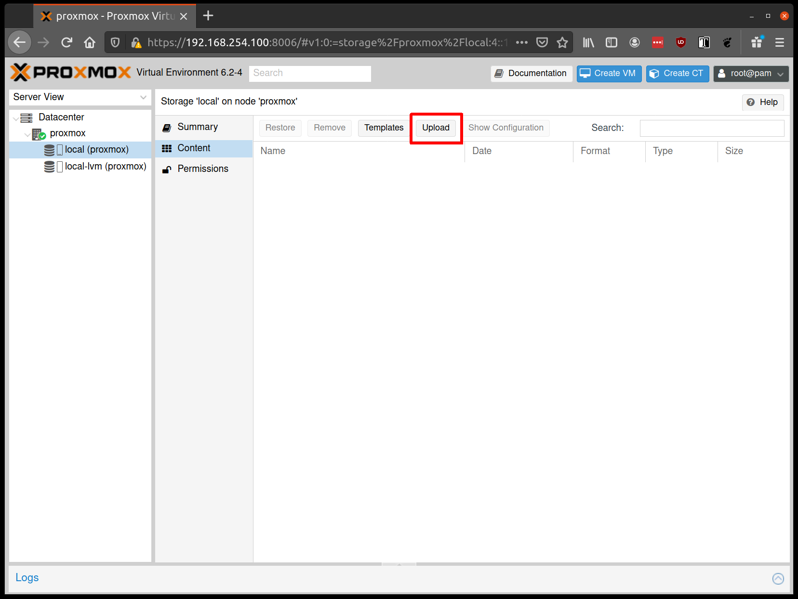

Select the ISO you downloaded in the prerequisites, then click **Upload**:

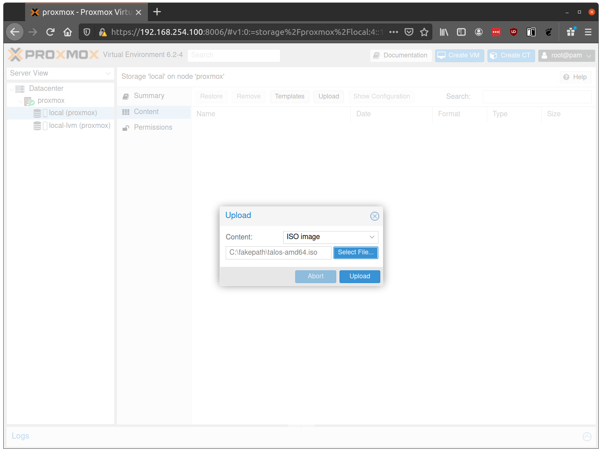

## Step 2: Create VMs

Create a new VM by clicking **Create VM** in the Proxmox UI:

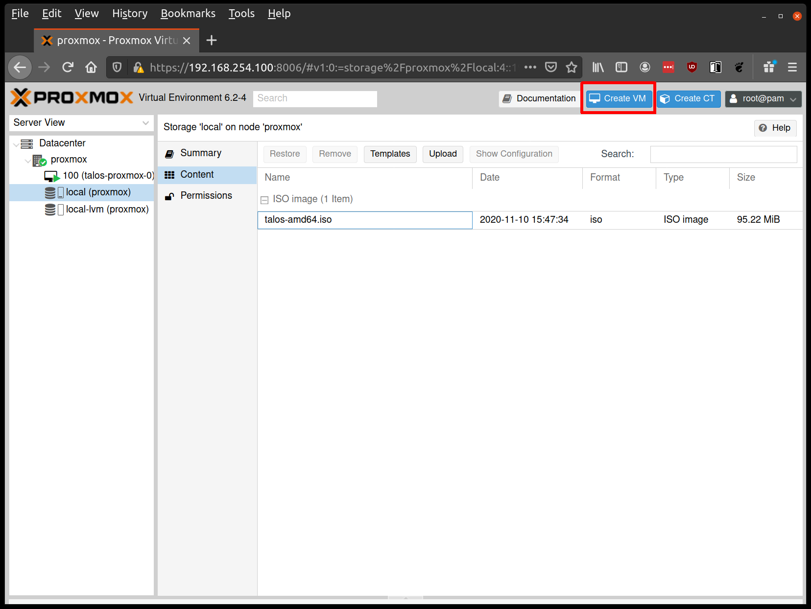

This action will open 8 tabs, configure the tabs as follows:

- **Name tab**: Fill out a name for the VM:

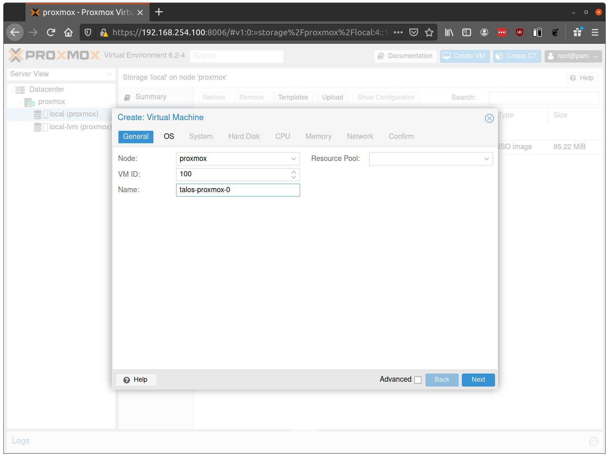

- **OS tab**: Select the ISO uploaded in Step 1:

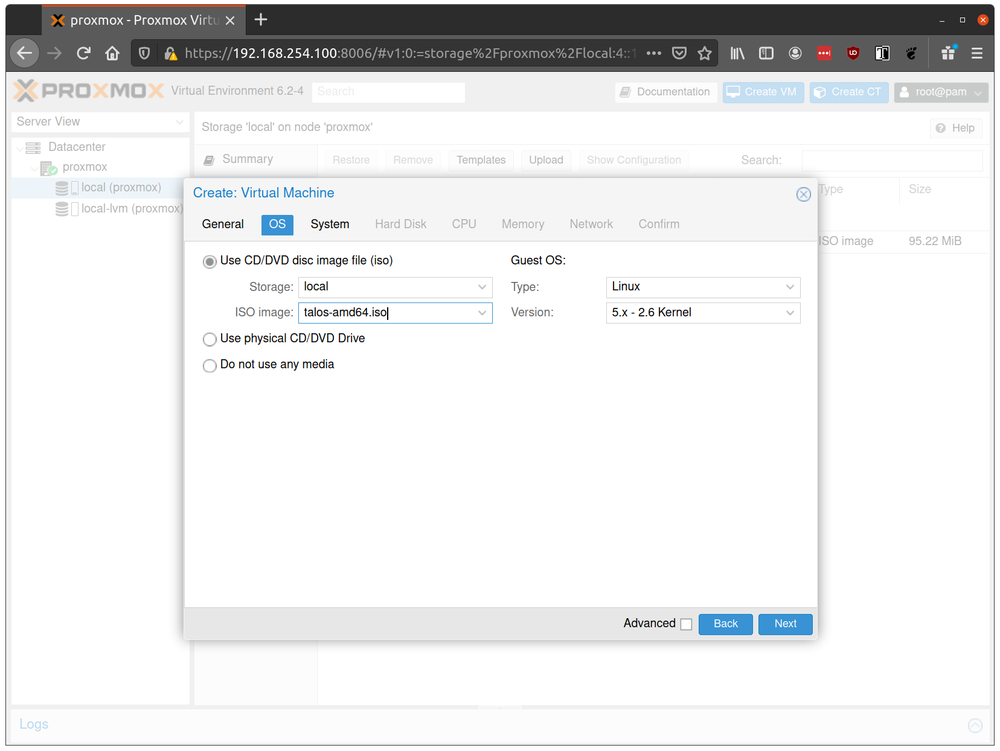

- **System tab:**
  - Set **BIOS** to `ovmf` (UEFI)
  - Set **Machine** to `q35`
  - Add an **EFI Disk** (4MB) for persistent UEFI settings and Secure Boot key storage

- **Hard Disk tab:**
  - Set **Bus/Device** to `VirtIO SCSI` (NOT **VirtIO SCSI Single**)
  - Set **Storage** to your main storage pool
  - Set **Format** to `Raw` (performance) or `QCOW2` (snapshots)
  - Set **Cache** to `Write Through`, or `None` for clustered environments
  - Enable **Discard** and **SSD emulation** if using SSD storage

- **CPU tab:**
  - Set **Cores** to 2+ for control planes, 4+ for workers
  - Set **Type** to `host` for best performance

  For Proxmox < 8.0, use `kvm64` with feature flags instead. Add the following to `/etc/pve/qemu-server/<vmid>.conf`:
  ```text
  args: -cpu kvm64,+cx16,+lahf_lm,+popcnt,+sse3,+ssse3,+sse4.1,+sse4.2
  ```

  > **Note:** `host` CPU type prevents live VM migration.

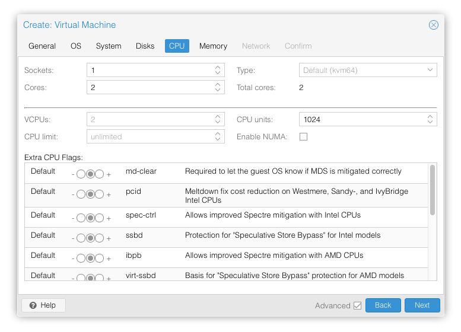

- **Memory tab:**
  - Set **Memory** to 4GB+ for control planes, 8GB+ for workers
  - **Disable Ballooning** — Talos does not support memory hotplug, and enabling it will prevent Talos from seeing all available memory

  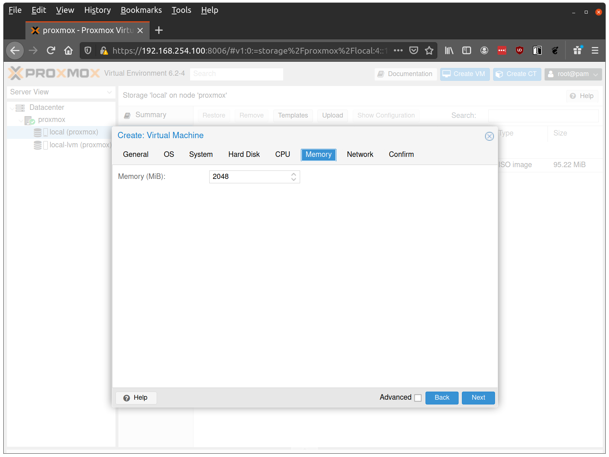

- **Network tab:**
  - Set **Model** to `virtio`
  - Set **Bridge** to your network bridge (e.g., `vmbr0`)

  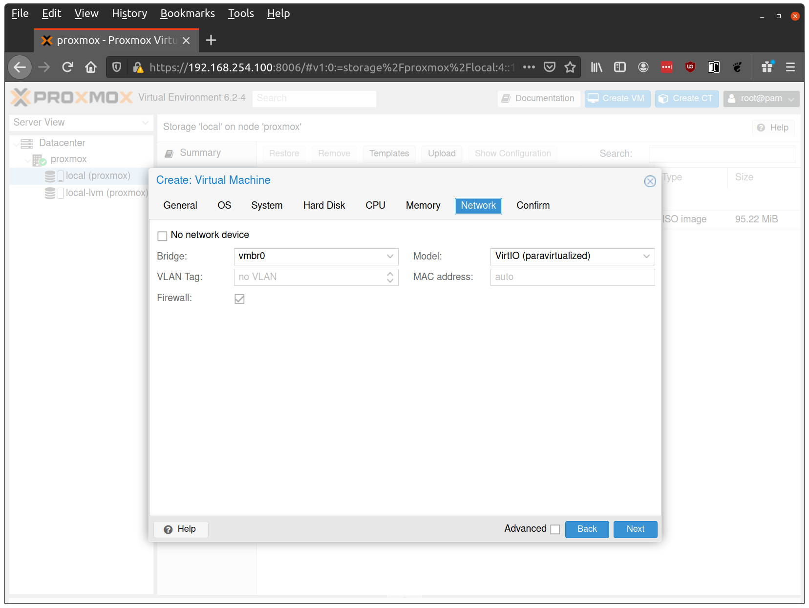

<Note>Enable a serial console (`ttyS0`) in Proxmox VM settings to see early boot logs and troubleshoot network issues. This is especially useful when debugging DHCP timing or bridge configuration problems.</Note>

- **Confirm tab**: Finish creating the VM by clicking through the **Confirm** tab and then **Finish**.

Repeat this process for each additional node, at minimum one control plane and one worker.

## Step 3: Start the control plane node

Start the VM designated as the first control plane node. It will boot from the ISO and enter maintenance mode.

<Tabs>
<Tab title="With DHCP">

Once the machine enters maintenance mode, the console will display the IP address the node received. Take note of this IP — it will be referred to as `$CONTROL_PLANE_IP` for the rest of this guide:

```bash
export CONTROL_PLANE_IP=1.2.3.4
```

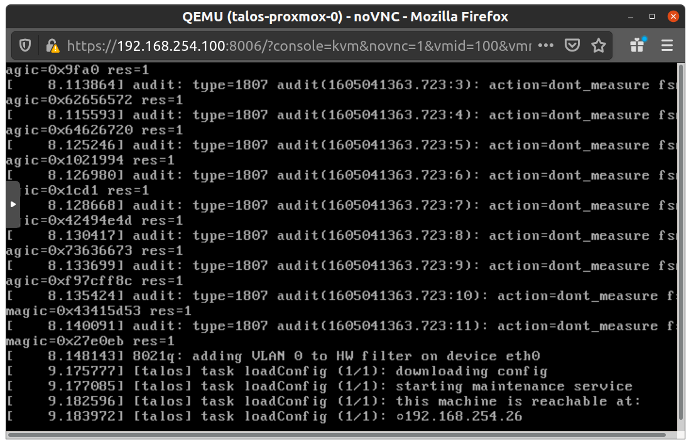

</Tab>
<Tab title="Without DHCP">

To apply machine configuration in maintenance mode, the VM needs a static IP. Set it manually at boot time.

1. Press `e` at the GRUB menu:

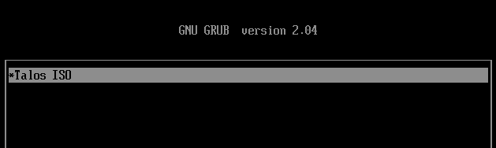

2. Append the IP parameters to the boot line using the following format ([kernel nfsroot format](https://www.kernel.org/doc/Documentation/filesystems/nfs/nfsroot.txt)):

  ```bash
  ip=<client-ip>:<srv-ip>:<gw-ip>:<netmask>:<host>:<device>:<autoconf>
  ```

  For example, with `$CONTROL_PLANE_IP` as `192.168.0.100` and gateway `192.168.0.1`:

  ```bash
  linux /boot/vmlinuz init_on_alloc=1 slab_nomerge pti=on panic=0 consoleblank=0 printk.devkmsg=on earlyprintk=ttyS0 console=tty0 console=ttyS0 talos.platform=metal ip=192.168.0.100::192.168.0.1:255.255.255.0::eth0:off
  ```

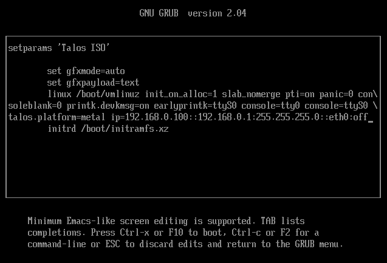

3. Press `Ctrl-x` or `F10` to boot with the updated parameters.
</Tab>
</Tabs>

## Step 4: Generate machine configurations

With `$CONTROL_PLANE_IP` set, generate the machine configurations for your cluster.

Choose the tab that matches your ISO.

<Tabs>
<Tab title="Talos ISO">

```bash
talosctl gen config talos-proxmox-cluster https://$CONTROL_PLANE_IP:6443 --output-dir _out
```
</Tab>
<Tab title="QEMU guest agent ISO">
Use this if you built the custom ISO with the `siderolabs/qemu-guest-agent` extension in the prerequisites. The command is the same but passes the custom installer image URL you noted earlier.

<CodeBlock lang="sh">
  {`talosctl gen config talos-proxmox-cluster https://$CONTROL_PLANE_IP:6443 --output-dir _out --install-image factory.talos.dev/installer/ce4c980550dd2ab1b17bbf2b08801c7eb59418eafe8f279833297925d67c7515:${release_v1_14}`}
</CodeBlock>
</Tab>
</Tabs>

This command creates three files in `_out/`: `controlplane.yaml`, `worker.yaml`, and `talosconfig`.

<Note>
The default config installs Talos to `/dev/sda`. Depending on your setup, the virtual disk may be at a different path (e.g., `/dev/vda`). Check available disks with:
```bash
talosctl get disks --insecure --nodes $CONTROL_PLANE_IP
```

Update `install.disk` in `controlplane.yaml` and `worker.yaml` if needed.
</Note>

## Step 5: Apply configuration to the control plane

Apply the control plane configuration to the node. If you are setting up an HA control plane, repeat this step for each additional control plane node.

```bash
talosctl apply-config --insecure --nodes $CONTROL_PLANE_IP --file _out/controlplane.yaml
```

You should see activity in the Proxmox console. Talos will install to disk, the VM will reboot, and Talos will configure the Kubernetes control plane. The VM will remain in stage `Booting` until the cluster is bootstrapped in the next steps.

## Step 6: Apply configuration to worker nodes

Start each worker VM and wait for it to enter maintenance mode. Repeat this step for each worker node, substituting `$WORKER_IP` with each node's IP address.

```bash
talosctl apply-config --insecure --nodes $WORKER_IP --file _out/worker.yaml
```

## Step 7: Bootstrap the cluster

With the control plane and worker nodes configured, complete the cluster setup by running the following commands in order:

1. Configure talosctl to talk to your control plane node:

```bash
export TALOSCONFIG="_out/talosconfig"
talosctl config endpoint $CONTROL_PLANE_IP
talosctl config node $CONTROL_PLANE_IP
```

2. Bootstrap etcd:

```bash
talosctl bootstrap
```

3. Retrieve the kubeconfig:

```bash
talosctl kubeconfig .
```

4. Verify that your cluster is ready:

```bash
kubectl get nodes
```

## Troubleshooting

This section covers common issues you may encounter when setting up Talos VMs on Proxmox, along with steps to resolve them.

### Cluster creation issues

If `talosctl cluster create` fails with disk controller errors, the most likely cause is an unsupported disk controller type. For example:

- `virtio-scsi-single disk controller is not supported`: This disk controller type causes Talos bootstrap to hang. Use `virtio` or `scsi` instead:

  ```bash
  # Wrong - will be rejected
  talosctl cluster create --disks virtio-scsi-single:10GiB

  # Correct - use virtio or scsi
  talosctl cluster create --disks virtio:10GiB
  talosctl cluster create --disks scsi:10GiB
  ```

### Network connectivity issues

If nodes fail to obtain IP addresses or show "network is unreachable" errors, work through the following checks:

1. **Verify bridge interface**: Ensure the bridge interface (e.g., `vmbr0`) exists and is UP before starting VMs:

  ```bash
  ip link show vmbr0
  ```

2. **Check DHCP server**: Ensure DHCP server is running and reachable from the bridge network

3. **Firewall rules**: If Proxmox VM firewall is enabled, allow DHCP traffic (UDP ports 67/68).
   If you enforce further filtering, ensure control-plane/API connectivity per your environment's policy (see Talos networking docs).

4. **VLAN configuration**: Ensure VLAN tags match between bridge configuration, VM network settings, and switch configuration

5. **Serial console**: Enable serial console to view early boot logs and network initialization messages

### Disk controller issues

If you run into disk-related problems during setup, the following may help:

- **Configuration rejected**: If you see "virtio-scsi-single disk controller is not supported", use `--disks virtio:10GiB` instead of `--disks virtio-scsi-single:10GiB`
- **Bootstrap hangs**: If bootstrap hangs or disks aren't discovered, verify you're using **VirtIO SCSI** (not "VirtIO SCSI Single")
- **Disk not found**: Check disk path using `talosctl get disks --insecure --nodes $CONTROL_PLANE_IP` and update `install.disk` in machine config if needed (e.g., `install.disk: /dev/vda`)

### Secure boot

For Secure Boot setup, see the [Secure Boot documentation](../bare-metal-platforms/secureboot).

## Cleaning up

To cleanup, simply stop and delete the virtual machines from the Proxmox UI.
